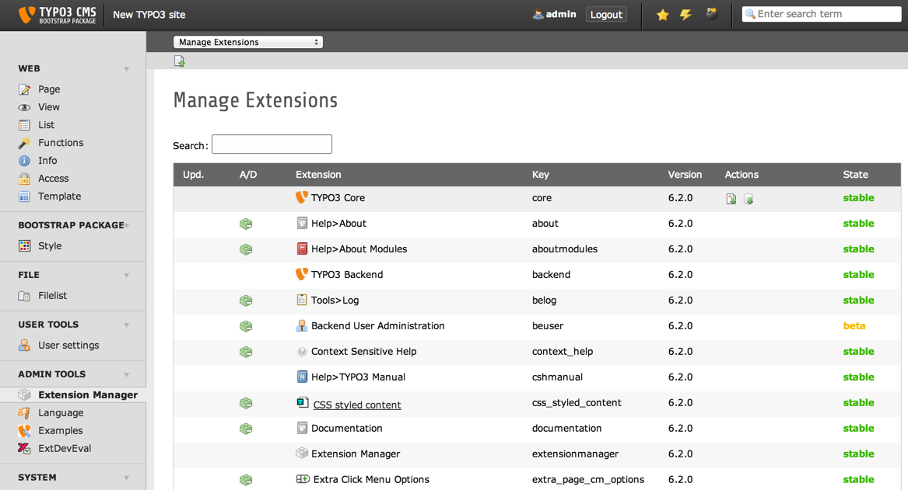

.. ==================================================
.. FOR YOUR INFORMATION
.. --------------------------------------------------
.. -*- coding: utf-8 -*- with BOM.

.. include:: ../Includes.txt

.. _admin-manual:

Administrator Manual
====================

Target group: **Administrators**

Describes how to manage the extension from an administrator point of view.
That relates to Page/User TSconfig, permissions, configuration etc.,
which administrator level users have access to.

Language should be non / semi-technical, explaining, using small examples.

.. _admin-installation:

Installation
------------

- How should the extension be installed?
- Are they dependencies to resolve?
- Is it a static template file to be included?

To install the extension, perform the following steps:

#. Go to the Extension Manager
#. Install the extension
#. Load the static template
#. ...

For a list of configuration options, using a definition list is recommended:

Some Configuration
  This option enables...

Other configuration
  This other option is for all the rest...

   Extension Manager (caption of the image)

   List of extensions within the Extension Manager also shorten with "EM" (legend of the image)

.. _admin-configuration:

Configuration
-------------

* Where and how the extension should be configured? TypoScript? PHP?

* Are there other prerequisite to full fill beforehand?
  For example, configure a setting in a special way somewhere.

.. _admin-faq:

FAQ
---

Possible subsection: FAQ

Subsection
^^^^^^^^^^

Some subsection

Sub-subsection
""""""""""""""

Deeper into the structure...
