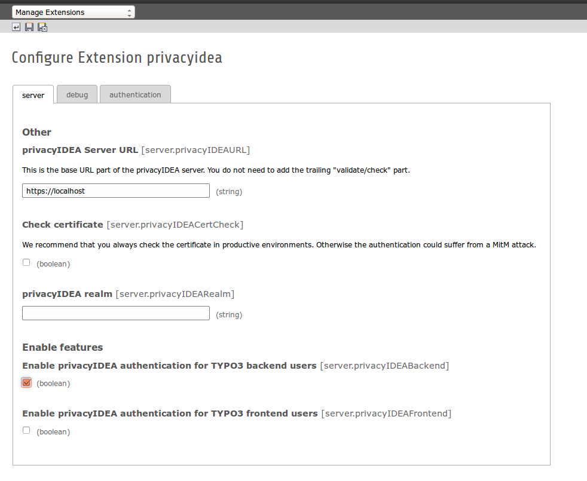

.. ==================================================
.. FOR YOUR INFORMATION
.. --------------------------------------------------
.. -*- coding: utf-8 -*- with BOM.

.. include:: ../Includes.txt

.. _configuration:

Configuration Reference
=======================

The privacyIDEA extension is easily configured.

**privacyIDEA Server URL**

This is the URL of your privacyIDEA installation. For easy ways to install
privacyIDEA take a look at `install documentation`_.

**Check certificate**

You really should run privacyIDEA with SSL. Otherwise the authentication
request could be modified. And when running SSL you really should use a
valid certificate, that is trusted by your TYPO3 machine.

**Enable privacyIDEA for backend users**

If checked, a user trying to authenticate at the backend, will need to
authenticate against privacyIDEA.
To get going with users and privacyIDEA read `UserIdResolvers
<https://privacyidea.readthedocs.org/en/latest/configuration/useridresolvers.html>`_
and
`Realms
<https://privacyidea.readthedocs.org/en/latest/configuration/realms.html>`_.

**Enable privacyIDEA for frontend users**

If checked, a user trying to authenticate at the frontend, will need to
authenticate against privacyIDEA.

**Pass to other authentication module**

If the authentication at privacyIDEA fails, the credential the user entered
will be verified against the next authentication module.

This can come in handy, if you are setting up the system and if you want to
avoid locking yourself out.

Anyway, in a productive environment you probably want to uncheck this feature.

.. _install documentation: https://privacyidea.readthedocs.org/en/latest/installation/index.html
