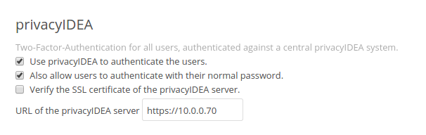

.. _application_plugins:

Application Plugins
===================

.. index:: Application Plugins, OTRS, FreeRADIUS, SAML, PAM, ownCloud

privacyIDEA comes with application plugins. These are plugins for
applications like PAM, OTRS, Apache2, FreeRADIUS, ownCloud or simpleSAMLphp
which enable these
application to authenticate users against privacyIDEA.

You may also write your own application plugin or connect your own application
to privacyIDEA. This is quite simple using a REST API 
:ref:`rest_validate`.

.. _pam_plugin:

Pluggable Authentication Module
-------------------------------

.. index:: offline, PAM

The PAM module of privacyIDEA directly communicates with the privacyIDEA
server via the API. The PAM module also supports offline authentication. In
this case you need to configure an offline machine application. (See
:ref:`application_offline`)

You can install the PAM module with a ready made Debian package for Ubuntu or
just use the source code file. It is a python module, that requires pam-python.

The configuration could look like this::

 ... pam_python.so /path/to/privacyidea_pam.py
 url=https://localhost prompt=privacyIDEA_Authentication

The URL parameter defaults to ``https://localhost``. You can also add the
parameters ``realm=`` and ``debug``.

If you want to disable certificate validation, which you should not do in a
productive environment, you can use the parameter ``nosslverify``.

A new parameter ``cacerts=`` lets you define a CA Cert-Bundle file, that
contains the trusted certificate authorities in PEM format.

The default behaviour is to trigger an online authentication request.
If the request was successful, the user is logged in.
If the request was done with a token defined for offline authentication, then
in addition all offline information is passed to the client and cached on the
client so that the token can be used to authenticate without the privacyIDEA
server available.

try_first_pass
~~~~~~~~~~~~~~

Starting with version 2.8 privacyidea_pam supports *try_first_pass*.
In this case the password that exists in the PAM stack will be sent to
privacyIDEA. If this password is successfully validated, than the user is
logged in without additional requests.
If the password is not validated by privacyIDEA, the user is asked for an
additional OTP value.

.. note:: This can be used in conjunction with the :ref:`passthru_policy`
   policy. In this case users with no tokens will be able to login with only
   the password in the PAM stack.

Read more about how to use PAM to do :ref:`openvpn`.

.. _pam_yubico:

Using pam_yubico
----------------

.. index:: pam_yubico, PAM

If you are using yubikey tokens you might also use ``pam_yubico``.
You can use Yubikey tokens for two more or less distinct applications. 
The first is using privacyideas PAM module as described above. 
In this case privacyidea handles the policies
for user access and password validation. This works fine, when you only use
privacyidea for token validation.

The second mode is using the standard PAM module for yubikeys from Yubico
``pam_yubico`` to handle the token validation. The upside ist that you can
use the PAM module included with you distribution, but there are downsides as
well.

* You can't set a token PIN in privacyidea, because ``pam_yubico`` tries to
  use the token PIN entered by the user as a system password (which is likely
  to fail), i.e. the PIN will be stripped by ``pam_yubico`` and will not reach 
  the privacyIDEA system.

* Setting the policy which tokens are valid for which users is done either in
  ``~/.yubico/authorized_keys`` or in the file given by the ``authfile`` option
  in the PAM configuration. The api server will only validate the token, but
  not check any kind of policy.

You can work around the restrictions by using a clever combination
of tokentype yubikey and yubico as follows:

* enroll a yubikey token with ``yubikey_mass_enroll --mode YUBICO``.

* do not set a token password.

* do not assign the token to a user.

* please make a note of yubikey.prefix (12 characters starting with vv).

Now the token can be used with ``pam_yubico``, but will not allow any
user access in privacyidea. If you want to use the token with
``pam_yubico`` see the manual page for details. You'll want something like the
following in your PAM config::

   auth required pam_yubico.so id=<apiid> key=<API key> \
        urllist=https://<privacyidea-server>/ttype/yubikey authfile=/etc/yubikeys/authorized_yubikeys

The file ``/etc/yubikeys/authorized_yubikeys`` contains a line
for each user with the username and the allowed tokens delimited
by ":", for example::

   <username>:<serial number1>:<prefix1>:<prefix2>

... doc/configuration/tokenconfig, add yubikey.rst to describe
how to configure Client ID/apiid and API key

Now create a second token representing the Yubikey, but this time
use the ``Yubico Cloud mode``. Go to Tokens -> Enroll Token and select
``Yubico Cloud mode``.  Enter the 12 characters prefix you noted above
and assign this token to a user and possibly set a token PIN. It would
be nice to have the the serial number of the UBCM token correspond
to the UBAM token, but this is right now not possible with the WebUI.

In the WebUI, test the UBAM token without a Token PIN, test the UBCM token
with the stored Token PIN, and check the token info afterwards.
Check the yubikey token via ``/ttype/yubikey``, for example with::

   ykclient --debug --url https://<privacyidea>/ttype/yubikey --apikey "<API key>" "apiid" <otp>

There should be successful authentications (count_auth_success),
but no failures.

.. _freeradius:

FreeRADIUS
----------

Starting with privacyIDEA 2.19, there are two ways to integrate FreeRADIUS:

 * Using a Perl-based privacyIDEA plugin, which is available for FreeRADIUS 2.0.x and above.
   It supports advanced use cases (such as challenge-response authentication or attribute mapping).
   Read more about it at :ref:`rlm_perl`.
 * Using the rlm_rest plugin provided by FreeRADIUS 3.0.x and above. However, this setup does not support
   challenge-response or attribute mapping. Read more about it at :ref:`rlm_rest`.

With either setup, you can test the RADIUS setup using a command like this::

   echo "User-Name=user, Password=password" | radclient -sx yourRadiusServer \
      auth topsecret

.. note:: Do not forget to configure the ``clients.conf`` accordingly.

Microsoft NPS server
--------------------
You can also use the Microsoft Network Protection Server with privacyIDEA.
A full featured integration guide can be found at the NetKnights webpage
[#NPS]_.

.. _simplesaml_plugin:

simpleSAMLphp Plugin
--------------------
You can install the plugin for simpleSAMLphp on Ubuntu 14.04 LTS (see
:ref:`install_ubuntu_simplesaml`) or on any other distribution using the
source files from [#simpleSAML]_.

Follow the simpleSAMLphp instructions to configure your authsources.php.
A usual configuration will look like this::

    'example-privacyidea' => array(
        'privacyidea:privacyidea',

        /*
         * The name of the privacyidea server and the protocol
         * A port can be added by a colon
         * Required.
         */
        'privacyideaserver' => 'https://your.server.com',

        /*
         * Check if the hostname matches the name in the certificate
         * Optional.
         */
        'sslverifyhost' => False,

        /*
         * Check if the certificate is valid, signed by a trusted CA
         * Optional.
         */
        'sslverifypeer' => False,

        /*
         * The realm where the user is located in.
         * Optional.
         */
        'realm' => '',

        /*
         * This is the translation from privacyIDEA attribute names to
         * SAML attribute names.
         */
         'attributemap' => array('username' => 'samlLoginName',
                                 'surname' => 'surName',
                                 'givenname' => 'givenName',
                                 'email' => 'emailAddress',
                                 'phone' => 'telePhone',
                                 'mobile' => 'mobilePhone',
                                 ),
    ),

TYPO3
-----
You can install the privacyIDEA extension from the TYPO3 Extension Repository.
The privacyIDEA extension is easily configured.

**privacyIDEA Server URL**

This is the URL of your privacyIDEA installation. You do not need to add the
path *validate/check*. Thus the URL for a common installation would be
*https://yourServer/*.

**Check certificate**

Whether the validity of the SSL certificate should be checked or not.

.. warning:: If the SSL certificate is not checked, the authentication
    request could be modified and the answer to the request can be modified,
    easily granting access to an attacker.

**Enable privacyIDEA for backend users**

If checked, a user trying to authenticate at the backend, will need to
authenticate against privacyIDEA.

**Enable privacyIDEA for frontend users**

If checked, a user trying to authenticate at the frontend, will need to
authenticate against privacyIDEA.

**Pass to other authentication module**

If the authentication at privacyIDEA fails, the credential the user entered
will be verified against the next authentication module.

This can come in handy, if you are setting up the system and if you want to
avoid locking yourself out.

Anyway, in a productive environment you probably want to uncheck this feature.

.. _otrs_plugin:

OTRS
----

There are two plugins for OTRS. For OTRS version 4.0 and higher use
*privacyIDEA-4_0.pm*.

This perl module needs to be installed to the directory ``Kernel/System/Auth``.

On Ubuntu 14.04 LTS you can also install the module using the PPA repository
and installing::

   apt-get install privacyidea-otrs

To activate the OTP authentication you need to add the following to
``Kernel/Config.pm``::

   $Self->{'AuthModule'} = 'Kernel::System::Auth::privacyIDEA';
   $Self->{'AuthModule::privacyIDEA::URL'} = \
           "https://localhost/validate/check";
   $Self->{'AuthModule::privacyIDEA::disableSSLCheck'} = "yes";

.. note:: As mentioned earlier you should only disable the checking of the
   SSL certificate if you are in a test environment. For productive use
   you should never disable the SSL certificate checking.

.. note:: This plugin requires, that you also add the path *validate/check*
   to the URL.

.. _apache_plugin:

Apache2
-------

The Apache plugin uses ``mod_wsgi`` and ``redis`` to provide a basic
authentication on Apache2 side and validating the credentials against
privacyIDEA.

On Ubuntu 14.04 LTS you can easily install the module from the PPA repository
by issuing::

   apt-get install privacyidea-apache-client

To activate the OTP authentication on a "Location" or "Directory" you need to
configure Apache2 like this::

   <Directory /var/www/html/secretdir>
        AuthType Basic
        AuthName "Protected Area"
        AuthBasicProvider wsgi
        WSGIAuthUserScript /usr/share/pyshared/privacyidea_apache.py
        Require valid-user
   </Directory>

.. note:: Basic Authentication sends the base64 encoded password on each
   request. So the browser will send the same one time password with each
   reqeust. Thus the authentication module needs to cache the password as the
   successful authentication. Redis is used for caching the password.

.. warning:: As redis per default is accessible by every user on the machine,
   you need to use this plugin with caution! Every user on the machine can
   access the redis database to read the passwords of the users. The cached
   credentials are stored as pbkdf2+sha512 hash.

.. _nginx_plugin:

NGINX
-----

The NGINX plugin uses the internal scripting language ``lua`` of the NGINX
webserver and ``redis`` as caching backend to provide basic authentication
against privacyIDEA.

On Ubuntu 14.04 LTS or Debian Jessi 8 you can easyly install the module
by installing the following packages::

    nginx-extras lua-nginx-redis lua-cjson redis-server

You can retrieve the nginx plugin here: [#nginxPlugin]_

To activate the OTP authentication on a "Location" you need to include the
``lua`` script that basically verifies the given credentials against the
caching backend. New authentications will be sent to a different (internal)
location via subrequest which points to the privacyIDEA authentication backend
(via proxy_pass).

For the basic configuration you need to include the following lines to your
``location`` block

    location / {
        # additional plugin configuration goes here #
        access_by_lua_file 'privacyidea.lua';
    }
    location /privacyidea-validate-check {
        internal;
        proxy_pass https://privacyidea/validate/check;
    }

You can customize the authentication plugin by setting some of the following
variables in the secured ``location`` block::

    # redis host:port
    # set $privacyidea_redis_host "127.0.0.1";
    set $privacyidea_redis_post 6379;

    # how long are accepted authentication allowed to be cached
    # if expired, the user has to reauthenticate
    set $privacyidea_ttl 900;

    # privacyIDEA realm. leave empty == default
    set $privacyidea_realm 'somerealm'; # (optional)

    # pointer to the internal validation proxy pass
    set $privacyidea_uri "/privacyidea-validate-check";

    # the http realm presented to the user
    set $privacyidea_http_realm "Secure zone (use PIN + OTP)";

.. note:: Basic Authentication sends the base64 encoded password on each
   request. So the browser will send the same one time password with each
   reqeust. Thus the authentication module needs to cache the password as the
   successful authentication. Redis is used for caching the password similar
   to the Apache2 plugin.

.. warning:: As redis per default is accessible by every user on the machine,
   you need to use this plugin with caution! Every user on the machine can
   access the redis database to read the passwords of the users. The cached
   credentials are stored as SHA1_HMAC hash. If you prefer a stronger hashing
   method feel free to extend the given ``password_hash/verify`` functions
   using additional lua libraries (for example by using ``lua-resty-string``).

ownCloud
--------

.. index:: ownCloud

ownCloud < 9
............

The ownCloud plugin is a ownCloud user backend. The directory
``user_privacyidea`` needs to be copied to your owncloud ``apps`` directory.

   *Activating the ownCloud plugin*

You can then activate the privacyIDEA ownCloud plugin by checking *Use
privacyIDEA to authenticate the users.*
All users now need to be known to privacyIDEA and need to authenticate using
the second factor enrolled in privacyIDEA - be it an OTP token, Google
Authenticator or SMS/Smartphone.

Checking *Also allow users to authenticate with their normal passwords.* lets
the user choose if he wants to authenticate with the OTP token or with his
original password from the original user backend.

.. note:: At the moment using a desktop client with a one time password is not
   supported.

ownCloud >= 9.1 and Nextcloud >= 10
....................................

ownCloud 9.1 and Nextcloud 10 come with a new two factor framework. The new
privacyIDEA ownCloud App allows you to add a second factor, that is centrally
managed by privacyIDEA to the ownCloud or Nextcloud installation.

The ownCloud privacyIDEA App is available here [#owncloud]_.

The App requires a subscription file to work for more than ten users. You can
 get the subscription file at NetKnights [#owncloudSubscription]_.

Django
------

.. index:: Django

You can add two factor authentication with privacyIDEA to Django using this
Django plugin. See :ref:`django`.

You can simple add ``PrivacyIDEA`` class to ``AUTHENTICATION_BACKENDS``
settings of Django.

OpenVPN
-------

.. index:: OpenVPN

Read more about how to use OpenVPN with privacyidea at :ref:`openvpn`.

Windows
-------

.. index:: Windows

Credential Provider
~~~~~~~~~~~~~~~~~~~
The privacyIDEA Credential Provider adds two factor authentication to
the Windows desktop or Terminal server.
See http://privacyidea-credential-provider.readthedocs.io

Provider Class
~~~~~~~~~~~~~~

There is a dot Net provider class, which you can use to integrate privacyIDEA
authentication into other products and worflows.
See https://github.com/sbidy/privacyIDEA_dotnetProvider

Further plugins
---------------

.. index:: Dokuwiki, Wordpress, Contao, Django

You can find further plugins for
Dokuwiki, Wordpress, Contao and Django at [#cornelinuxGithub]_.

.. [#simpleSAML] https://github.com/privacyidea/simplesamlphp-module-privacyidea
.. [#privacyideaGithub] https://github.com/privacyidea/privacyidea/tree/master/authmodules
.. [#cornelinuxGithub] https://github.com/cornelinux?tab=repositories
.. [#nginxPlugin] https://github.com/dhoffend/lua-nginx-privacyidea
.. [#NPS] https://netknights.it/en/nps-2012-for-two-factor-authentication-with-privacyidea/
.. [#django] https://github.com/jeweber/django-privacyidea-auth
.. [#owncloud] https://apps.owncloud.com/content/show.php/privacyIDEA+ownCloud+App?content=174779
.. [#owncloudSubscription] https://netknights.it/en/produkte/privacyidea-owncloud-app/
