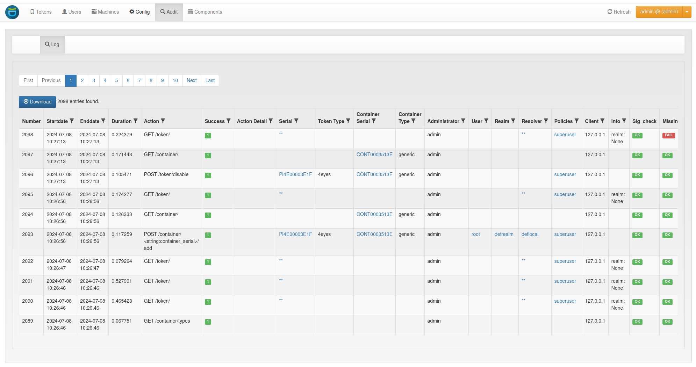

.. index:: Audit
.. _audit:

Audit
=====

The systems provides a sophisticated audit log, which can be viewed in the
WebUI.

   *Audit Log*

privacyIDEA comes with a default SQL audit module (see :ref:`code_audit`).

Starting with version 3.2 privacyIDEA also provides a :ref:`logger_audit` and
a :ref:`container_audit` which can be used to send privacyIDEA audit log messages
to services like splunk or logstash.

.. _sql_audit:

SQL Audit
---------

.. _audit_search:

Searching the audit log
~~~~~~~~~~~~~~~~~~~~~~~

The audit log can be filtered in the WebUI and via the ``GET /audit/`` API by
any audit column (``user``, ``realm``, ``serial``, ``action``, ...). Filter
values are matched as follows:

* ``*`` is the wildcard and matches any sequence of characters. For example,
  ``action=*/token/init`` matches every action ending in ``/token/init`` and
  ``serial=OATH*`` matches every serial starting with ``OATH``.
* All other characters are matched literally. In particular ``%`` and ``_`` are
  *not* wildcards. A value that contains no ``*`` must match the column exactly.
* A leading ``!`` negates the condition, e.g. ``authentication=!CHALLENGE``
  returns the entries whose ``authentication`` is not ``CHALLENGE``.

.. versionchanged:: 3.14 ``*`` is the only wildcard. Earlier versions also
   treated a literal ``%`` as a wildcard in the audit search; now ``%`` and
   ``_`` match literally. Update any saved filters or integrations that relied
   on ``%`` to use ``*`` instead.

.. index:: Audit Log Rotate
.. _audit_rotate:

Cleaning up entries
~~~~~~~~~~~~~~~~~~~

The ``sqlaudit`` module writes audit entries to an SQL database.
For performance reasons the audit module does not remove old audit entries
during the logging process.

But you can set up a cron job to clean up old audit entries. Since version
2.19 audit entries can be either cleaned up based on the number of entries or
based on on the age. Cleaning based on the age takes precedence.

.. versionadded:: 2.22 The ``--chunksize`` parameter allows cleaning up audit
    entries in chunks to avoid exzessive memory usage.

Cleaning based on the number of entries:
^^^^^^^^^^^^^^^^^^^^^^^^^^^^^^^^^^^^^^^^

You can specify a *highwatermark* and a *lowwatermark*. To clean
up the audit log table, you can call :ref:`the pi-manage script <pimanage>` on
the command line::

   pi-manage audit rotate --highwatermark 20000 --lowwatermark 18000

If there are more than 20000 log entries, this will clean up all old log entries, leaving only 18000 log entries.

Cleaning based on the age:
^^^^^^^^^^^^^^^^^^^^^^^^^^

You can specify the number of days, how old an audit entry may be at a max::

   pi-manage audit rotate --age 365

This will delete all audit entries that are older than one year.

.. index:: retention time

Cleaning based on the config file:
^^^^^^^^^^^^^^^^^^^^^^^^^^^^^^^^^^
.. versionadded:: 2.21

Using a config file, you can define different retention times for the audit data.
E.g. this way you can define, that audit entries about token listings can be deleted after
one month,
while the audit information about token creation will only be deleted after ten years.

The config file is in a *YAML* format and looks like this::

    # DELETE auth requests of nils after 10 days
    - rotate: 10
      user: nils
      action: .*/validate/check.*

    # DELETE auth requests of friedrich after 7 days
    - rotate: 7
      user: friedrich
      action: .*/validate/check.*

    # Delete nagios user test auth directly
    - rotate: 0
      user: nagiosuser
      action: POST /validate/check.*

    # Delete token listing after one month
    - rotate: 30
      action: ^GET /token

    # Delete audit logs for token creating after 10 years
    - rotate: 3650
      action: POST /token/init

    # Delete everything else after 6 months
    - rotate: 180
      action: .*

This is a list of rules.
privacyIDEA iterates over *all* audit entries. The first matching rule for an entry wins.
If the rule matches, the audit entry is deleted if the entry is older than the days
specified in "rotate".

If is a good idea to have a *catch-all* rule at the end.

.. note:: The keys "user", "action"... correspond to the column names of the audit table.
   You can use any column name here like "date", "action", "action_detail", "success", "serial", "administrator",
   "user", "realm"... for a complete list, see the model definition here: :class:`privacyidea.models.Audit`.
   You may use Python regular expressions for matching.

You can then add a call like::

   pi-manage audit rotate --config /etc/privacyidea/audit.yaml

in your crontab.

.. note:: The cleaning based on a config file currently does **not** work with
    the ``--chunksize`` parameter. If the audit-table is too big, consider
    cleaning based on the age or number of entries first.

Access rights
~~~~~~~~~~~~~

You may also want to run the cron job with reduced rights. I.e. a user who
has no read access to the original pi.cfg file, since this job does not need
read access to the SECRET or PEPPER in the pi.cfg file.

So you can simply specify a config file with only the content::

   PI_AUDIT_SQL_URI = <your database uri>

Then you can call ``pi-manage`` like this::

   PRIVACYIDEA_CONFIGFILE=/home/cornelius/src/privacyidea/audit.cfg \
   pi-manage audit rotate

This will read the configuration (only the database URI) from the config file
``audit.cfg``.

.. _audit_table_size:

Table size
~~~~~~~~~~

Sometimes the entries to be written to the database may be longer than the
column in the database. You should set::

   PI_AUDIT_SQL_TRUNCATE = True

in the :ref:`config file <cfgfile>`. This will truncate each entry to the
defined column length.

However, if you sill want to add more information to the audit log, you can
increase the column length directly in the database by the usual database means
(i.e. :code:`ALTER TABLE pidea_audit MODIFY user varchar(100);` for MariaDB).
However, privacyIDEA does not know about this and will still truncate the entries
to the originally defined lengths.

To avoid this, you need to tell privacyIDEA about the changes.
In Your :ref:`config file <cfgfile>` add the setting like::

    PI_AUDIT_SQL_COLUMN_LENGTH = {"user": 100,
                                  "policies": 1000}

which will increase truncation of the user column to 100 and the policies
column to 1000. Check the database schema for the available columns
here: :class:`privacyidea.models.Audit`.

.. _logger_audit:

Logger Audit
------------

The *Logger Audit* module can be used to write audit log information to
the Python logging facility and thus write log messages to a plain file,
a syslog daemon, an email address or any destination that is supported
by the Python logging mechanism. The log message passed to the python logging
facility is a JSON-encoded string of the fields of the audit entry.

You can find more information about this in :ref:`advanced_logging`.

To activate the *Logger Audit* module you need to configure the following
settings in your :ref:`pi.cfg <cfgfile>` file::

   PI_AUDIT_MODULE = "privacyidea.lib.auditmodules.loggeraudit"
   PI_AUDIT_SERVERNAME = "your choice"
   PI_LOGCONFIG = "/etc/privacyidea/logging.cfg"

You can optionally set a custom logging name for the logger audit with::

   PI_AUDIT_LOGGER_QUALNAME = "pi-audit"

It defaults to the module name ``privacyidea.lib.auditmodules.loggeraudit``.
In contrast to the :ref:`sql_audit` you *need* a ``PI_LOGCONFIG`` otherwise
the *Logger Audit* will not work correctly.

In the ``logging.cfg`` you then need to define the audit logger::

   [logger_audit]
   handlers=audit
   qualname=privacyidea.lib.auditmodules.loggeraudit
   level=INFO

   [handler_audit]
   class=logging.handlers.RotatingFileHandler
   backupCount=14
   maxBytes=10000000
   formatter=detail
   level=INFO
   args=('/var/log/privacyidea/audit.log',)

Note, that the ``level`` always needs to be *INFO*. In this example, the
audit log will be written to the file ``/var/log/privacyidea/audit.log``.

Finally you need to extend the following settings with the defined audit logger
and audit handler::

   [handlers]
   keys=file,audit

   [loggers]
   keys=root,privacyidea,audit

.. note:: The *Logger Audit* only allows to **write** audit information. It
   can not be used to **read** data. So if you are only using the
   *Audit Logger*, you will not be able to *view* audit information in the
   privacyIDEA Web UI!
   To still be able to *read* audit information, take a look at the
   :ref:`container_audit`.

.. note:: The policies :ref:`policy_auth_max_success`
   and :ref:`policy_auth_max_fail`
   depend on reading the audit log. If you use a non readable audit log
   like the *Logger Audit* these policies will not work.

.. _container_audit:

Container Audit
---------------

The *Container Audit* module is a meta audit module, that can be used to
write audit information to more than one audit module.

It is configured in the ``pi.cfg`` like this::

    PI_AUDIT_MODULE = 'privacyidea.lib.auditmodules.containeraudit'
    PI_AUDIT_CONTAINER_WRITE = ['privacyidea.lib.auditmodules.sqlaudit','privacyidea.lib.auditmodules.loggeraudit']
    PI_AUDIT_CONTAINER_READ = 'privacyidea.lib.auditmodules.sqlaudit'

The key ``PI_AUDIT_CONTAINER_WRITE`` contains a list of audit modules,
to which the audit information should be written. The listed
audit modules need to be configured as mentioned in the corresponding audit
module description.

The key ``PI_AUDIT_CONTAINER_READ`` contains one single audit module, that
is capable of reading information. In this case the :ref:`sql_audit` module can be
used. The :ref:`logger_audit` module can **not** be used for reading!

Using the *Container Audit* module you can on the one hand send audit information
to external services using the :ref:`logger_audit` but also keep the
audit information visible within privacyIDEA using the :ref:`sql_audit` module.

.. index:: Authentication log
.. _authentication_log:

Authentication log
------------------

.. versionadded:: 3.14

Next to the audit log, privacyIDEA keeps an *authentication log*. Every
request that authenticates a user or an administrator writes an entry, which
records how the server decided about that request: the event type, why the
event came out that way, the endpoint that served the request, the user, the
source IP, the client, the token serial and the transaction. Entries that
belong to one logical attempt share an ``attempt_id``, so a triggered
challenge and the response answering it read as one authentication although
they are separate requests.

The log is shown in the WebUI under *Logs -> Authentication Log* and can be
read through the :ref:`rest_authentication_log`. Administrators need the
:ref:`policy_authentication_log_read` action; if that policy is scoped to
realms, resolvers or users, the administrator only sees the entries matching
that scope. The same action in the user scope lets a user read their own
entries.

Event types
~~~~~~~~~~~

Each entry is classified by exactly one event type, e.g. ``LOGIN_SUCCESS``,
``PIN_FAIL``, ``MFA_FAIL``, ``NO_USABLE_TOKEN`` or ``CHALLENGE_TRIGGERED``.
Every event type has one outcome, ``success``, ``failure`` or ``pending``, so
entries can be grouped by result without listing each type: a *pending* event
is an authentication still in flight, e.g. a challenge that was sent and not
yet answered.

``GET /authenticationlog/eventtypes`` returns every event type with its
outcome, and the WebUI builds its filter from that list.

Why an event happened
~~~~~~~~~~~~~~~~~~~~~

The event type says *what* happened to a request, and several different causes
share one event type. ``NO_USABLE_TOKEN`` is the clearest case: it is the same
event whether every token of the user is disabled, past its failcounter,
outside its validity period or not fully enrolled, which are four findings
calling for four different reactions. Each entry therefore also carries a
*reason*, a short value that can be filtered on like the event type. The
reasons fall into four groups:

* **The state of a token**, e.g. ``TOKEN_DISABLED``, ``TOKEN_REVOKED``,
  ``TOKEN_FAILCOUNT_EXCEEDED`` or ``TOKEN_OUTSIDE_VALIDITY_PERIOD``.
* **A policy** refusing an otherwise valid authentication, e.g.
  ``AUTHORIZATION_POLICY``, ``AUTH_MAX_FAIL`` or ``LAST_AUTH_TOO_OLD``.
* **The credentials**, e.g. ``WRONG_USERSTORE_PASSWORD``, ``WRONG_TOKEN_PIN``
  or ``WRONG_OTP``.
* **Challenge-response**, e.g. ``CHALLENGE_WRONG_RESPONSE``,
  ``CHALLENGE_EXPIRED`` or ``CHALLENGE_DECLINED_ON_DEVICE``.

``GET /authenticationlog/reasons`` returns every defined reason, and the
*Reason* column filter in the WebUI offers the same list.

Only a failed or denied authentication carries a reason. A success needs none,
and a request still in flight has nothing to explain yet. The column is also
empty when nothing classified a cause, so an empty reason means *not
classified*, not *no cause*.

One entry, one reason
^^^^^^^^^^^^^^^^^^^^^

A request is checked against every token of the user, and those tokens can
fail for different reasons. The entry names the most informative one, by a
fixed precedence:

* A policy decision outranks any token state, because it applies whatever the
  tokens look like.
* A permanent token state (revoked) outranks a transient one (a failcounter,
  which a reset clears).
* A wrong credential ranks below every state, since the state is what made the
  credential moot.

The reduction loses nothing: the *Info* column of the entry (``other_info`` in
the API) keeps the finding of every token under ``reason_detail.reasons``,
keyed by serial, and the names of the policies that decided under
``reason_detail.policies``.

.. note::

   ``CHALLENGE_EXPIRED`` tells a timeout apart from a wrong answer: the user
   answered correctly, only too late. Recognizing it depends on the lapsed
   challenge still being readable, which is best-effort. Stored in the
   database, a challenge stays until the janitor removes it; cached in Redis
   (``PI_REDIS_CACHE_CHALLENGES``), the key expires shortly after the
   challenge validity, so an answer arriving much later finds nothing and is
   recorded as ``CHALLENGE_UNKNOWN_TRANSACTION``.

Which endpoint served the request
~~~~~~~~~~~~~~~~~~~~~~~~~~~~~~~~~

Each entry records the endpoint the request authenticated against, as its
request path:

* ``/auth`` - the login of a user or an administrator, e.g. from the WebUI.
* ``/validate/check`` and ``/validate/radiuscheck`` - an authentication by an
  application or a RADIUS client.
* ``/validate/triggerchallenge`` - a challenge triggered by an administrator.
* ``/validate/initialize`` - the anonymous bootstrap of a FIDO2/passkey
  challenge before login.
* ``/ttype/push`` - a push challenge answered on the smartphone, which reaches
  the server out of band.

The column is empty for an event recorded outside a request, e.g. from the
command line. The same value is what an ``Endpoint`` condition of a
conditional-access policy is matched against, so a lockout policy can be
limited to the endpoints it should watch, e.g. counting the failed
authentications of an application without counting WebUI logins.

Searching the authentication log
~~~~~~~~~~~~~~~~~~~~~~~~~~~~~~~~

In the WebUI the filters are set through the column headers. The same filters
are available on ``GET /authenticationlog/`` (see
:ref:`rest_authentication_log`), where every filter parameter is plural and
takes a comma-separated list of values. An entry matches when it equals any of
them::

   GET /authenticationlog/?event_types=NO_USABLE_TOKEN&reasons=TOKEN_FAILCOUNT_EXCEEDED
   GET /authenticationlog/?endpoints=/validate/check,/validate/radiuscheck

Filter values are matched as follows:

* ``*`` is the wildcard and matches any sequence of characters, e.g.
  ``serials=TOTP*``. A value containing a ``*`` always matches
  case-insensitively.
* All other characters are matched literally, ``%`` and ``_`` included. A value
  without a ``*`` must match the column exactly, case-sensitively unless
  ``case_insensitive`` is passed.

.. index:: retention time

Cleaning up entries
~~~~~~~~~~~~~~~~~~~

The authentication log grows with every authentication and is never pruned
during logging. To enforce a retention period, call :ref:`the pi-manage script
<pimanage>` from a cron job::

   pi-manage authlog cleanup --age 365

This deletes every entry older than one year. ``--chunksize`` deletes in
chunks to avoid long transactions on a large table, and ``--dryrun`` only
reports how many entries the run would delete.
