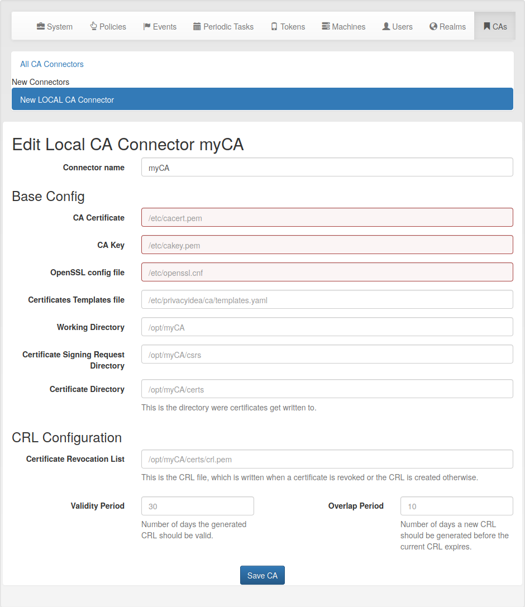
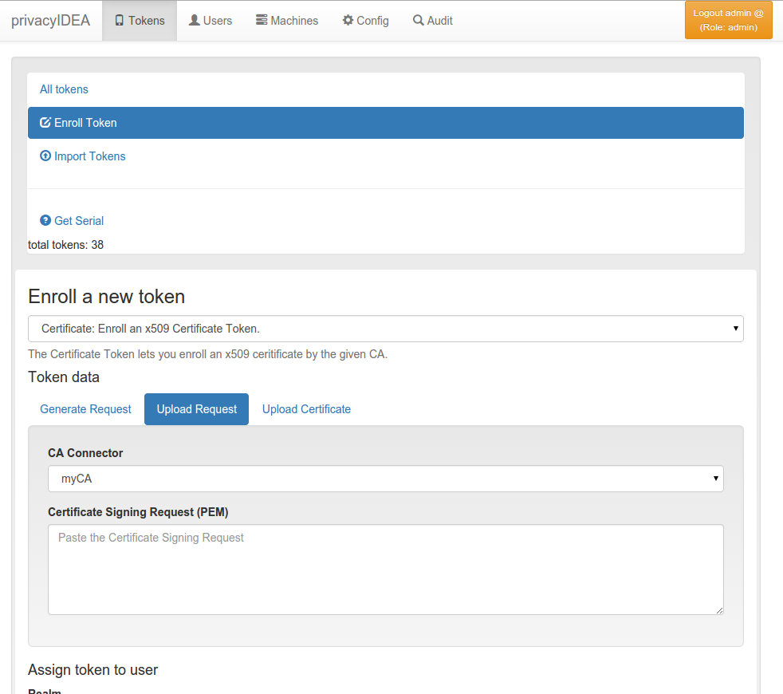

.. _caconnectors:

CA Connectors
-------------

.. index:: caconnectors, CA, Certificate Authority, certificate token

You can use privacyIDEA to enroll certificates and assign certificates to users.

You can define connections to Certifacte Authorities, that are used when
enrolling certificates.

.. _fig_caconnector:

   *A local CA definition*

When you enroll a Token of type *certificate* the Certificate Signing Request
gets signed by one of the CAs attached to privacyIDEA by the CA connectors.

The first CA connector that ships with privacyIDEA is a connector to a local
openSSL based Certificate Authority as shown in figure :ref:`fig_caconnector`.

When enrolling a certificate token you can choose, which CA should sign the
certificate request.

   *Enrolling a certificate token*

.. _local_caconnector:

Local CA Connector
~~~~~~~~~~~~~~~~~~

.. index:: openssl

The local CA connector calls a local openssl configuration.

Starting with privacyIDEA version 2.12 an example *openssl.cnf* is provided in
*/etc/privacyidea/CA/openssl.cnf*.

.. note:: This configuration and also this
   description is ment to be as an example. When setting up a productive CA, you
   should ask a PKI consultant for assistance.

Manual Setup
............

1. Modify the parameters in the file */etc/privacyidea/CA/openssl.cnf* according
   to your needs.

2. Create your CA certificate::

       openssl req -days 1500 -new -x509 -keyout /etc/privacyidea/CA/ca.key \
                   -out /etc/privacyidea/CA/ca.crt \
                   -config /etc/privacyidea/CA/openssl.cnf

       chmod 0600 /etc/privacyidea/CA/ca.key
       touch /etc/privacyidea/CA/index.txt
       echo 01 > /etc/privacyidea/CA/serial
       chown -R privacyidea /etc/privacyIDEA/CA

3. Now set up a local CA connector within privacyIDEA with the directory
   */etc/privacyidea/CA* and the files accordingly.

Easy Setup
..........

Starting with privacyIDEA version 2.18 it gets easier to setup local CAs.

You can use the :ref:`pi-manage` tool to setup a new CA like this:

   pi-manage ca create myCA

This will ask you for all necessary parameters for the CA and then automatically

1. Create the files for this new CA and
2. Create the CA connector in privacyIDEA.

Management
..........

There are different ways to enroll a certificate token. See :ref:`certificates`.

When an administrator *revokes* a certificate token, the certificate is
revoked and a CRL is created.

.. note:: privacyIDEA does not create the CRL regularly. The CRL usually has a
   validity period of 30 days. I.e. you need to create the CRL on a regular
   basis. You can use openssl to do so or the pi-manage command.

Starting with version 2.18 the pi-manage command has an additional
sub-command ``ca``:

    pi-manage ca list

lists all configured *CA connectors*. You can use the *-v* switch to get more
information.

You can create a new CRL with the command:

    pi-manage ca create_crl <CA name>

This command will check the *overlap period* and only create a new CRL if it
is necessary. If you want to force the creation of the CRL, you can use the
switch *-f*.

For more information on pi-manage see :ref:`pimanage`.

Templates
.........

.. index:: Certificate Templates

The *local CA* supports a kind of certificate templates. These "templates"
are predefined combinations of *extensions* and *validity days*, as they are
passed to openssl via the parameters ``-extensions`` and ``-days``.

This way the administrator can define certificate templates with certain
X.509 extensions like keyUsage, extendedKeyUsage, CDPs or AIAs and
certificate validity periods.

The extensions are defined in YAML file and the location of this file is
added to the CA connector definition.

The file can look like this, defining three templates "user", "webserver" and
"template3":

    user:
        days: 365
        extensions: "user"
    webserver:
        days: 750
        extensions: "server"
    template3:
        days: 10
        extensions: "user"

