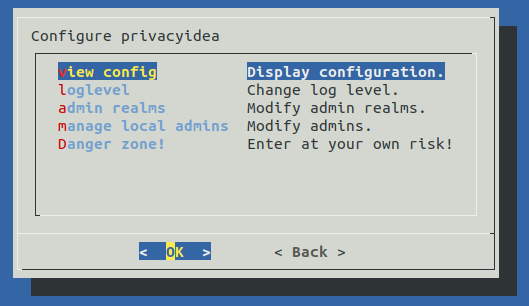
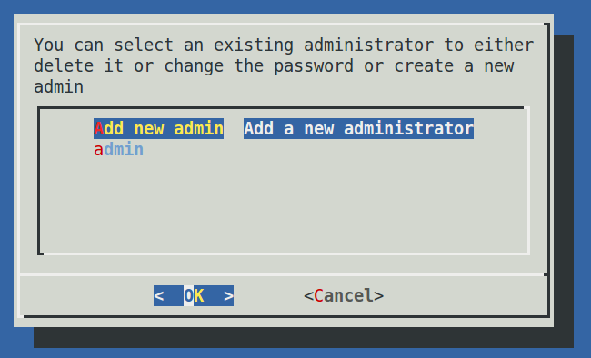
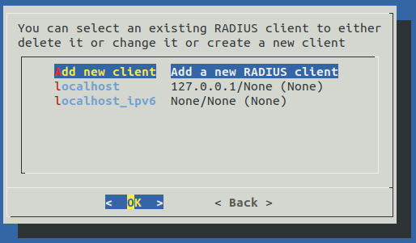
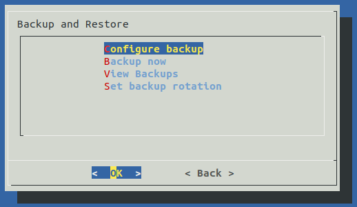
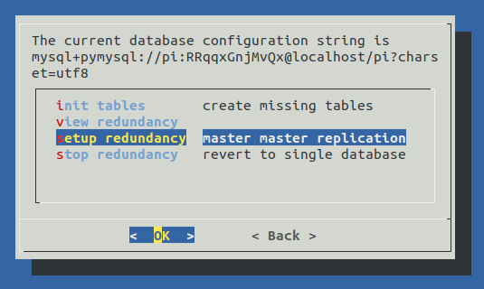
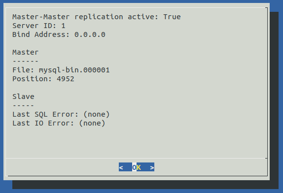

.. _privacyidea-appliance:

privacyIDEA Appliance
---------------------

.. index:: appliance, setup tool

privacyIDEA offers an appliance tool to manage your token administrators, RADIUS clients and
also setup MySQL master-master replication.
It can be found in a Github repository [#applianceGithub]_.

This tool is supposed to run on Ubuntu 16.04 LTS or 18.04 LTS.
You can find a ready install ISO at another Github reposity [#applianceISO]_.

.. note:: The ready made Ubuntu package for the appliance tool is only available with a Service Level Agreement from
   the company NetKnights [#applianceNetKnights]_.

To configure the system, login as the user root on your machine and
run the command::

   pi-appliance

This will bring you to this start screen.

.. figure:: images/appliance/start-screen.png
   :scale: 80 %

   Start screen of the appliance setup tool.

You can configure privacyidea settings, the log level, administrators, encryption key and
much more. You can configure the webserver settings and RADIUS clients.

   Configure privacyidea

   You can create new token administrators, delete them and change
   their passwords.

   In the FreeRADIUS settings you can create and delete RADIUS
   clients.

All changes done in this setup tool are directly read from and written to the
corresponding configuration files. The setup tool parses the original nginx
and freeradius configuration files. So there is no additional place where this
data is kept.

.. note:: You can also edit the clients.conf and other configuration files
   manually. The setup tool will also read those manual changes!

.. _backup_and_restore:

Backup and Restore
..................

.. index:: Backup, Restore

Starting with version 1.5 the setup tool also supports backup and 
restore. Backups are written to the directory `/var/lib/privacyidea/backup`.

The backup contains all privacyIDEA configuration, the contents of
the directory `/etc/privacyidea`, the encryption key, the configured
administrators, the complete token database (MySQL) and Audit log. 
Furthermore if you are running FreeRADIUS the backup also contains
the `/etc/freeradius/clients.conf` file.

Schedulded backup
~~~~~~~~~~~~~~~~~

At the configuration point *Configure Backup* you can define times
when a scheduled backup should be performed. This information is
written to the file `/etc/crontab`.

.. figure:: images/appliance/backup2.png
   :width: 400px

   Scheduled backup

You can enter minutes, hours, day of month, month and day of week.
If the entry should be valid for each e.g. month or hour, you need
to enter a '*'.

In this example the `10 17 * * *` (minute=10, hour=17)
means to perform a backup each day
and each month at 17:10 (5:10pm).

The example `1 10 1 * *` (minute=1, hour=10, day of month=1) means
to perform a backup on the first day of each month at 10:01 am.

Thus you could also perform backups only once a week at the weekend.

Immediate backup
~~~~~~~~~~~~~~~~

If you want to run a backup right now you can choose the entry
`Backup now`.

Restore
~~~~~~~

The entry `View Backups` will list all the backups available.

.. figure:: images/appliance/backup3.png
   :width: 550px

   All available backups

You can select a backup and you are asked if you want to restore the data. 

.. warning:: Existing data is overwritten and will be lost.

.. _database:

Database: Setup Redundancy
..........................

The appliance-tool is also capable of setting up a redundant setup between
two privacyIDEA nodes. For the setup, the privacyIDEA slave instance has to
be setup and running with identical software than the master instance. The
appliance-tool can use a tinc-tunnel to share the configuration and the database.

.. note:: If you choose to use the tinc VPN connection between
   the nodes and an SSH root login make sure the services are installed.

.. warning:: Existing data on the second node is overwritten and will be lost.

.. _pi-appliance_updates:

Updates
.......

In this menu, you can setup cronjobs for automatic updates which is seldom
used in productive setups.

.. _pi-appliance_audit:

Audit Rotation
..............

In the `Audit Rotation` menu, you can setup cronjobs for the audit rotation conditioned
by age or the number of entries. The syntax follows the crontab syntax as explained
in :ref:`backup_and_restore`.

.. note:: Keep in mind that the audit log is synchronized between the nodes in a redundant
   setup. Therefore an audit log rotation is only nessesary on one node.

.. [#applianceGithub] https://github.com/NetKnights-GmbH/privacyidea-appliance
.. [#applianceISO] https://github.com/NetKnights-GmbH/privacyidea-appliance-iso
.. [#applianceNetKnights] https://netknights.it/en/produkte/privacyidea/