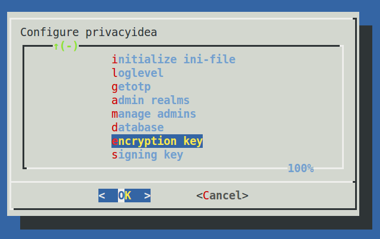

.. _privacyidea-setup:

privacyIDEA setup tool
----------------------

Starting with 1.3.3 privacyIDEA comes with a graphical setup tool 
to manage your token administrators and RADIUS clients.
Thus you will get a kind of appliance experience.
To install all necessary components read :ref:`appliance`.

To configure the system, login as the user root on your machine and
run the command::

   privacyidea-setup-tui

This will bring you to this start screen.

.. figure:: appliance/start-screen.png
   :scale: 50 %

   Start screen of the appliance setup tool.

You can configure privacyidea settings, the log level, administrators, encryption key and
much more. You can configure the webserver settings and RADIUS clients.

   Configure privacyidea

.. figure:: appliance/manage-admins.png
   :scale: 40 %   

   You can create new token administrators, delete them and change
   their passwords.

.. figure:: appliance/manage-radius-clients.png
   :scale: 40 %   

   In the FreeRADIUS settings you can create and delete RADIUS
   clients.

All changes done in this setup tool are directly read from and written to the
corresponding configuration files. The setup tool parses the original nginx
and freeradius configuration files. So there is no additional place where this
data is kept.

.. note:: You can also edit the clients.conf and other configuration files
   manually. The setup tool will also read those manual changes!

