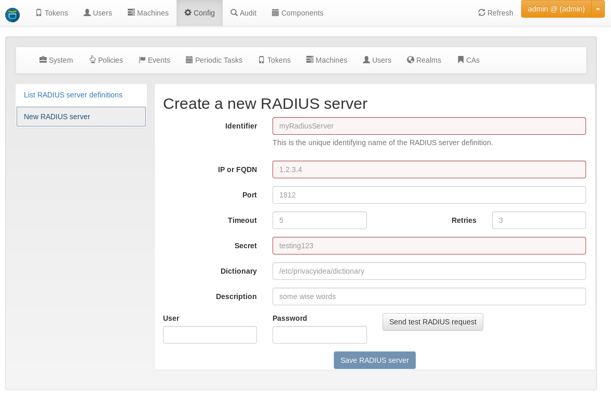

.. _radiusserver:

RADIUS server configuration
---------------------------

.. index:: RADIUS server

At *config->system->RADIUS servers* the administrator
can configure a RADIUS servers to which privacyIDEA can forward authentication requests.

These RADIUS servers can be used with :ref:`RADIUS tokens <radius_token>`
and in the :ref:`Passthru Policy <passthru_policy>`.

.. note:: This is meant for outgoing RADIUS requests, not for incoming RADIUS requests!
   To receive RADIUS requests you need to install
   the :ref:`privacyIDEA FreeRADIUS plugin <rlm_perl>`.

.. figure:: images/radius-server-chain.png
   :width: 700

   *privacyIDEA can reveice incoming RADIUS requests and send outgoing RADIUS requests.*
