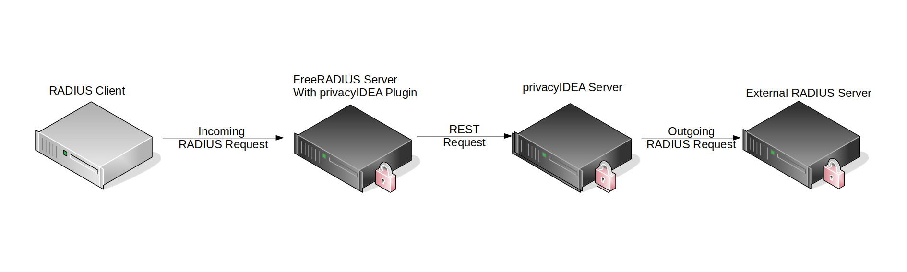

.. _radiusserver:

RADIUS server configuration
---------------------------

.. index:: RADIUS server

At *config->system->RADIUS servers* the administrator
can configure to which RADIUS servers privacyIDEA can forward authentication requests.
These RADIUS servers can be used with :ref:`RADIUS tokens <radius_token>`
and in the :ref:`Passthru Policy <passthru_policy>`.

.. note:: This is ment for outgoing RADIUS requests, not for incoming RADIUS requests!
   To receive RADIUS requests you need to install
   the :ref:`privacyIDEA FreeRADIUS plugin <rlm_perl>`.

   *privacyIDEA can reveice incoming RADIUS requests and send outgoing RADIUS requests.*
