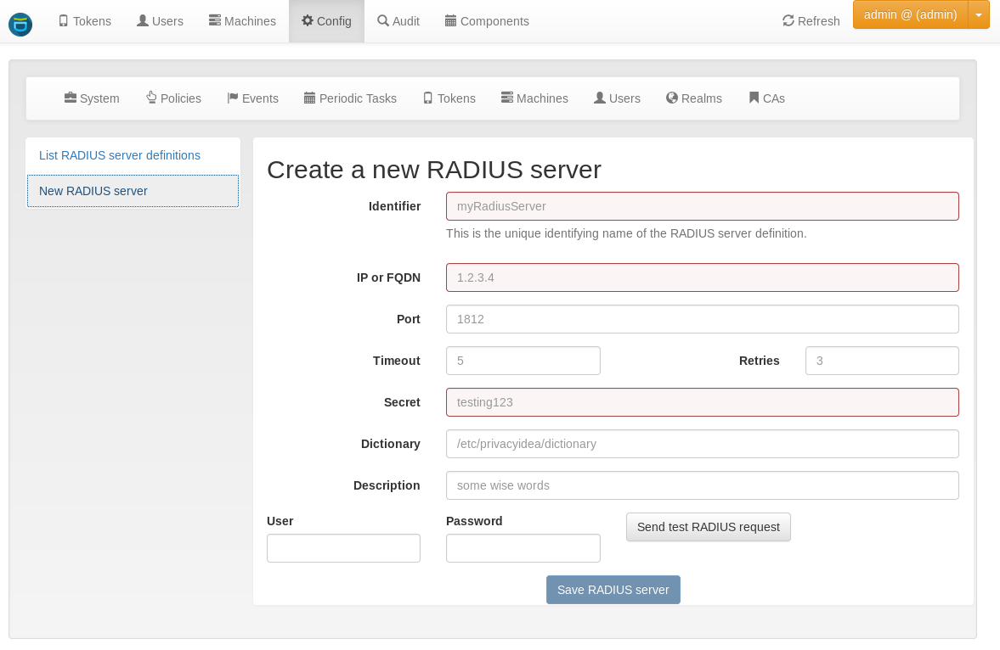
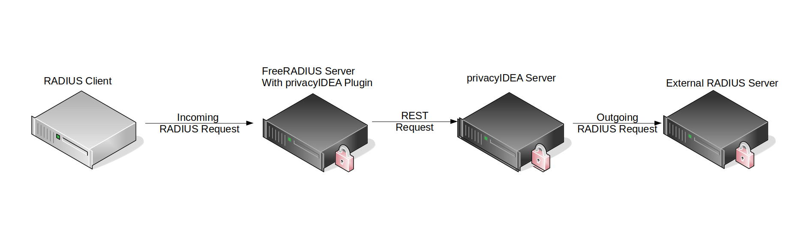

.. _radiusserver_config:

RADIUS server configuration
---------------------------

.. index:: RADIUS server

At *External Services -> RADIUS Servers* the administrator
can configure RADIUS servers to which privacyIDEA can forward authentication requests.

A RADIUS server definition has a unique *Identifier*, the *Server* (host name or IP
address) and *Port* (default 1812), the shared *Secret*, the *Dictionary* file on the
privacyIDEA server (default ``/etc/privacyidea/dictionary``), the *Timeout* per attempt in
seconds (default 5), the number of *Retries* (default 3), a *Description*, and
*Require Message-Authenticator*.

With *Require Message-Authenticator*, privacyIDEA adds a Message-Authenticator to its
requests and rejects a response without a valid one.

These RADIUS servers can be used with :ref:`RADIUS tokens <radius_token>`
and in the :ref:`Passthru Policy <passthru_policy>`.

.. note:: This is meant for outgoing RADIUS requests, not for incoming RADIUS requests!
   To receive RADIUS requests you need to install
   the :ref:`privacyIDEA FreeRADIUS plugin <rlm_perl>`.

   *privacyIDEA can receive incoming RADIUS requests and send outgoing RADIUS requests.*
