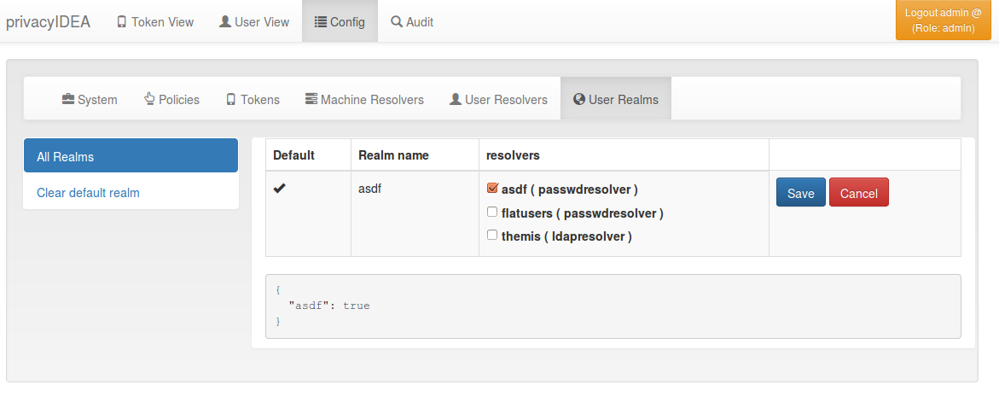
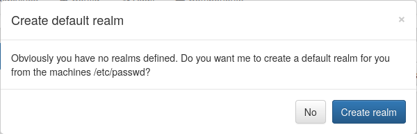

.. _realms:

Realms
------

.. index:: realms, default realm

Users need to be in realms to have tokens assigned. A user, who is not
member of a realm can not have a token assigned and can not authenticate.

You can combine several different UserIdResolvers (see :ref:`useridresolvers`)
into a realm.
The system knows one default realm. Users within this default realm can 
authenticate with their username.

Users in realms, that are not the default realm, need to be additionally identified.
Therefor the users need to authenticate with their username and the realm like this::
   
   user@realm

.. _relate_realm:

Relate User to a Realm
......................

.. index:: realm relation

There are several options to relate a user to a specific realm during
authentication. Usually, if only a login name is given, the user will be
searched in the default realm.

If a *realm* parameter is given in a :ref:`/auth<rest_auth>` or
:ref:`/validate/check<rest_validate>` request, it supersedes a possible
:ref:`split<splitatsign>` realm.

The following table shows different combinations of *user(name)*-parameter
and *realm*-parameter. Depending on the :ref:`splitatsign`-setting, this shows
in which realm the user will be searched:

=============  =======  ========================  ========================
  Input parameter       :ref:`splitatsign`-setting
----------------------  --------------------------------------------------
user(name)     realm    true                      false
=============  =======  ========================  ========================
user           --       user ➔ defrealm           user ➔ defrealm
user           realm1   user ➔ realm1             user ➔ realm1
user           unknown  --                        --
user\@realm1   --       user ➔ realm1             user\@realm1 ➔ defrealm
user\@realm1   realm1   user ➔ realm1             user\@realm1 ➔ realm1
user\@realm1   realm2   user ➔ realm2             user\@realm1 ➔ realm2
user\@realm2   realm1   user ➔ realm1             user\@realm2 ➔ realm1
user\@realm1   unknown  --                        --
user\@unknown  --       user\@unknown ➔ defrealm  user\@unknown ➔ defrealm
user\@unknown  realm1   user\@unknown ➔ realm1    user\@unknown ➔ realm1
user\@unknown  unknown  --                        --
=============  =======  ========================  ========================

.. note::
    Be aware that if the :ref:`splitatsign`-setting is *true*, a *realm*
    parameter is given **and** a user name with an *@*-sign is given where the
    part after the *@* denotes a valid realm, the *realm* parameter will take
    precedence.

.. _list_of_realms:

List of Realms
..............

The realms dialog gives you a list of the already defined realms.

It shows the name of the realms, whether it is the default realm and
the names of the resolvers, that are combined to this realm.

You can delete or edit an existing realm or create a new realm.

.. _edit_realm:

Edit Realm
..........

.. index:: realm edit

Each realm has to have a unique name. The name of the realm is 
case insensitive. If you create a new realm with the same name
like an existing realm, the existing realm gets overwritten.

If you click *Edit Realm* you can select which userresolver should be
contained in this realm. A realm can contain several resolvers.

   *Edit a realm*

.. _resolver_priority:

Resolver Priority
.................

.. index:: resolver priority

Within a realm you can give each resolver a priority. The priority is used to
find a user that is located in several resolvers. If a user is located in
more than one resolver, the user will be taken from the resolver with the
lowest number in the priority.

Priorities are numbers between 1 and 999. The lower the number the higher the
priority.

**Example**:

A user "administrator" is located in a resolver "users" which contains all
Active Directory users. And the "administrator" is located in a resolver
"admins", which contains all users in the Security Group "Domain
Admins" from the very same domain. Both resolvers are in the realm
"AD", "admins" with priority 1 and "users" with priority 2.

Thus the user "administrator@AD" will always resolve to the user located in
resolver "admins".

This is useful to create policies for the security group "Domain
Admins".

.. note:: A resolver has a priority per realm. I.e. a resolver can have a
   different priority in each realm.

.. _autocreate_realm:

Autocreate Realm
................

.. index:: realm autocreation

If you have a fresh installation, no resolver and no realm is
defined. To get you up and running faster, the system
will ask you, if it should create the first realm for you.

If you answer "yes", it will create a resolver named "deflocal"
that contains all users from /etc/passwd and a realm named
"defrealm" with this very resolver.

Thus you can immediately start assigning and enrolling tokens.

If you check "Do not ask again" this will be stored in 
a cookie in your browser.

.. note:: The realm "defrealm" will be the default realm. 
   So if you create a new realm manually and want this new
   realm to be the default realm, you need to set this new
   realm to be default manually.
