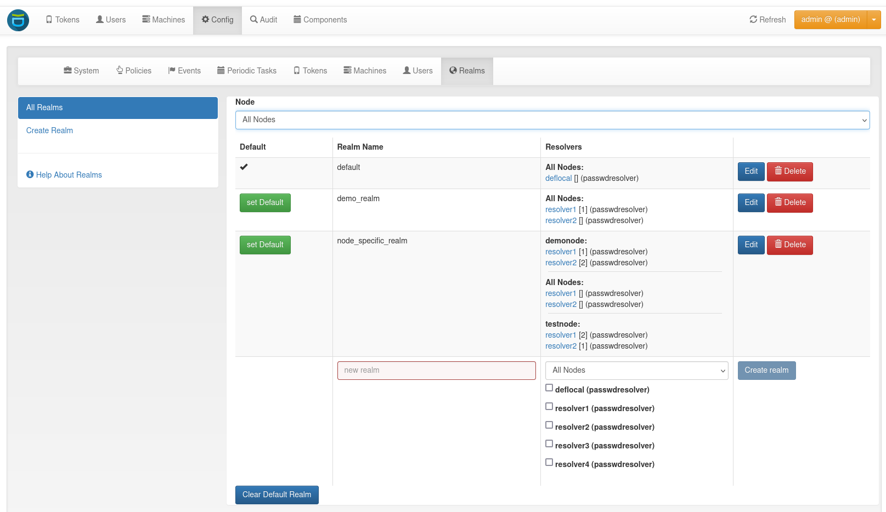
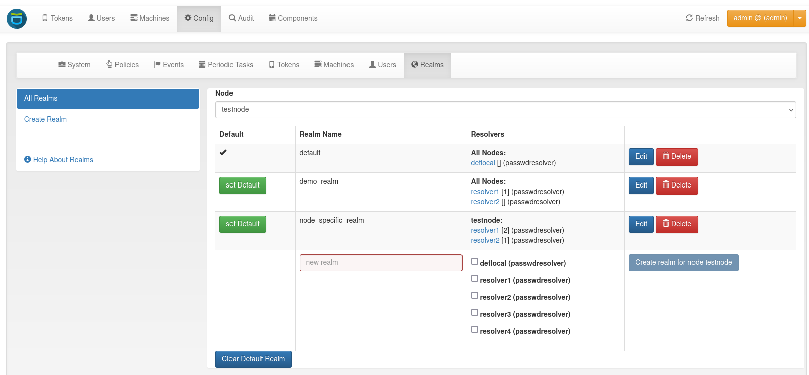
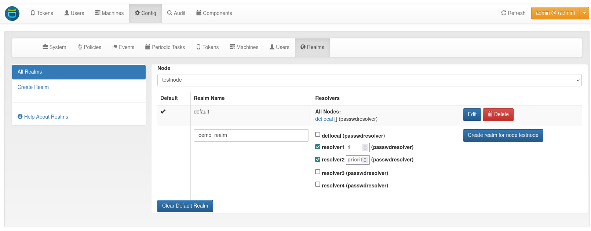
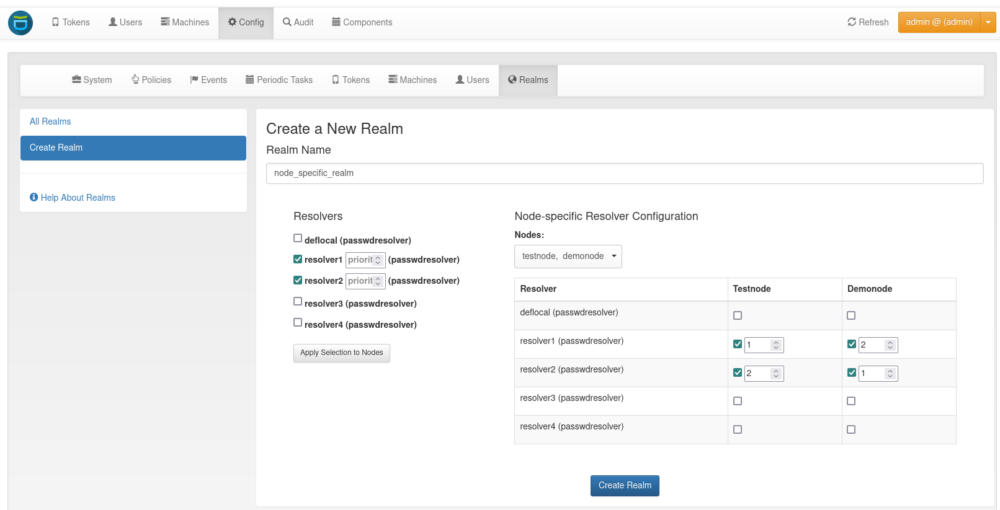
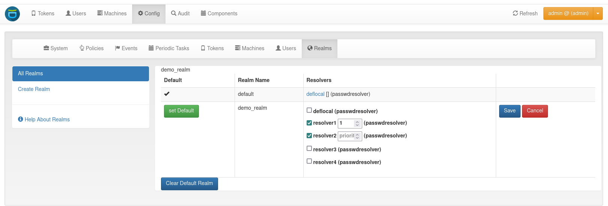
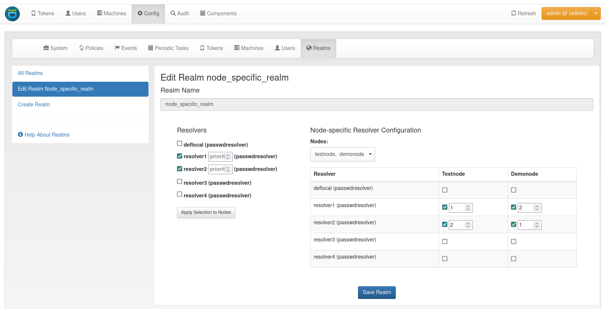
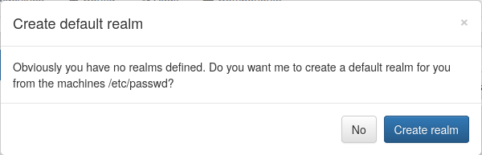

.. _realms:

Realms
------

.. index:: realms, default realm

Users need to be in realms to have tokens assigned. A user who is not
a member of a realm cannot have a token assigned and cannot authenticate.

You can combine several different UserIdResolvers (see :ref:`useridresolvers`)
into a realm.
The system knows one default realm. Users within this default realm can
authenticate with their username.

Users in realms that are not the default realm need to be additionally identified.
Therefore, the users need to authenticate with their username and the realm like this::

   user@realm

.. _user_parameters_in_request:

Users and Realms in a request
.............................

When a request is processed, the given parameters are evaluated and a user object is created within the request.
If the user object cannot be created, a User Error E904 is returned.

However, privacyIDEA can modify the given user related parameters and modify the user object.

You can use the policy :ref:`policy_set_realm` in the scope authentication if you want to set the realm to a specific
value. It is evaluated *before* the parameters are evaluated to a user object.

The other possibilities change the user *after* the user object has been initially created from the given parameters:

You can use the policy :ref:`policy_mangle` in the scope authentication if you want to set the realm, the username
or even the password. In this case you can use regular expressions to modify these values, and the user object is
created again from the modified values.

The pre event handler :ref:`requestmanglerhandler` can modify user parameters in the request as well. The user object
is only created again from the modified parameters if its option *reset_user* is checked.

The policy :ref:`policy_setrealm` from the scope authorization sets the realm of the user object.

.. _relate_realm:

Relate User to a Realm
......................

.. index:: realm relation

There are several options to relate a user to a specific realm during
authentication. Usually, if only a login name is given, the user will be
searched in the default realm, indicated with ``defrealm`` in the mapping table below.

If a *realm* parameter is given in a :ref:`/auth<rest_auth>` or
:ref:`/validate/check<rest_validate>` request, it supersedes a possible
:ref:`split<splitatsign>` realm.

The following table shows different combinations of *user(name)*-parameter
and *realm*-parameter. Depending on the :ref:`splitatsign`-setting, the
following table shows in which realm the user will be searched.

=============  =======  ========================  ========================
  Input parameter       :ref:`splitatsign`-setting
----------------------  --------------------------------------------------
user(name)     realm    true                      false
=============  =======  ========================  ========================
user           --       user ➔ defrealm           user ➔ defrealm
user           realm1   user ➔ realm1             user ➔ realm1
user           unknown  --                        --
user\@realm1   --       user ➔ realm1             user\@realm1 ➔ defrealm
user\@realm1   realm1   user ➔ realm1             user\@realm1 ➔ realm1
user\@realm1   realm2   user ➔ realm2             user\@realm1 ➔ realm2
user\@realm2   realm1   user ➔ realm1             user\@realm2 ➔ realm1
user\@realm1   unknown  --                        --
user\@unknown  --       user\@unknown ➔ defrealm  user\@unknown ➔ defrealm
user\@unknown  realm1   user\@unknown ➔ realm1    user\@unknown ➔ realm1
user\@unknown  unknown  --                        --
=============  =======  ========================  ========================

.. note::
    Be aware that if the :ref:`splitatsign`-setting is *true*, a *realm*
    parameter is given **and** a user name with an *@*-sign is given where the
    part after the *@* denotes a valid realm, the *realm* parameter will take
    precedence.

.. note::
    With :ref:`splitatsign` *true*, a login name of the form ``realm1\user``
    (without *@*) is split as well, and the user is searched in the realm
    ``realm1``. With :ref:`splitatsign` *false* the whole name is searched in
    the default realm.

.. _list_of_realms:

List of Realms
..............

The realm list at *Users -> Realms* shows the already defined realms.

It shows the name of the realms, whether it is the default realm and
the names of the resolvers that are combined to this realm.

If multiple nodes exist, you can display the realms for each node by selecting the node from the *Node* drop-down menu.
By default all nodes are selected.
The resolvers of each node are displayed below the node name.
The resolvers in the realm that are not assigned to a node are displayed under *All nodes*.

   *Realm list of all nodes*

Selecting a specific node lists only the realms that have at least one resolver assigned to that node; for these
realms all resolvers are still shown, grouped by *All nodes* and by node. A realm that only has resolvers under *All
nodes* is not listed for the node, although the node uses it: a node uses the resolvers under *All nodes* together with
the resolvers assigned to it.

   *Realm list of testnode*

A node lists and manages the tokens of the users it serves: the tokens whose owner belongs to a resolver the node
uses in a realm, and the tokens without an owner. The tokens of users that only other nodes serve are left out. A
token whose owner belongs to a resolver that is in no realm at all, e.g. because the resolver was deleted, belongs to
no node and is listed on every node, so that it can still be found and deleted. The token janitor finds such tokens
as orphaned, see :ref:`cleanup_jobs`.

You can delete or edit an existing realm or create a new realm.

.. _create_realm:

Create Realm
............

.. index:: realm create

A new realm can be created directly in the realm list, in the row below the existing realms.

Each realm has to have a unique name. The name of the realm is
case insensitive. If you create a new realm with the same name
as an existing realm, the existing realm gets overwritten.

Select the resolvers of the realm. Optionally, a priority can be set for each resolver. A realm without resolvers can be
created as well, but it contains no users.

If multiple nodes exist, you can select the resolvers and their priorities separately for each node. The resolvers
selected under *All nodes* are not node specific, and these settings will be applied to all nodes.

   *Create a realm on the list page*

In the previous WebUI, navigate to the *Create Realm* page in the sidebar menu for more advanced node-specific settings.
A unique realm name is required and resolvers applicable for all nodes can be selected.
Additionally, multiple nodes can be selected from the drop down menu. All selected nodes appear in the table where the
resolvers and priorities can be selected individually for each node.
Another option is to select non-node specific resolvers and click *Apply Selection to Nodes* to select the selected
resolvers and priorities for all nodes. This can be useful if only the priority differs between nodes.

   *Create a node-specific realm on the create page*

.. _edit_realm:

Edit Realm
..........

.. index:: realm edit

In the realm list, you can click *Edit realm* to edit an existing realm.
The resolvers and priorities can be selected in place, for each node separately. A realm can contain several resolvers.

   *Edit a realm directly in the realm list*

In the previous WebUI, if multiple nodes exist, you are forwarded to an edit page, similar to the create page, where
you can edit the realm for each node.

   *Edit a realm on a separate page*

.. _resolver_priority:

Resolver Priority
.................

.. index:: resolver priority

Within a realm you can give each resolver a priority. The priority determines
the order in which resolvers are searched when looking up a user.
If a user with the same login name exists in more than one resolver, the user
will be taken from the resolver with the lowest priority number (i.e. the
highest priority).

Priorities are numbers between 1 and 999. The lower the number the higher the
priority. If no priority is set, the resolver defaults to priority 1000.

If two resolvers share the same priority, they are ordered alphabetically by
resolver name. To avoid ambiguity, it is recommended to assign a distinct
priority to each resolver.

.. note:: A resolver has a priority per realm. I.e. the same resolver can have
   a different priority in each realm it belongs to.

User Masking
^^^^^^^^^^^^

When a realm contains multiple resolvers, the resolver priority determines
which users are visible. If a user with the same login name exists in more
than one resolver, only the user from the highest-priority resolver is
visible. The user in the lower-priority resolver is **masked** (hidden).

This affects:

* **Authentication**: The user always authenticates against the
  highest-priority resolver.
* **User list**: The user list (in the WebUI and via the API) only shows
  the user from the highest-priority resolver. The duplicate in the
  lower-priority resolver is suppressed.
* **Policies**: By default, policies only match the resolver where the
  user was found (the highest-priority one). See the ``check_all_resolvers``
  option in :ref:`policies` to also match lower-priority resolvers.

**Example**:

A user "administrator" is located in a resolver "users" which contains all
Active Directory users. And the "administrator" is located in a resolver
"admins", which contains all users in the Security Group "Domain
Admins" from the very same domain. Both resolvers are in the realm
"AD", "admins" with priority 1 and "users" with priority 2.

The user "administrator@AD" will always resolve to the user in resolver
"admins". The duplicate entry in "users" is masked and will not appear in the
user list. This is useful to create separate policies for members of the
security group "Domain Admins".

.. _autocreate_realm:

Autocreate Realm
................

.. index:: realm autocreation

If you have a fresh installation, no resolver and no realm is
defined. To get you up and running faster, the previous WebUI
asks you whether it should create the first realm for you.
The current WebUI does not offer this.

If you select *Create Realm*, it will create a resolver named ``deflocal``
that contains all users from ``/etc/passwd`` and a realm named
``defrealm`` with this very resolver.

Thus you can immediately start assigning and enrolling tokens.

The dialog is shown at each administrator login as long as no realm
exists.

.. note:: The realm ``defrealm`` will be the default realm.
   So if you create a new realm manually and want this new
   realm to be the default realm, you need to set this new
   realm to be default manually.
