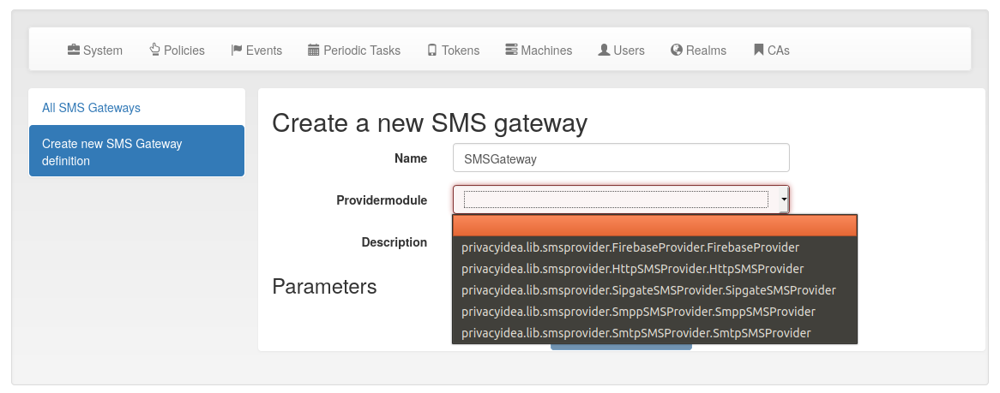

.. _sms_gateway_config:

SMS Gateway configuration
-------------------------

.. index:: SMS Gateway, SMS Provider

You can centrally define SMS gateways that can be used to send SMS with :ref:`sms_token`
or to use the SMS gateway for sending notifications.

There are different providers (gateways) to deliver SMS.

.. _firebase_provider:

Firebase Provider
~~~~~~~~~~~~~~~~~

The Firebase provider was added in privacyIDEA 3.0. It sends notifications
via the Google Firebase service and this is used for the :ref:`push_token`.
For an exemplary configuration, you may have a look on the articles on the
privacyIDEA community website `tagged with push token <https://www.privacyidea.org/tag/push-token/>`_.

**JSON config file**

   This is the location of the configuration file of
   the Firebase service. It has to be located on the privacyIDEA
   server.

You can get the necessary *JSON config file*, from your Firebase console.
The default PUSH authenticator App (privacyIDEA Authenticator) which you can
find in Google Play Store and Apple App Store uses a Firebase project, that is
managed by the company NetKnights.
You need to get an SLA to receive a JSON config file for accessing the project.

HTTP provider
~~~~~~~~~~~~~

.. index:: HTTP Provider

The HTTP provider can be used for any SMS gateway that provides a simple
HTTP POST or GET request. This is the most commonly used provider.
Each provider type defines its own set of parameters.

The following parameters can be used. These are parameters, that define the
behaviour of the SMS Gateway definition.

**CHECK_SSL**

   If the URL is secured via TLS (HTTPS), you can select, if the
   certificate should be verified or not.

**PROXY**, **HTTP_PROXY** and **HTTPS_PROXY**

   You can specify a proxy to connect to the HTTP gateway. Use the specific values
   to separate HTTP and HTTPS.

**REGEXP**

   Regular expression to modify the phone number to make it compatible with provider.

   *Example*: If you want to replace the leading zero with your country code like
   0123456789 -> 0049123456789, then you need to enter ``/^0/0049/``.

**HTTP_METHOD**

   Can be GET or POST.

**RETURN_FAIL**

   If the text of ``RETURN_FAIL`` is found in the HTTP response
   of the gateway privacyIDEA assumes that the SMS could not be sent
   and an error occurred.

**RETURN_SUCCESS**

   You can either use ``RETURN_SUCCESS`` or ``RETURN_FAIL``.
   If the text of ``RETURN_SUCCESS`` is found in the HTTP response
   of the gateway privacyIDEA assumes that the SMS was sent successfully.

**TIMEOUT**

   The timeout for contacting the API and receiving a response.

**URL**

   This is the URL for the gateway.

**USERNAME** and **PASSWORD**

   These are the username and the password if the HTTP request requires
   **basic authentication**.

Options
.......

You can define additional options. These are sent as parameters in the GET or
POST request.

.. note:: You can use the tags ``{phone}`` to specify the phone number. The tag ``{otp}``
   will be replaced simply with the OTP value or with the contents created
   by the policy :ref:`smstext`.

.. todo:: Add description of additional headers

Examples
........

Clickatell
''''''''''

In case of the **Clickatell** provider the configuration will look like this:

 * **URL**: http://api.clickatell.com/http/sendmsg
 * **HTTP_METHOD**: GET
 * **RETURN_SUCCESS**: ID

Set the additional **options** to be passed as HTTP GET parameters:

 * user: *YOU*
 * password: *your password*
 * api_id: *you API ID*
 * text: "Your OTP value is {otp}"
 * to: {phone}

This will construct an HTTP GET request like this::

   http://api.clickatell.com/http/sendmsg?user=YOU&password=YOU&\
        api_id=YOUR API ID&text=....&to=....

where ``text`` and ``to`` will contain the OTP value and the mobile
phone number. privacyIDEA will assume a successful sent SMS if the
response contains the text "ID".

GTX-Messaging
'''''''''''''

GTX-Messaging is an SMS Gateway located in Germany.

The configuration looks like this (see [#gtxapi]_):

 * **URL**: https://http.gtx-messaging.net/smsc.php
 * **HTTP_METHOD**: GET
 * **CHECK_SSL**: yes
 * **RETURN_SUCCESS**: 200 OK

You need to set the additional **options**:

 * user: <your account>
 * pass: <the account password>
 * to: {phone}
 * text: Your OTP value is {otp}.

.. note:: The *user* and *pass* are not the credentials you use to login.
   You can find the required credentials for sending SMS  in your GTX
   messaging account when viewing the details of your *routing account*.

Twilio
''''''

You can also use the **Twilio** service for sending SMS. [#twilio]_.

 * **URL**: https://api.twilio.com/2010-04-01/Accounts/B...8/Messages
 * **HTTP_METHOD**: POST

For basic authentication you need:

 * **USERNAME**: *your accountSid*
 * **PASSWORD**: *your password*

Set the additional **options** as POST parameters:

 * From: *your Twilio phone number*
 * Body: {otp}
 * To: {phone}

Sipgate provider
~~~~~~~~~~~~~~~~

The sipgate provider connects to https://samurai.sipgate.net/RPC2 and takes only
two arguments *USERNAME* and *PASSWORD*.

Parameters:

**USERNAME**

   The sipgate username.

**PASSWORD**

   The sipgate password.

**PROXY**

   You can specify a proxy to connect to the HTTP gateway.

It takes not options.

If you activate debug log level you will see the submitted SMS and the response
content from the Sipgate gateway.

SMPP Provider
~~~~~~~~~~~~~

The SMPP provider was added in privacyIDEA 2.22. It uses an SMS Center via the SMPP protocol to
deliver SMS to the users.

You need to specify the **SMSC_HOST** and **SMSC_PORT** to talk to the SMS center.
privacyIDEA need to authenticate against the SMS center. For this you can add the parameters
**SYSTEM_ID** and **PASSWORD**. The parameter **S_ADDR** is the sender's number, shown to the users
receiving an SMS.
For the other parameters contact your SMS center operator.

.. [#twilio] https://www.twilio.com/docs/api/rest/sending-messages
.. [#gtxapi] https://www.gtx-messaging.com/de/api-docs/http/

SMTP provider
~~~~~~~~~~~~~

The SMTP provider sends an email to an email gateway. This is a specified,
fixed mail address.

The mail should contain the phone number and the OTP value. The email gateway
will send the OTP via SMS to the given phone number.

**BODY**

   This is the body of the email. You can use this to explain the user, what
   he should do with this email.
   You can use the tags ``{phone}`` and ``{otp}`` to
   replace the phone number or the one time password.

**MAILTO**

   This is the address where the email with the OTP value will be sent.
   Usually this is a fixed email address provided by your SMTP Gateway
   provider. But you can also use the tags ``{phone}`` and ``{otp}`` to
   replace the phone number or the one time password.

**SMTPIDENTIFIED**

   Here you can select on of your centrally defined SMTP servers.

**SUBJECT**

   This is the subject of the email to be sent.
   You can use the tags ``{phone}`` and ``{otp}`` to
   replace the phone number or the one time password.

The default *SUBJECT* is set to ``{phone}`` and the default *BODY* to ``{otp}``.
You may change the *SUBJECT* and the *BODY* accordingly.

Script provider
~~~~~~~~~~~~~~~

The *Script provider* calls a script which can take care of sending the SMS.
The script takes the phone number as the only parameter. The message is expected at stdin.

Scripts are located in the directory ``/etc/privacyidea/scripts/``. You can change this default
location by setting the value in ``PI_SCRIPT_SMSPROVIDER_DIRECTORY`` in :ref:`cfgfile`.

In the configuration of the Script provider you can set two attributes.

**SCRIPT**

This is the file name of the script without the directory part.

**BACKGROUND**

Here you can choose, whether the script should be started and run in the background or if the
HTTP requests waits for the script to finish.
