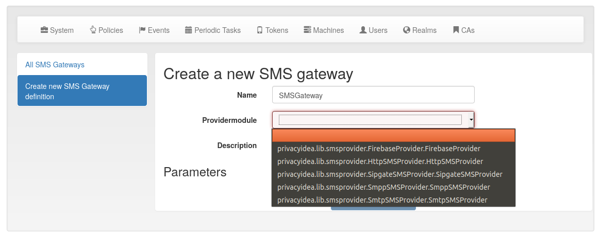

.. _sms_gateway_config:

SMS Gateway configuration
-------------------------

.. index:: SMS Gateway, SMS Provider

You can centrally define SMS gateways that can be used to send SMS with :ref:`sms_token`
or to use the SMS gateway for sending notifications.
Firebase, HTTP, and Script providers can also deliver signed challenge payloads for
:ref:`push_token`. Firebase gateways allow PUSH by default. HTTP and Script gateways
require ``ALLOW_PUSH`` to be set to ``yes``.

There are different providers (gateways) to deliver SMS.

.. _firebase_provider:

Firebase Provider
~~~~~~~~~~~~~~~~~

The Firebase provider sends notifications
via the Google Firebase service and this is used for the :ref:`push_token`.
PUSH delivery is enabled by default and can be disabled by setting ``ALLOW_PUSH``
to ``no``.
For an exemplary configuration, you may have a look at the articles on the
privacyIDEA community website `tagged with push token <https://www.privacyidea.org/tag/push-token/>`_.

**JSON config file**

   This is the location of the configuration file of
   the Firebase service. It has to be located on the privacyIDEA
   server.

**httpsproxy**

   Optional proxy for the HTTPS connections to googleapis.com.

You can get the necessary *JSON config file* from your Firebase console.
The default PUSH authenticator App (privacyIDEA Authenticator) which you can
find in Google Play Store and Apple App Store uses a Firebase project that is
managed by the company NetKnights.
You need to get an SLA to receive a JSON config file for accessing the project.

HTTP provider
~~~~~~~~~~~~~

.. index:: HTTP Provider

The HTTP provider can be used for any SMS gateway that provides a simple
HTTP POST or GET request. This is the most commonly used provider.
Each provider type defines its own set of parameters.

The following parameters can be used. These are parameters that define the
behavior of the SMS Gateway definition.

**ALLOW_PUSH**

   ``yes`` lets the gateway deliver :ref:`push_token` notifications, see
   *Using the HTTP provider for PUSH*.

**CHECK_SSL**

   If the URL is secured via TLS (HTTPS), you can select whether the
   certificate should be verified or not. The certificate is verified unless
   this is set to ``no``.

**PROXY**, **HTTP_PROXY** and **HTTPS_PROXY**

   **HTTP_PROXY** and **HTTPS_PROXY**: the proxy for gateway URLs starting with
   ``http://`` and ``https://``. **PROXY** is deprecated: it is only used if
   neither HTTP_PROXY nor HTTPS_PROXY is set, and only for gateway URLs with the
   same scheme as the proxy URL itself, so ``PROXY=http://proxy:3128`` is not used
   for an ``https://`` gateway, and a proxy without a scheme is never used. For an
   https gateway set HTTPS_PROXY. Without a matching setting, the proxy
   environment variables of the privacyIDEA process apply, if any.

**REGEXP**

   Regular expression to modify the phone number to make it compatible with the provider.

   *Example*: If you want to replace the leading zero with your country code like
   0123456789 -> 0049123456789, then you need to enter ``/^0/0049/``.

**HTTP_METHOD**

   Can be GET or POST.

**RETURN_FAIL**

   If the text of ``RETURN_FAIL`` is found in the HTTP response
   of the gateway, privacyIDEA assumes that the SMS could not be sent
   and an error occurred.

**RETURN_SUCCESS**

   You can either use ``RETURN_SUCCESS`` or ``RETURN_FAIL``.
   If both are set, only ``RETURN_SUCCESS`` is checked.
   If the text of ``RETURN_SUCCESS`` is found in the HTTP response
   of the gateway, privacyIDEA assumes that the SMS was sent successfully.

**SEND_DATA_AS_JSON**

   ``yes``: a POST request sends the options as a JSON body; ``no`` (default):
   as form data.

**TIMEOUT**

   The timeout in seconds (default 3) for connecting to the gateway and for each
   read of the response, not for the whole request.

**URL**

   This is the URL for the gateway.

**USERNAME** and **PASSWORD**

   These are the username and the password if the HTTP request requires
   **basic authentication**.

Options
.......

You can define additional options. These are sent as parameters in the GET or
POST request.

The options can have JSON or strings as values. privacyIDEA will try to
parse the values as JSON and either send JSON or strings to the HTTP gateway.

.. note:: You can use the tag ``{phone}`` to specify the phone number. The tag ``{otp}``
   will be replaced simply with the OTP value or with the contents created
   by the policy :ref:`smstext`.

Headers
.......

You can also define additional HTTP headers, for example an access token that the
gateway expects (see the SMSEagle example below). privacyIDEA sends them with every
request to the gateway. Tags are not replaced in headers. Only the HTTP provider
supports headers.

Using the HTTP provider for PUSH
.................................

The HTTP provider can be selected as the gateway for a :ref:`push_token`. Set
``ALLOW_PUSH`` and ``SEND_DATA_AS_JSON`` to ``yes`` for a JSON POST request,
then add options such as:

* ``device_token``: ``{phone}``
* ``push_payload``: ``{message}``

For PUSH messages, ``{phone}`` contains the device token rather than a phone number.
If an option consists only of ``{message}``, the complete structured PUSH payload is
preserved as a JSON object. When embedded in another value, the payload is serialized
as JSON text. The existing ``{otp}`` placeholder remains an alias for ``{message}``
for compatibility; prefer ``{message}`` in new PUSH gateway configurations.

The gateway must forward the signed payload without modifying its fields, otherwise
the authenticator cannot verify its signature.

.. note:: With Firebase, privacyIDEA learns from the Firebase response whether a
   notification was accepted for the device and adjusts the message shown to the
   user when it was not. An HTTP gateway can only report that it accepted the
   request; delivery to the push service happens afterwards and is not visible to
   privacyIDEA. Configure ``RETURN_SUCCESS`` or ``RETURN_FAIL`` so the gateway can
   report the final delivery result if you want this feedback. A Script gateway
   running in ``background`` mode reports no result at all.

Examples
........

Clickatell
''''''''''

In case of the **Clickatell** HTTP API the configuration will look like this [#clickatell]_:

 * **URL**: ``https://platform.clickatell.com/messages/http/send``
 * **HTTP_METHOD**: GET

Set the additional **options** to be passed as HTTP GET parameters:

 * apiKey: *your integration API key*
 * content: "Your OTP value is {otp}"
 * to: {phone}

This will construct an HTTP GET request like this::

   https://platform.clickatell.com/messages/http/send?apiKey=...&content=....&to=....

where ``content`` and ``to`` will contain the OTP value and the mobile
phone number. Clickatell answers with the HTTP status 202 and a JSON object
that states for each message whether it was ``accepted``. Without
**RETURN_SUCCESS** or **RETURN_FAIL**, privacyIDEA assumes a successfully sent SMS
if the gateway answers with the HTTP status 200, 201 or 202.

GTX-Messaging
'''''''''''''

GTX-Messaging is an SMS Gateway located in Germany.

The configuration looks like this (see [#gtxapi]_):

 * **URL**: https://http.gtx-messaging.net/smsc.php
 * **HTTP_METHOD**: GET
 * **CHECK_SSL**: yes
 * **RETURN_SUCCESS**: 200 OK

You need to set the additional **options**:

 * user: <your account>
 * pass: <the account password>
 * to: {phone}
 * text: Your OTP value is {otp}.

.. note:: The *user* and *pass* are not the credentials you use to log in.
   You can find the required credentials for sending SMS in your GTX
   messaging account when viewing the details of your *routing account*.

Twilio
''''''

You can also use the **Twilio** service for sending SMS [#twilio]_.

 * **URL**: https://api.twilio.com/2010-04-01/Accounts/B...8/Messages
 * **HTTP_METHOD**: POST

For basic authentication you need:

 * **USERNAME**: *your accountSid*
 * **PASSWORD**: *your password*

Set the additional **options** as POST parameters:

 * From: *your Twilio phone number*
 * Body: {otp}
 * To: {phone}
 
SMSEagle
''''''''''

You can send OTP messages by using the **SMSEagle** hardware SMS gateway (requires physical hardware). [#smseagle]_

Parameters:

 * **URL**: http://your-smseagle-url/api/v2/sms
 * **HTTP_METHOD**: POST
 * **RETURN_SUCCESS**: queued
 * **SEND_DATA_AS_JSON**: yes

Headers:

 * **access-token**: *your-access-token*
 
Options:

 * **to**: ["{phone}"]
 * **text**: "Your OTP: {otp}"

You can personalize the **text** option, but you must place it inside double-quotes and must include the *{otp}* value.

Sipgate provider
~~~~~~~~~~~~~~~~

.. note:: sipgate shut down the XML-RPC API that this provider uses on 2022-01-01, so the provider can no
   longer send messages.

The sipgate provider connects to ``https://samurai.sipgate.net/RPC2``.

Parameters:

**USERNAME**

   The sipgate username.

**PASSWORD**

   The sipgate password.

**PROXY**

   You can specify a proxy to connect to the HTTP gateway.

**REGEXP**

   Modifies the phone number like in the HTTP provider.

It takes no options.

If you activate the debug log level, you will see the submitted SMS and the response
content from the sipgate gateway.

SMPP Provider
~~~~~~~~~~~~~

The SMPP provider uses an SMS Center via the SMPP protocol to
deliver SMS to the users.

You need to specify the **SMSC_HOST** and **SMSC_PORT** to talk to the SMS center.
privacyIDEA needs to authenticate against the SMS center. For this you can add the parameters
**SYSTEM_ID** and **PASSWORD**. The parameter **S_ADDR** is the sender's number, shown to the users
receiving an SMS.
The parameter **REGEXP** modifies the phone number like in the HTTP provider.
For the other parameters contact your SMS center operator.

SMTP provider
~~~~~~~~~~~~~

The SMTP provider sends an email to an email gateway. This is a specified,
fixed mail address.

The mail should contain the phone number and the OTP value. The email gateway
will send the OTP via SMS to the given phone number.

**BODY**

   This is the body of the email. You can use this to explain to the user what
   to do with this email.
   You can use the tags ``{phone}`` and ``{otp}`` to
   replace the phone number or the one time password.

**MAILTO**

   This is the address where the email with the OTP value will be sent.
   Usually this is a fixed email address provided by your SMTP Gateway
   provider. But you can also use the tags ``{phone}`` and ``{otp}`` to
   replace the phone number or the one time password.

**REGEXP**

   Regular expression to modify the phone number, like in the HTTP provider.

**SMTPIDENTIFIER**

   Here you can select one of your centrally defined SMTP servers.

**SUBJECT**

   This is the subject of the email to be sent.
   You can use the tags ``{phone}`` and ``{otp}`` to
   replace the phone number or the one time password.

The default *SUBJECT* is set to ``{phone}`` and the default *BODY* to ``{otp}``.
You may change the *SUBJECT* and the *BODY* accordingly.

Script provider
~~~~~~~~~~~~~~~

The *Script provider* calls a script which can take care of sending the SMS.
The script takes the phone number as the only parameter. The message is expected at stdin.

Set ``ALLOW_PUSH`` to ``yes`` before selecting a Script gateway for a PUSH token.
The first command line argument then contains the device token and stdin contains
the structured PUSH payload serialized as JSON.

Scripts are located in the directory ``/etc/privacyidea/scripts/``. You can change this default
location by setting the value in ``PI_SCRIPT_SMSPROVIDER_DIRECTORY`` in :ref:`cfgfile`.

In the configuration of the Script provider you can set the following attributes.

**script**

This is the file name of the script without the directory part.

**REGEXP**

Regular expression to modify the phone number, like in the HTTP provider.

**background**

Here you can choose whether the script should be started and run in the background (``background``) or if the
HTTP request waits for the script to finish (``wait``).

.. note:: A script running in the background reports no exit code, so privacyIDEA cannot tell
   whether the message was delivered. For a PUSH token this means that a script which fails
   after it was started still counts as a successful send: the user is asked to confirm the
   notification on the smartphone instead of being pointed at the polling fallback. Choose
   ``wait`` if you want a failed delivery to be visible.

.. rubric:: Footnotes

.. [#clickatell] https://help.clickatell.com/developers-api-reference/sms-api
.. [#twilio] https://www.twilio.com/docs/messaging/api
.. [#gtxapi] https://www.gtx-messaging.com/de/api-docs/http/
.. [#smseagle] https://www.smseagle.eu/integration-plugins/privacyidea-sms-integration/
