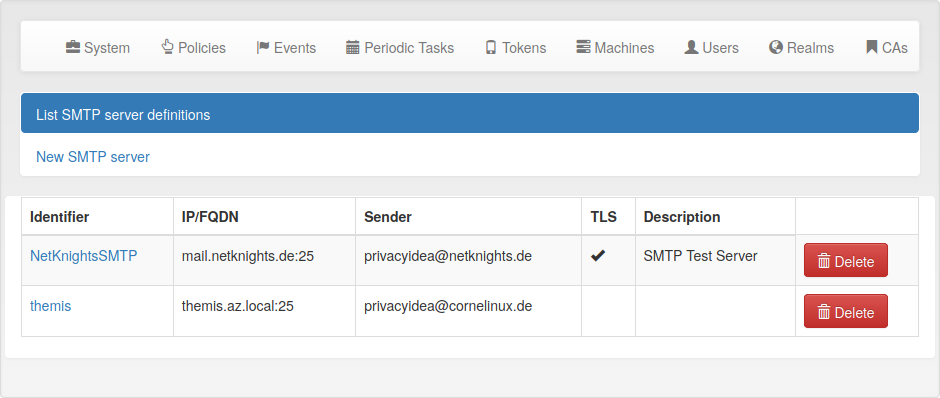
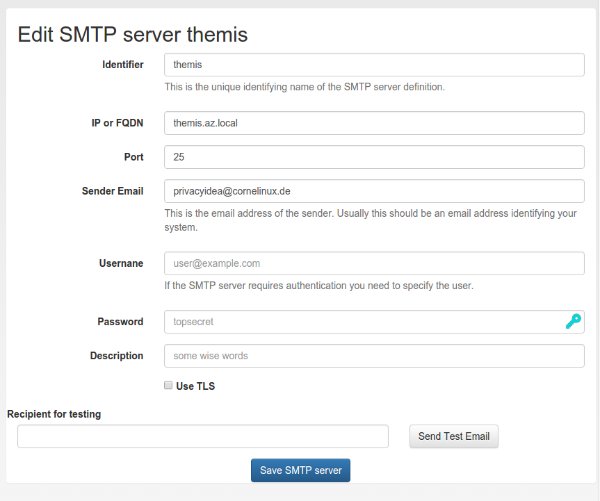

.. _smtpserver:

SMTP server configuration
-------------------------

.. index:: SMTP server

Starting with privacyIDEA 2.10 you can define SMTP server configurations.
:ref:`rest_smtpserver`.

An SMTP server configuration contains the

   * server as FQDN or IP address,
   * the port (defaults to 25),
   * the sender email address,
   * a username and password in case of authentication
   * an optional description
   * a TLS flag.

Each SMTP server configuration is addressed via a *unique identifier*.
You can then use such a configuration for Email or SMS token, for PIN
handling or in policies for :ref:`user_registration`.

Under *Config->Sytem->SMTP servers* you can get a list of all configured SMTP
servers, create new server definitions and delete them.

   *The list of SMTP servers.*

   *Edit an existing SMTP server definition.*

In the edit dialog you can enter all necessary attributes to talk to the SMTP
server. You can also send a test email, to verify if your settings are correct.

In case a :ref:`job_queue` is configured, the SMTP server dialog shows a checkbox that
enables sending all emails for the given SMTP server configuration via the job queue.
Note that if the checkbox is checked, any test email will also be sent via the queue.
This also means that privacyIDEA will display a success notice when the job has been
sent to the queue successfully, which does not necessarily mean that the mail was
actually sent. Thus, it is important to check that the test email is actually received.