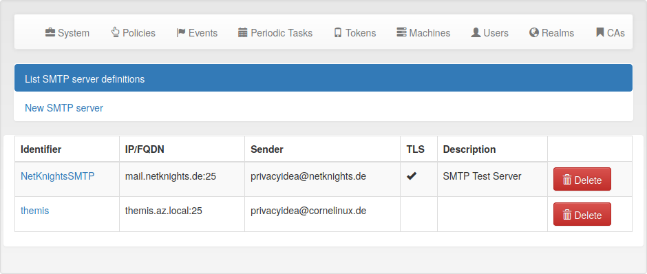
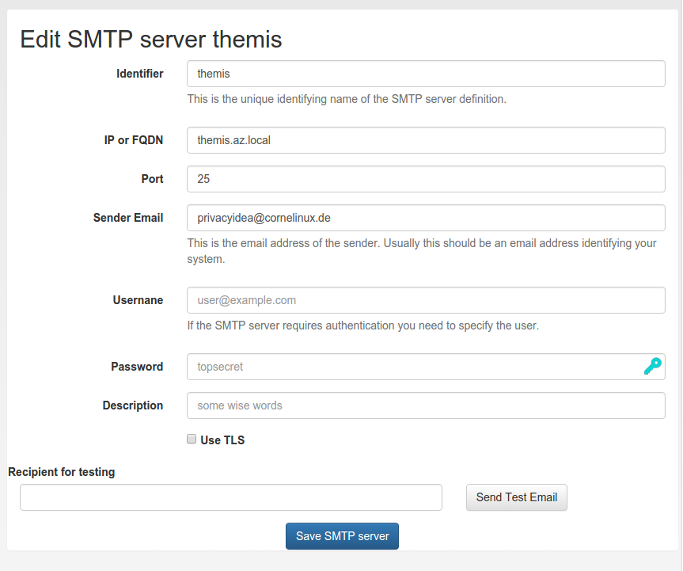

.. _smtpserver:

SMTP server configuration
-------------------------

.. index:: SMTP server

You can define SMTP server configurations in the WebUI or with the
:ref:`rest_smtpserver`.

An SMTP server configuration contains the

   * server as FQDN, IP address or URL: ``smtp://host[:port]``, or
     ``smtps://host[:port]`` for TLS from the start (usually port 465; the current
     WebUI then hides the StartTLS checkbox). A port in the URL takes precedence
     over the port field.
   * the port (defaults to 25),
   * the timeout in seconds (default 10),
   * the sender email address,
   * a username and password in case of authentication
   * an optional description
   * a TLS flag
   * S/MIME signing flag
   * S/MIME private_key
   * password for the private_key (empty if not needed)
   * S/MIME certificate
   * Don't send on signing error flag

.. note:: To use S/MIME you need to configure the paths to your S/MIME private_key and certificate for
   each SMTP server via the WebUI.

Each SMTP server configuration is addressed via a *unique identifier*.
You can then use such a configuration for the Email token, the SMTP SMS provider,
the :ref:`usernotification`, Email tokens enrolled by the :ref:`tokenhandler`, the
email notifications of :ref:`conditional_access`, :ref:`user_registration` and
:ref:`policy_password_reset`.

Under *External Services -> SMTP Servers* you can get a list of all configured SMTP
servers, create new server definitions and delete them.

   *The list of SMTP servers.*

   *Edit an existing SMTP server definition.*

In the edit dialog you can enter all necessary attributes to talk to the SMTP
server. You can also send a test email to verify that your settings are correct.

The SMTP server dialog has a checkbox that enables sending all emails for the given
SMTP server configuration via the :ref:`job_queue`. It only has an effect if a job
queue is configured. The previous WebUI only shows it then, the current WebUI always
shows it.
Note that if the checkbox is checked, any test email will also be sent via the queue.
This also means that privacyIDEA displays a success notice when the job has been
sent to the queue successfully, which does not necessarily mean that the mail was
actually sent. Thus, it is important to check that the test email is actually received.
