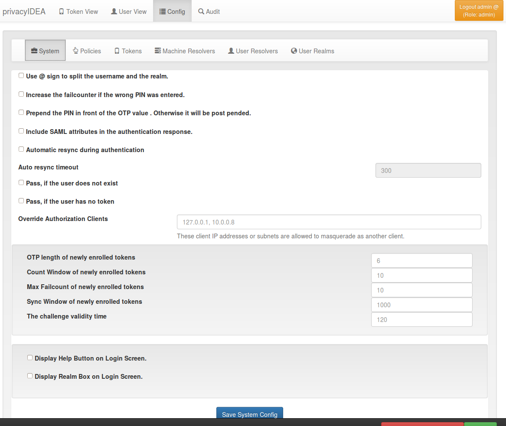

.. index:: system config, token default settings
.. _system_config:

System Config
-------------

The system configuration has two logical topics: Settings and
token default settings.

   *The system config*

Settings
........

.. _splitatsign:

Use @ sign to split the username and the realm.
~~~~~~~~~~~~~~~~~~~~~~~~~~~~~~~~~~~~~~~~~~~~~~~

This option defines if the username like *user@company*
given during authentication should
be split into the loginname *user* and the realm name *company*.
In most cases this is the desired behavior so this is enabled by default.

A name like *user@gmail.com* is only split if a realm *gmail.com* exists (see
:ref:`relate_realm`). So you probably only want to disable splitting if users
log in with email addresses whose domain is also the name of a realm.

How a user is related to a realm is described here: :ref:`relate_realm`

This option also affects the login via the :ref:`rest_auth`

.. index:: failcount

Increase the failcounter if the wrong PIN was entered.
~~~~~~~~~~~~~~~~~~~~~~~~~~~~~~~~~~~~~~~~~~~~~~~~~~~~~~

If during authentication the given PIN matches a token but the OTP value is
wrong, the failcounter of the tokens for which the PIN matches, is increased.
This option is enabled by default: if the given PIN does not match any token,
the failcounter of every token of the user that can still be used (active, not
revoked, below its maximum failcount, within its validity period) is increased
by one. So a series of requests with wrong PINs for a user name can lock all
tokens of that user. If the option is disabled, a wrong PIN does not increase
any failcounter.

.. index:: failcount
.. _clear_failcounter:

Clear failcounter after minutes
~~~~~~~~~~~~~~~~~~~~~~~~~~~~~~~

When the failcounter reaches the maximum, the token gets a timestamp of the time the max fail count was reached.
After the specified number of minutes has passed since that timestamp, any authentication attempt will clear the fail
counter.

A ``0`` means that the automatic clearing of the fail counter is not used.

.. note:: After the maximum failcounter is reached, new requests will not update the mentioned timestamp.

Also see :ref:`brute_force`.

Do not use an authentication counter per token.
~~~~~~~~~~~~~~~~~~~~~~~~~~~~~~~~~~~~~~~~~~~~~~~

Usually privacyIDEA keeps track of how often a token is used for authentication and
how often this authentication was successful. This is a per token counter.
This information is written to the token database as a parameter of each token.

This setting means that privacyIDEA does not track this information at all.
Without the counter, the maximum number of authentications set for a token
(``count_auth_max``, ``count_auth_success_max``) is not enforced.

Prepend the PIN in front of the OTP value.
~~~~~~~~~~~~~~~~~~~~~~~~~~~~~~~~~~~~~~~~~~

Defines if the OTP PIN should be given in front (``pin123456``)
or in the back (``123456pin``) of the OTP value.

.. index:: autoresync, autosync
.. _autosync:

Automatic resync during authentication
~~~~~~~~~~~~~~~~~~~~~~~~~~~~~~~~~~~~~~

Automatic *resync* defines if the system should try to resync a token if a user
provides a wrong OTP value. AutoResync works like this:

* If the counter of a wrong OTP value is within the resync window, the system
  remembers the counter of the OTP value for this token in the token info
  field ``otp1c``.

* Now the user needs to authenticate a second time within the time-interval
  given in **Auto resync timeout** with the next successive OTP value.

* The system checks if the counter of the second OTP value is the successive
  value to ``otp1c``.

* If it is, the token counter is set and the user is successfully authenticated.

.. note:: AutoResync works for all HOTP and TOTP based tokens including SMS and
   Email tokens. For TOTP tokens the **Auto resync timeout** is not used: the
   second OTP value must belong to the time step directly after the remembered
   one and lie within the sync window around the current time, which limits the
   resync to about two time steps. Day password tokens are not resynchronized
   automatically.

.. index:: usercache
.. _user_cache_timeout:

User Cache expiration in seconds
~~~~~~~~~~~~~~~~~~~~~~~~~~~~~~~~

This setting is used to enable the user cache and
configure its expiration timeout. If its value is set to ``0`` (which is the default value),
the user cache is disabled.
Otherwise, the value determines the time in seconds after which entries of the user
cache expire. For more information read :ref:`usercache`.

.. note:: If the user cache is already enabled and you increase the expiration timeout,
   expired entries that still exist in the user cache could be considered active again!

.. index:: Override client, map client, proxies, RADIUS server, authenticating client, client
.. _override_client:

Override Authorization Client
~~~~~~~~~~~~~~~~~~~~~~~~~~~~~

This setting is important with client specific
policies (see :ref:`policies`) and RADIUS servers or other proxies. In
case of RADIUS the authenticating client
for the privacyIDEA system will always be the RADIUS server, which issues
the authentication request. But you can allow the RADIUS server IP to
send another client information (in this case the RADIUS client) so that
the policy is evaluated for the RADIUS client. A RADIUS server
may add the API parameter *client* with a new IP address. An HTTP reverse
proxy may append the respective client IP to the ``X-Forwarded-For`` HTTP
header. The *client* parameter is only evaluated for ``/validate/``,
``/ttype/`` and ``/auth`` requests; the ``X-Forwarded-For`` header for every
request.

This field takes a comma separated list of sequences of IP Networks
mapping to other IP networks.

**Examples**

::

   10.1.2.0/24 > 192.168.0.0/16

Proxies in the subnet 10.1.2.0/24 may mask as client IPs 192.168.0.0/16. In
this case the policies for the corresponding client in 192.168.x.x apply.

::

   172.16.0.1

The proxy 172.16.0.1 may mask as any arbitrary client IP.

::

   10.0.0.18 > 10.0.0.0/8

The proxy 10.0.0.18 may mask as any client in the subnet 10.x.x.x.

Note that the proxy definitions may be nested in order to support multiple proxy hops. As an example::

    10.0.0.18 > 10.1.2.0/24 > 192.168.0.0/16

means that the proxy 10.0.0.18 may map to another proxy into the subnet 10.1.2.x, and a proxy in this
subnet may mask as any client in the subnet 192.168.x.x.

With the same configuration, a proxy 10.0.0.18 may map to an application plugin in the subnet 10.1.2.x,
which may in turn use a ``client`` parameter to mask as any client in the subnet 192.168.x.x.

A nested entry only applies to requests that passed all listed hops. For requests that only pass the first proxy,
or that come directly from the second, add separate entries such as ``10.0.0.18 > 10.1.2.0/24`` or
``10.1.2.0/24 > 192.168.0.0/16``.

.. note:: Every authentication-log entry records not only which client IP was used but how it was arrived
   at: the effective address (``source_ip``), the address the connection actually came from
   (``peer_ip``), which of the two - or which forwarded hop - was chosen (``source_ip_source``), and the
   whole path that was considered (``ip_chain``). The ``X-Forwarded-For`` chain and any ``client``
   parameter are recorded **even when this setting is empty** and they are therefore not honored, so the
   log shows what a request claimed as well as what privacyIDEA believed. Only ``source_ip`` is ever used
   for a decision; everything past ``peer_ip`` is client-supplied.

   ``source_ip_source`` distinguishes ``REMOTE_ADDR`` (no mapping is configured) from
   ``REMOTE_ADDR_UNMAPPED`` (a mapping is configured, but this peer may not map the client any further),
   which is what makes a misconfigured proxy path visible in the log rather than silent.

SMTP server for password recovery
~~~~~~~~~~~~~~~~~~~~~~~~~~~~~~~~~

Specify the :ref:`SMTP server configuration <smtpserver>` which should be used
for sending password recovery emails.

Token default settings
......................

.. note:: The following settings are token specific values which are
   set during enrollment.
   Some of these values can be overridden by policies or events during rollout.

OTP length of newly enrolled tokens
~~~~~~~~~~~~~~~~~~~~~~~~~~~~~~~~~~~

This is the default length of the OTP value of OATH-based tokens like SMS,
Email, TOTP and HOTP. It is used when the enrollment request contains no OTP
length, e.g. an API request without ``otplen``. The current WebUI always sends
an OTP length for HOTP and TOTP tokens (6 unless changed in the dialog), so
there this value only applies to Email and SMS tokens; the previous WebUI sends
6 for every token type. An ``hotp_otplen`` or ``totp_otplen`` policy replaces
the sent value on the server.

Count Window of newly enrolled tokens
~~~~~~~~~~~~~~~~~~~~~~~~~~~~~~~~~~~~~

This setting defines how many OTP values will be calculated during
an authentication request to check for a match. This applies to counter-based
tokens (HOTP, Email, SMS). TOTP tokens use their time window instead, which a new
TOTP token gets from the TOTP token configuration (``totp.timeWindow``, default
180 seconds).

.. index:: failcount

Max Failcount of newly enrolled tokens
~~~~~~~~~~~~~~~~~~~~~~~~~~~~~~~~~~~~~~

This setting defines the maximum failcounter for newly enrolled tokens. When the
failcounter reaches this number, the token cannot be used until the failcounter
is reset (by an administrator, or automatically, see :ref:`clear_failcounter`).

.. note:: In fact the failcounter will only increase up to this maximum failcount (``Maxfail``).
   Even if more failed authentication requests occur, the failcounter will
   not be increased.

.. index:: syncwindow

Sync Window of newly enrolled tokens
~~~~~~~~~~~~~~~~~~~~~~~~~~~~~~~~~~~~

This setting defines the synchronization window for newly enrolled tokens.
The window defines how many OTP values will be calculated
during a resync of the token.

.. note:: In case of HOTP token, this is the amount of steps that will be calculated
   from the current token counter onwards. For TOTP token, the number of steps
   will be multiplied with the timestep of the token and this interval will be checked
   *before* **and** *after* the current time.

.. _challenge_validity_time:

The challenge validity time
~~~~~~~~~~~~~~~~~~~~~~~~~~~

This setting defines the timeout for a challenge response
authentication. If the response is received after the given time interval, the
response is not accepted anymore.

A token type can have its own value in the config key
``<Type>ChallengeValidityTime``, e.g. ``HotpChallengeValidityTime``,
``TiqrChallengeValidityTime``, ``PushChallengeValidityTime`` (see
:ref:`push_token`) or ``WebauthnChallengeValidityTime`` (see
:ref:`webauthn_otp_token`); this setting is used for types without their own
value. Email and SMS tokens do not use it: their challenges are valid for the
*OTP validity time* of their token configuration (default 120 seconds for
Email, 300 seconds for SMS), see :ref:`email_token_config` and
:ref:`sms_token_config`.

To clean up expired challenges read the :ref:`pimanage_challenge` section.
