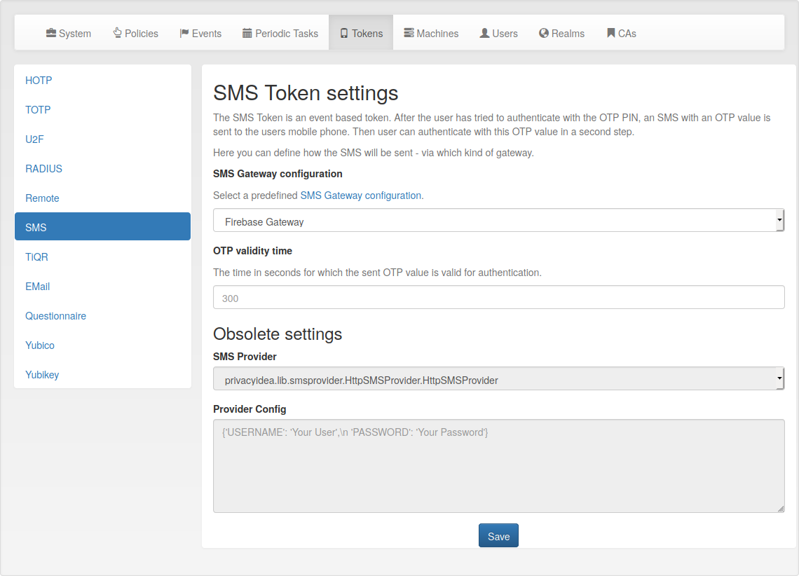

.. _token_config:

Token configuration
--------------------

.. index:: token configuration

Each of the :ref:`tokentypes` can provide its own configuration dialog.

In this configuration dialog you can define default values for these token
types. Some token additionally require :ref:`configuration` such as the configuration
of an SMTP server.

   *Examplary token configuration for an SMS Token*

.. toctree::
   :glob:
   :maxdepth: 1

   tokenconfig/*