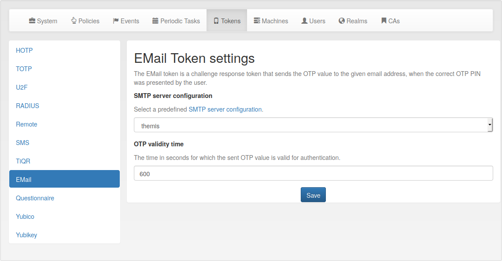

.. _email_token_config:

Email Token Configuration
.........................

.. index:: Email Token

   *Email Token configuration*

For the :ref:`email token <email_token>` to work, you have to first setup an :ref:`smtpserver` and link it
to the Email Token configuration at *Config -> Tokens -> Email*. The UI warns the user
if one of these requirements is not fulfilled yet.

The Email OTP token creates a OTP value and sends this OTP value to the email
address of the uses. The email can be triggered by authenticating with only
the OTP PIN:

First step
~~~~~~~~~~

In the first step the user will enter his OTP PIN and the sending of the
email is triggered. The user is denied access for now.

Seconds step
~~~~~~~~~~~~

In the second step, the user authenticates with the OTP PIN and the OTP value
he received via email. The user is granted access if the OTP values match.

.. _index: transaction_id

Alternatively, the user can authenticate with the ``transaction_id`` that was
sent to him in the response during the first step and only use the OTP value. The
``transaction_id`` assures that the user already presented the first factor (OTP
PIN) successfully.

Configuration Parameters
~~~~~~~~~~~~~~~~~~~~~~~~

**SMTP server configuration**
  The mail server configuration that is used to send emails.

**OTP validity time**
  This is the time in seconds, for how long the sent OTP value is valid. If a
  user tries to authenticate with the sent OTP value after this time,
  authentication will fail.
