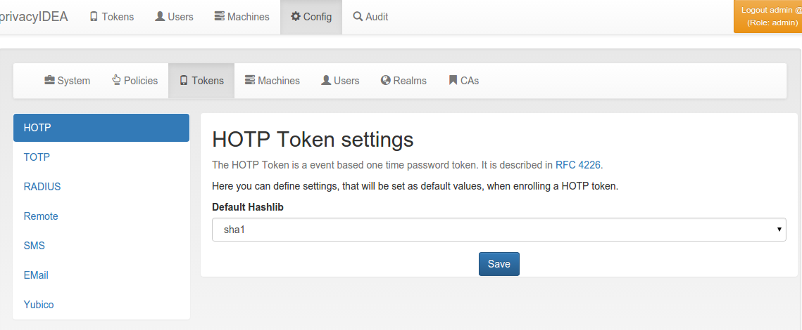

.. _hotp_token_config:

HOTP Token Config
.................

.. index:: HOTP Token

   *HOTP Token configuration*

**Default Hashlib** (``hotp.hashlib``, default ``sha1``) is the hash algorithm of a
new HOTP token if the enrollment request does not contain one; it is then stored
with the token. A :ref:`hotp_hashlib <hotp-hashlib>` policy takes precedence. The
current WebUI enrollment dialog always sends a hash algorithm (sha1 unless changed),
so there the default only takes effect for enrollments through the API; the
previous WebUI presets its dialog with this value.
