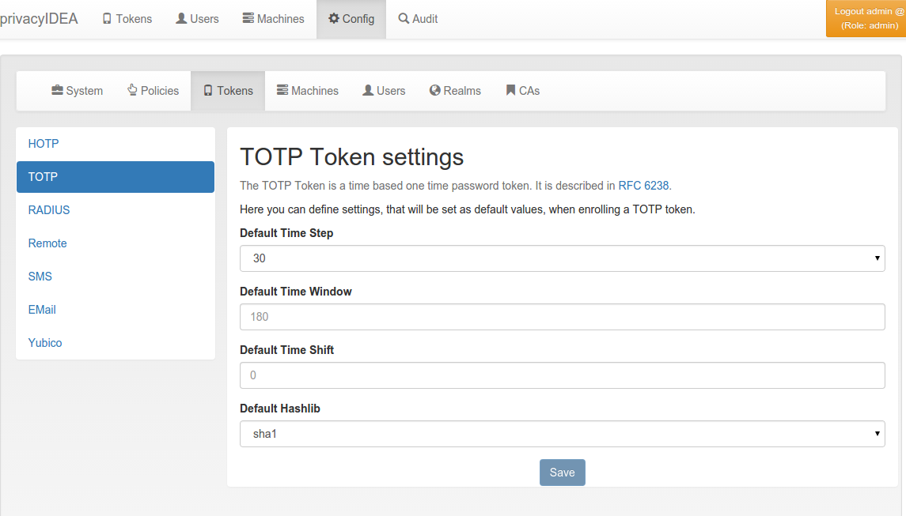

.. _totp_token_config:

TOTP Token Config
.................

.. index:: TOTP Token

   *TOTP Token configuration*

**Default Time Step** (``totp.timeStep``, default 30 seconds), **Default Time
Window** (``totp.timeWindow``, default 180 seconds) and **Default Hashlib**
(``totp.hashlib``, default ``sha1``) are used for a new TOTP token if the enrollment
request does not contain these values; they are then stored with the token. The
policies :ref:`totp_hashlib <totp-hashlib>` and :ref:`totp_timestep <totp-timestep>`
take precedence. The current WebUI enrollment dialog always sends the hash
algorithm and the time step (sha1 and 30 unless changed), so there these defaults
only take effect for enrollments through the API; the previous WebUI presets its
dialog with them.

**Default Time Shift** (``totp.timeShift``) has no effect: privacyIDEA does not read
it, and a new TOTP token starts with the time shift 0.
