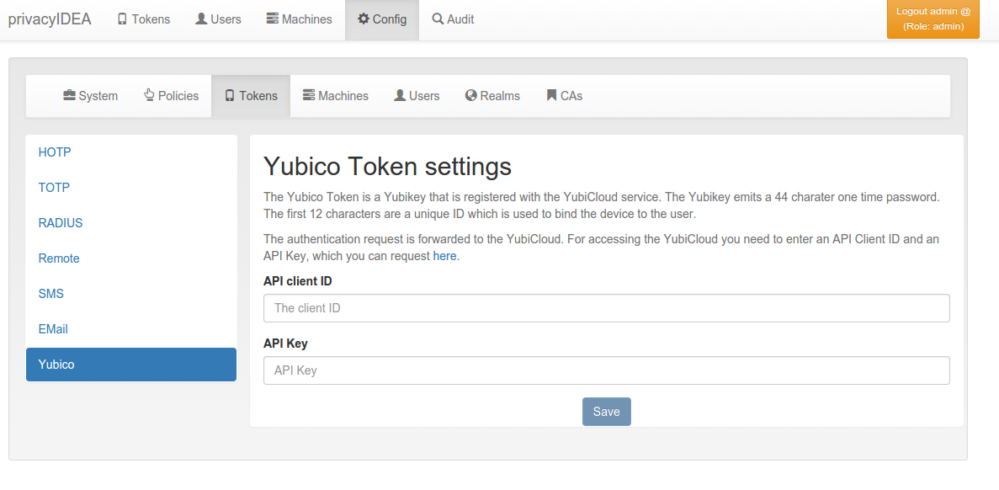

.. _yubico_token_config:

Yubico Cloud mode
.................

.. index:: Yubico Cloud mode

The Yubico Cloud mode sends the One Time Password emitted by the YubiKey to
the Yubico Cloud service or another (possibly self-hosted) validation server.

   *Configure the Yubico Cloud mode*

To contact the Yubico Cloud service you need to get an API key and a Client
ID from Yubico and enter them here in the config dialog. If the Yubico URL is
not set, privacyIDEA uses ``https://api.yubico.com/wsapi/2.0/verify``. Do not
save the field empty after it was filled: a stored empty value is used as URL
and every authentication with a Yubico token fails; delete the entry instead
(``DELETE /system/yubico.url``). If no Client ID and API key are configured,
privacyIDEA uses a built-in shared Client ID and API key and logs a warning;
configure your own.

You can use another validation host, e.g. a self-hosted validation server.
If you use the privacyIDEA token type *Yubikey*, you can use the URL
``https://<privacyideaserver>/ttype/yubikey``, other validation servers might
use ``https://<validationserver>/wsapi/2.0/verify``. You'll get the Client ID
and API key from the configuration of your validation server.

You can get your own API key at [#yubico]_.

.. [#yubico] https://upgrade.yubico.com/getapikey/
