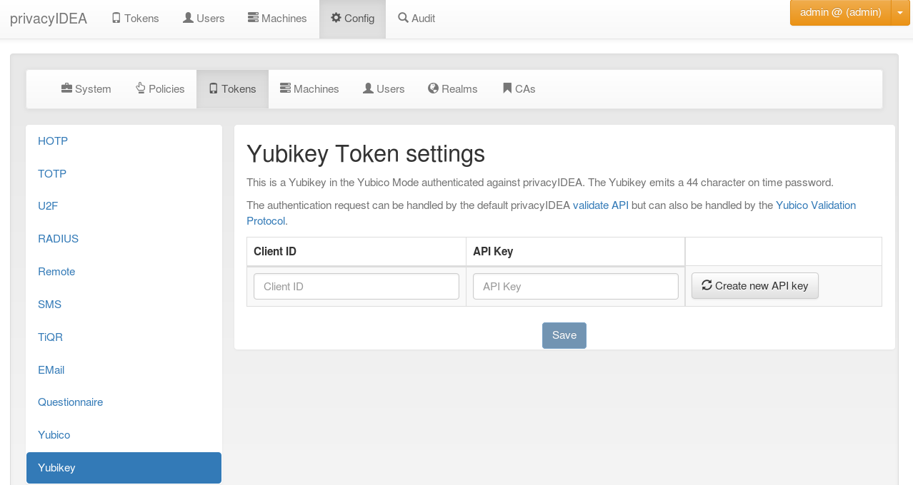

.. _yubikey_token_config:

Yubikey AES mode
................

.. index:: Yubikey AES mode

The Yubico AES mode uses the same kind of token as the Yubico Cloud service
but validates the OTP in your local privacyidea server. So the secrets
stay local to your system and are not stored in Yubico's Cloud service.

   *Configure the Yubikey AES mode*

You can have more than one Client with a Client ID connect to your server.
The Client ID starts with yubikey.apiid. and is followed by the API ID,
which you'll need to configure your clients.
With ``create new API key`` you generate a new API key for that specific
Client ID. The API key is used to sign the validation request sent to the
server and the server signs the answer too. That way, tampering or
MITM attacks might be detected. It is possible to validate token without
the API key, but then the request and answer can't be verified against
the key. It is useful to use HTTPS for your validation requests, but
this is another kind of protection.

OTP validation can either use the privacyidea API ``/validate/check`` or
the Yubikey validation protocol ``/ttype/yubikey`` or - if enabled in
your web-server configuration - ``/wsapi/2.0/verify``.
