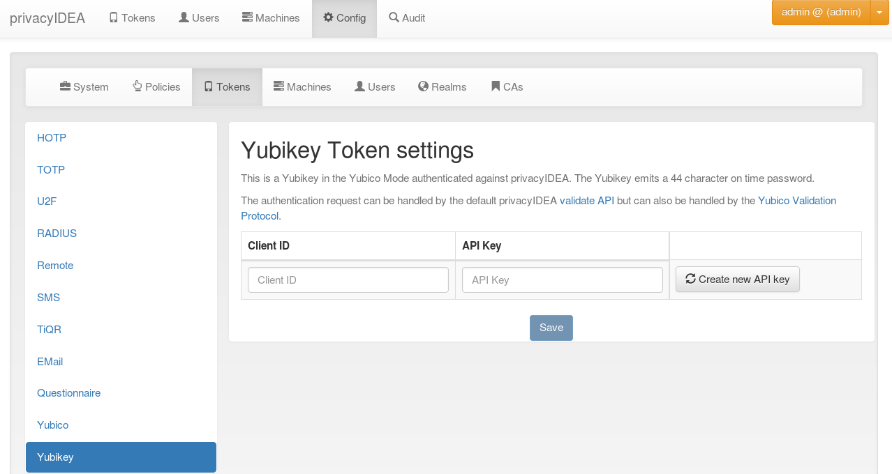

.. _yubikey_token_config:

YubiKey AES mode
................

.. index:: YubiKey AES mode

The YubiKey AES mode uses the same kind of token as the Yubico Cloud service
but validates the OTP in your local privacyIDEA server. So the secrets
stay local to your system and are not stored in Yubico's Cloud service.

   *Configure the YubiKey AES mode*

You can have more than one Client with a Client ID connect to your server.
The Client ID starts with ``yubikey.apiid.`` and is followed by the API ID,
which you'll need to configure your clients.
If you check *Generate API Key* and click *Add*, a new API key is generated for that specific
Client ID. The API key is used to sign the validation request sent to the
server, and the server signs its answer with the API key of the Client ID.
Signing the request is optional: for a known Client ID the server also accepts
a request without signature (``h``), so configuring an API key does not make
clients sign. A request with an unknown Client ID is answered with
``NO_SUCH_CLIENT``. It is useful to use *HTTPS* for your validation requests, but
this is another kind of protection.

OTP validation can either use the privacyIDEA API ``/validate/check`` or
the YubiKey validation protocol ``/ttype/yubikey`` or - if enabled in
your web server configuration - ``/wsapi/2.0/verify``.

More information about the YubiKey OTPs can be found at `developers.yubico.com`_

.. _developers.yubico.com: https://developers.yubico.com/OTP/OTPs_Explained.html
