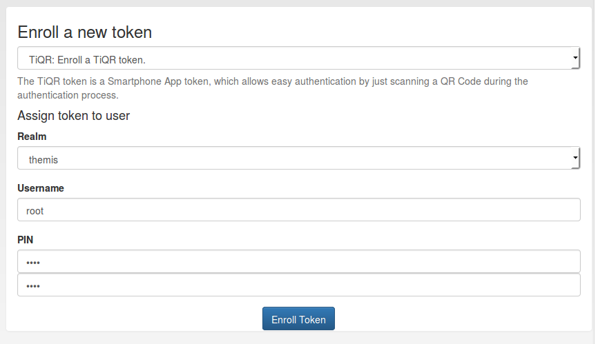

.. _tiqr:

TiQR
----

.. index:: TiQR, OCRA

Starting with version 2.6 privacyIDEA supports the TiQR token.
The TiQR token is a smartphone token, that can be used to login by only
scanning a QR code.

The TiQR token implements the
:ref:`outofband authentication mode <authentication_mode_outofband>`.

The token is also enrolled by scanning a QR code.

   *Choose a user for the TiQR token*

You can only enroll a TiQR token, when a user is selected.

.. note:: You can not enroll a TiQR token without assign the token to a user.

.. figure:: images/enroll_tiqr_2.png

For more technical information about the TiQR token please see
:ref:`code_tiqr_token`.
