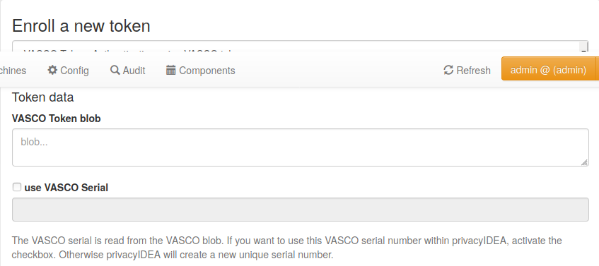

.. _vasco:

VASCO
-----

.. index:: VASCO

Starting with version 2.22 privacyIDEA supports VASCO tokens.

VASCO OTP tokens are a proprietary OTP token. You can import
the VASCO blobs from a CSV file or you the administrator can enroll
a single VASCO token.

.. note:: privacyIDEA uses a proprietary VASCO library vacman to verify
   the OTP values. Please note that you need to license this library from
   *VASCO Data Security N.V.* directly. The privacyIDEA project does not
   provide this library.
