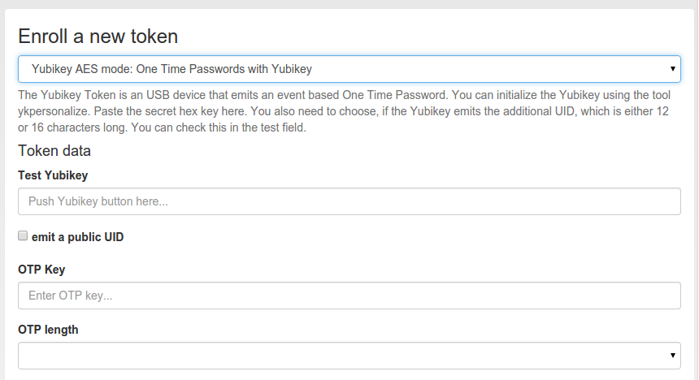

.. _yubikey:

Yubikey
-------

.. index:: Yubikey, Yubico AES mode

The Yubikey is initialized with privacyIDEA and works in Yubicos own AES mode.
It outputs a 44 character OTP value, consisting of a 12 character prefix and
a 32 character OTP. But in contrast to the :ref:`yubico` Cloud
mode, in this mode the secret key is contained within the token and your own
privacyIDEA installation.

If you have the time and care about privacy, you should prefer the
Yubikey AES mode over the :ref:`yubico` Cloud mode.

There are three possible ways to enroll a Yubikey token. 

.. note:: We recommend that you use the ``privacyidea`` command line
   client, to initialize the Yubikeys. You can use the mass enrollment, which
   eases the process of initializing a whole bunch of tokens.

Run the command like this::

   privacyidea -U https://your.privacyidea.server -a admin token \
   yubikey_mass_enroll --yubimode YUBICO

This command initializes the token and stores the AES secret and prefix
in privacyidea, so the token is immediatly useful. You can choose the slot
with ``--yubislot``. For further help call
``privcyidea yubikey_mass_enroll`` with the ``--help`` option.

The second way to enroll a yubikey token is also using ``yubikey_mass_enroll``,
but with the option ``--filename`` to write to token configuration into the
specified file.  The resulting file can then be imported into privacyidea:
Select Tokens -> Import Tokens, select "OATH CSV" and the file you just created.

Using the yubikey personalization GUI
~~~~~~~~~~~~~~~~~~~~~~~~~~~~~~~~~~~~~

Third and last you can use the privacyIDEA Web UI to enroll a
Yubikey AES mode token, if you have
initialized the yubikey with the external *ykpersonalize* tool.

.. figure:: images/yk-personalization-gui.png
   :width: 500

   *Use the yubikey-personalization-gui to initialize the yubikey*

When using the yubikey personalization GUI you need to copy the value of
"Secret Key (16 bytes Hex)". This is the secret OTP key, which you need to
copy and paste in the field "OTP Key" in the privacyIDEA Web UI.

   *Enroll a Yubikey AES mode token*

In the field "Test Yubikey" push the Yubikey button. This will grab the
yubikey's public identifier and also determine the lenght of the *otp value*.
The field *OTP value* is automatically filled.

Redirect api url to privacyideas /ttype/yubikey
...............................................

Yubico servers use ``/wsapi/2.0/verify`` as the path in the
validation URL. Some tools (e.g. Kolab 2fa) let the 
user/admin change the api host, but not the rest of
the URL. Let's redirect the api URL to privacyideas
/ttype/yubikey - you'll need to enable the following two 
lines in /etc/apache2/site-enabled/privacyidea.conf:

    RewriteEngine  on
    RewriteRule    "^/wsapi/2.0/verify"  "/ttype/yubikey" [PT]

If you use nginx there is a similar line provided as a comment
to the nginx configuration as well.

