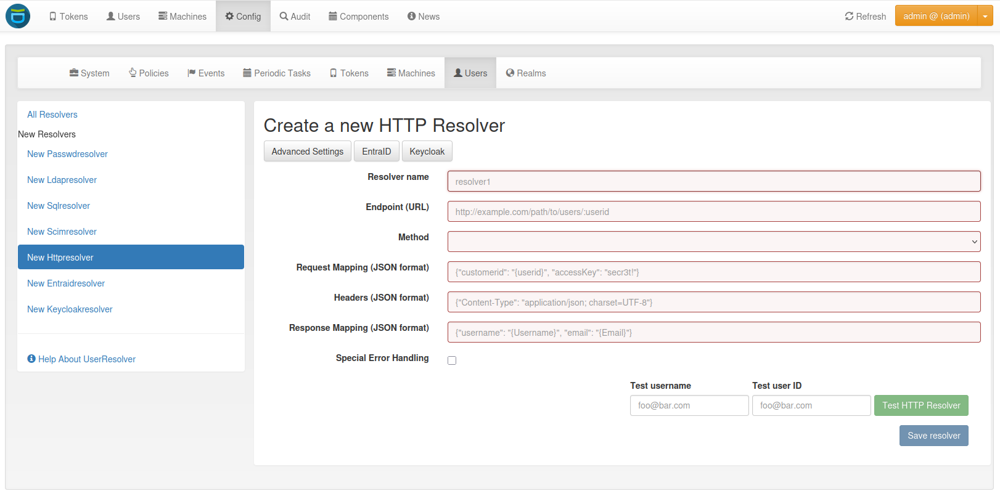

.. _useridresolvers:

UserIdResolvers
---------------

.. index:: useridresolvers, LDAP, Active Directory

Each organisation or company usually has its users managed at a central location.
This is why privacyIDEA does not provide its own user management but rather
connects to existing user stores.

UserIdResolvers are connectors to those user stores, the locations,
where the users are managed. Nowadays this can be LDAP directories or
especially Active Directory, some times FreeIPA or the Redhat 389 service.
But classically users are also located in files like /etc/passwd on
standalone unix systems. Web services often use SQL databases as
user store.

Today with many more online cloud services SCIM is also an uprising
protocol to access userstores.

privacyIDEA already comes with UserIdResolvers to talk to all these
user stores:

 * :ref:`flatfile_resolver`
 * :ref:`ldap_resolver`
 * :ref:`sql_resolver`
 * :ref:`scim_resolver`
 * :ref:`http_resolver`
    * :ref:`entra_id_resolver`
    * :ref:`keycloak_resolver`

.. note:: New resolver types (python modules) can be added easily. See the
   module section for this
   (:ref:`code_useridresolvers`).

You can create as many UserIdResolvers as you wish and edit existing resolvers.
When you have added all configuration data, most UIs of the UserIdResolvers have a
button "Test resolver", so that you can test your configuration before saving
it.

Starting with privacyIDEA 2.4 resolvers can be editable, i.e. you can edit
the users in the user store. Read more about this at :ref:`manage_users`.

.. note:: Using the authentication policy ``otppin=userstore`` users can
   authenticate with the password
   from their user store, being the LDAP password, SQL password or password
   from flat file.

.. _flatfile_resolver:

Flatfile resolver
.................

.. index:: flatfile resolver

Flatfile resolvers read files like ``/etc/passwd``.

.. note:: The file ``/etc/passwd`` does not contain the unix password.
   Thus, if you create a flatfile resolver from this file the functionality
   with ``otppin=userstore`` is not available. You can create a flatfile with
   passwords using the tool ``privacyidea-create-pwidresolver-user`` which is
   usually found in ``/opt/privacyidea/bin/``.

Create a flat file like this::

   privacyidea-create-pwidresolver-user -u user2 -i 1002 >> /your/flat/file

.. _ldap_resolver:

LDAP resolver
.............

.. index:: LDAP resolver, OpenLDAP, Active Directory, FreeIPA, Penrose,
   Novell eDirectory, SAML attributes, Kerberos

The LDAP resolver can be used to access any kind of LDAP service like
OpenLDAP, Active Directory, FreeIPA, Penrose, Novell eDirectory.

.. figure:: images/ldap-resolver.png
   :width: 500

   *LDAP resolver configuration*

Server settings
~~~~~~~~~~~~~~~
The ``Server URI`` can contain a comma separated list of servers.
The servers are used to create a server pool and are used with a round robin
strategy [#serverpool]_.

**Example**::

   ldap://server1, ldaps://server2:1636, server3, ldaps://server4

This will create LDAP requests to

 * server1 on port 389
 * server2 on port 1636 using SSL
 * server3 on port 389
 * server4 on port 636 using SSL.

TLS Version
"""""""""""

When using TLS, you may specify the TLS version to use. Starting from version 3.6, privacyIDEA offers
TLS v1.3 by default.

TLS certificates
""""""""""""""""

When using TLS with LDAP, you can tell privacyIDEA to verify the certificate. The according
checkbox is visible in the WebUI if the target URL starts with *ldaps* or when using STARTTLS.

You can specify a file with the trusted CA certificate, that signed the
TLS certificate. The default CA filename is */etc/privacyidea/ldap-ca.crt*
and can contain a list of base64 encoded CA certificates.
PrivacyIDEA will use the CA file if specified. If you leave the field empty
it will also try the system certificate store (*/etc/ssl/certs/ca-certificates.crt*
or */etc/ssl/certs/ca-bundle.crt*).

Binding
"""""""

The ``Bind Type`` for querying the LDAP-Server can be ``Anonymous``, ``Simple``,
``NTLM``, ``SASL Digest-MD5`` (Deprecated) or ``SASL Kerberos``.

.. note:: When using bind type ``Simple`` you can specify the Bind-DN like
   ``cn=administrator,cn=users,dc=domain,dc=name`` or ``administrator@domain.name``.
   When using bind type ``NTLM`` you need to specify Bind-DN like
   ``DOMAINNAME\\username``. In case of ``SASL Kerberos`` the Bind-DN needs to
   be the *PrincipalName* corresponding to the given *keytab*-file.

For the ``SASL Kerberos`` bind type, the privacyIDEA server needs to be
integrated into the AD Domain. A basic setup and more information on the Kerberos
authentication can be found in the corresponding
`GitHub Wiki <https://github.com/privacyidea/privacyidea/wiki/concept:-LDAP-resolver-with-Kerberos-auth>`_.

Caching
"""""""

The ``Cache Timeout`` configures a short living per process cache for LDAP users.
The cache is not shared between different Python processes, if you are running more processes
in Apache or Nginx. You can set this to ``0`` to deactivate this cache.

Server Pools
""""""""""""

The ``Server pool retry rounds`` and ``Server pool skip timeout`` settings configure the behavior of
the LDAP server pool. When establishing a LDAP connection, the resolver uses a round-robin
strategy to select a LDAP server from the pool. If the current server is not reachable, it is removed
from the pool and will be re-inserted after the number of seconds specified in the *skip timeout*.
If the pool is empty after a round, a timeout is added before the next round is started.
The ldap3 module defaults system wide to 10 seconds before starting the next round.
This timeout can be changed by setting ``PI_LDAP_POOLING_LOOP_TIMEOUT`` to an
integer in seconds in the :ref:`cfgfile`.
If no reachable server could be found after the number of rounds specified in the *retry rounds*,
the request fails.

By default, knowledge about unavailable pool servers is not persisted between requests.
Consequently, a new request may retry to reach unavailable servers, even though the *skip timeout*
has not passed yet. If the *Per-process server pool* is enabled, knowledge about unavailable
servers is persisted within each process. This setting may improve performance in situations in
which a LDAP server from the pool is down for extended periods of time.

Modifying users
"""""""""""""""

Starting with privacyIDEA 2.12, you can define the LDAP resolver as editable.
I.e. you can create and modify users from within privacyIDEA.

There are two additional configuration parameters for this case.

``DN Template`` defines how the DN of the new LDAP object should be created. You can use *username*, *surname*,
*givenname* and *basedn* to create the distinguished name.

**Examples**::

   CN=<givenname> <surname>,<basedn>

   CN=<username>,OU=external users,<basedn>

   uid=<username>,ou=users,o=example,c=com

``Object Classes`` defines which object classes the user should be assigned to. This is a comma separated list.
The usual object classes for Active Directory are::

   top, person, organizationalPerson, user, inetOrgPerson

Resolver settings
~~~~~~~~~~~~~~~~~

Loginname Attribute
"""""""""""""""""""

The ``LoginName attribute`` is the attribute that holds the login name. It
can be changed to your needs.

Starting with version 2.20 you can provide a list of attributes in
``LoginName Attribute`` like::

    sAMAccountName, userPrincipalName

This way a user can login with either his ``sAMAccountName`` or his ``principalName``.

Search Filter
"""""""""""""

The ``searchfilter`` is used to list all possible users, that can be used
in this resolver. The search filter is used for forward and backward
search the object in LDAP.

Attribute Mapping
"""""""""""""""""

The ``attribute mapping`` maps LDAP object attributes to user attributes in
privacyIDEA. privacyIDEA knows the following attributes:

 * ``phone``,
 * ``mobile``,
 * ``email``,
 * ``surname``,
 * ``givenname``,
 * ``password``
 * ``accountExpires``.

The above attributes are used for privacyIDEA's normal functionality and are
listed in the :ref:`user_details`. However, with a SAML authentication request,
the user attributes can be returned. (see :ref:`return_saml_attributes`). To return
arbitrary attributes from the LDAP You can add additional keys to the
attribute mapping with a key, you make up and the LDAP attribute like::

   "homedir": "homeDirectory",
   "studentID": "objectGUID"

``"homeDirectory"`` and ``"objectGUID"`` being the attributes in the LDAP directory
and ``"homedir"`` and ``"studentID"`` the keys returned in a SAML authentication
request.

Multivalue Attributes
"""""""""""""""""""""

The ``MULTIVALUEATTRIBUTES`` config value can be used to specify a list of
user attributes, that should return a list of values. Imagine you have a user mapping like
``{ "phone" : "telephoneNumber", "email" : "mail", "surname" : "sn", "group": "memberOf"}``.
Then you could specify ``["email", "group"]`` as the multi value attribute and the user object
would return the emails and the group memberships of the user from the LDAP server as a list.

.. note:: If the ``MULTIVALUEATTRIBUTES`` is left blank the default setting is "mobile". I.e. the
   mobile number will be returned as a list.

The ``MULTIVALUEATTRIBUTES`` can be well used with the ``samlcheck`` endpoint (see :ref:`rest_validate`)
or with the policy
:ref:`policy_add_user_in_response`.

UID Type
""""""""

The ``UID Type`` is the unique identifier for the LDAP object. If it is left
blank, the distinguished name will be used. In case of OpenLDAP this can be
*entryUUID* and in case of Active Directory *objectGUID*. For FreeIPA you
can use *ipaUniqueID*.

.. note:: The attributes *entryUUID*, *objectGUID*, and *ipaUniqueID*
   are case sensitive!

Recursive Search of User Groups
"""""""""""""""""""""""""""""""

Active Directory only returns the direct group memberships of a user. If you are using nested groups and are interested
in all group memberships, you can use this option. The resolver will then perform another search to retrieve all groups
of the user, according to the defined search filter.

**Search Filter for User Groups**

Define a search filter to get the groups of the user. The following tags can be used:
    * ``{base_dn}``: The base DN of the LDAP resolver as defined in ``Base DN``
    * ``{username}``: The username of the user to search for
    * All keys defined in the attribute mapping surrounded by curly braces

For example, a valid search filter could be::

    (&(sAMAccountName=*)(objectCategory=group)(member:1.2.840.113556.1.4.1941:=cn={username},{base_dn}))

The OID ``1.2.840.113556.1.4.1941`` stands for the ``LDAP_MATCHING_RULE_IN_CHAIN``, flag indicating that the search should
be done recursively. This filter works if the user location is in the ``Base DN``. If this is not the case, you can
add the user location to the attribute mapping, e.g., ``distinguishedName``. Then this attribute can be used as a tag
in the search filter, such as ::

    (&(sAMAccountName=*)(objectCategory=group)(member:1.2.840.113556.1.4.1941:={distinguishedName}))

**Group Name Attribute**

The LDAP group attribute defining the group's name, which should be stored in the user info (attribute mapping value),
e.g., ``distinguishedName``.

**User Info Key**

The key to store the groups in the user info (attribute mapping key).

No anonymous referral chasing
"""""""""""""""""""""""""""""

In case of Active Directory connections you might need to check the box
``No anonymous referral chasing``. The underlying LDAP library is only
able to do anonymous referral chasing. Active Directory will produce an
error in this case [#adreferrals]_.

No retrieval of schema information
""""""""""""""""""""""""""""""""""

The option ``No retrieval of schema information`` can be used to
disable the retrieval of schema information [#ldapschema]_ in
order to improve performance. This checkbox is deactivated by default
and should only be activated after having ensured that schema information
are unnecessary.

Expired Users
~~~~~~~~~~~~~

.. index:: Expired Users

You may set::

    "accountExpires": "accountExpires"

in the attribute mapping for Microsoft Active Directories. You can then call
the user listing API with the parameter ``accountExpires=1`` and you will only
see expired accounts.

This functionality is used with the script *privacyidea-expired-users*.

.. _sql_resolver:

SQL resolver
............

.. index:: SQL resolver, MySQL, PostgreSQL, Oracle, DB2, sqlite

The SQL resolver can be used to retrieve users from any kind of
SQL database like MySQL, PostgreSQL, Oracle, DB2 or sqlite.

.. figure:: images/sql-resolver.png
   :width: 500

   *SQL resolver configuration*

In the upper frame you need to configure the SQL connection.
The SQL resolver uses `SQLAlchemy <http://sqlalchemy.org>`_ internally.
In the field ``Driver`` you need to set a driver name as defined by the
`SQLAlchemy  dialects <http://docs.sqlalchemy.org/en/rel_0_9/dialects/>`_
like "mysql" or "postgres".

In the ``SQL attributes`` frame you can specify how the users are
identified.

The ``Database table`` contains the users.

.. note:: At the moment, only one table
   is supported, i.e. if some of the user data like email address or telephone
   number is located in a second table, those data can not be retrieved.

The ``Limit`` is the SQL limit for a userlist request. This can be important
if you have several thousand user entries in the table.

The ``Attribute mapping`` defines which table column should be mapped to
which privacyIDEA attribute. The known attributes are:

 * userid *(mandatory)*,
 * username *(mandatory)*,
 * phone,
 * mobile,
 * email,
 * givenname,
 * surname,
 * password.

The ``password`` attribute is the database column that contains the user
password. This is used, if you are doing user authentication against the SQL
database.

.. note:: There is no standard way to store passwords in an SQL database.
   privacyIDEA supports the most
   common ways like Wordpress hashes starting with *$P* or *$S*. Secure hashes
   starting with *{SHA}* or salted secure hashes starting with *{SSHA}*,
   *{SSHA256}* or *{SSHA512}*. Password hashes of length 64 are interpreted as
   OTRS sha256 hashes.

You can mark the users as ``Editable``. The ``Password_Hash_Type`` can be
used to determine which hash algorithm should be used, if a password of an
editable user is written to the database.

You can add an additional ``Where statement`` if you do not want to use
all users from the table.

The ``poolSize`` and ``poolTimeout`` determine the pooling behaviour. The
``poolSize`` (default 5) determine how many connections are kept open in the
pool. The ``poolTimeout`` (default 10) specifies how long the application
waits to get a connection from the pool.

.. note:: The pooling parameters only have an effect if the ``PI_ENGINE_REGISTRY_CLASS``
   config option is set to ``"shared"`` (see :ref:`engine-registry`).
   If you then have several SQL resolvers with the same connection and pooling settings,
   they will use the same shared connection pool.
   If you change the connection settings of an existing connection, the connection pool
   for the old connection settings will persist until the respective connections
   are closed by the SQL server or the web server is restarted.

.. note:: The ``Additional connection parameters``
   refer to the SQLAlchemy connection but are not used at the moment.

.. _scim_resolver:

SCIM resolver
.............

.. index:: SCIM resolver

SCIM is a "System for Cross-domain Identity Management". SCIM is a REST-based
protocol that can be used to ease identity management in the cloud.

The SCIM resolver is tested in basic functions with OSIAM [#osiam]_,
the "Open Source Identity & Access Management".

To connect to a SCIM service you need to provide a URL to an authentication
server and a URL to the resource server. The authentication server is used to
authenticate the privacyIDEA server. The authentication is based on a ``Client``
name and the ``Secret`` for this client.

.. figure:: images/scim-resolver.png
   :width: 500

User information is then retrieved from the resource server.

The available attributes for the ``Attribute mapping`` are:

 * username *(mandatory)*,
 * givenname,
 * surname,
 * phone,
 * mobile,
 * email.

.. _http_resolver:

HTTP resolver
.............

.. index:: HTTP resolver, resolver, api, http

Starting with version 3.4 the HTTP resolver is available to retrieve user information from any kind
of web service API. There are four types of HTTP resolvers:

    * :ref:`basic_http_resolver`: Limited configuration options to retrieve user information for a single user.
    * :ref:`advanced_http_resolver`: More complex configuration options to not only get user information for different
      purposes, but also allows to create, edit and delete users.
    * :ref:`entra_id_resolver`: Preconfigured advanced HTTP resolver to retrieve user information from Microsoft Entra
      ID.
    * :ref:`keycloak_resolver`: Preconfigured advanced HTTP resolver to retrieve user information from Keycloak.

.. _basic_http_resolver:

Basic HTTP resolver
~~~~~~~~~~~~~~~~~~~
.. index:: Basic HTTP resolver

privacyIDEA issues a request to the target service and expects a JSON object in return.
The configuration of the HTTP resolver sets the details of the request in the ``Request Mapping`` as well as the
mapping of the obtained information as a ``Response Mapping``.

The ``Request Mapping`` is used to build the request issued to the remote API from privacyIDEA's user information.
For example an endpoint definition::

   POST /get-user
   customerId=<user_id>&accessKey="secr3t!"

will require a request mapping

.. code-block:: json

   { "customerId": "{userid}", "accessKey": "secr3t!" }

The ``Response Mapping`` follows the same rules as the attribute mapping of the SQL resolver. The known attributes are

 * username *(mandatory)*,
 * givenname,
 * surname,
 * phone,
 * mobile,
 * email.

Nested attributes are also supported using `pydash deep path <https://pydash.readthedocs.io/en/latest/deeppath.html>`_
for parsing, e.g.

.. code-block:: json

   { "username": "{Username}", "email": "{Email}", "phone": "{Phone_Numbers.Phone}" }

For APIs which return ``200 OK`` also for a negative response, ``Special error handling`` can be activated to treat
the request as unsuccessful if the response contains certain content.

The above configuration image will throw an error for a response

.. code-block:: json

   { "success": false, "message": "There was an error!" }

because privacyIDEA will match ``{ "success": false }``.

.. note:: If the HTTP response status is >= 400, the resolver will throw an exception.

.. _advanced_http_resolver:

Advanced HTTP resolver
~~~~~~~~~~~~~~~~~~~~~~
.. index:: Advanced HTTP resolver

The advanced HTTP resolver is a more complex version of the basic HTTP resolver. In the UI, first some generic settings
are configured. Below that, you can set up the user store API endpoint for each resolver functionality.

**Generic Settings**
    * **Resolver name**: A unique name for the resolver.
    * **Base URL**: The base URL of the user store API. It will be concatenated with the ``Endpoint`` in the detailed
      configurations, except for endpoints where a full URL is specified starting with ``http``.
    * **Attribute Mapping**: Mapping between the user attribute names used by privacyIDEA and the user store API.
      The known attributes in privacyIDEA are:

            * username
            * userid
            * givenname
            * surname
            * phone
            * mobile
            * email

    * **Headers**: Default request header to use if no specific one is defined. It has to be in JSON format, e.g.
      ``{"Content-Type": "application/json"}``.
    * **Edit user store**: If checked, the resolver is editable and allows creating, editing, and deleting users in the
      user store. Note that these rights must also be granted in the user store.
    * **Verify TLS**: If checked, the TLS certificate of the user store API is verified. This should always be checked
      for productive use!
      Optionally, a CA certificate can be provided to verify the TLS certificate of the user store API.
    * **Timeout**: Time in seconds to wait for a response from the user store API. If the request takes longer, it will
      be aborted.

**Endpoint Configuration**

The configuration is similar for each endpoint:
    * **Method**: The HTTP method to use for the request (GET, POST, PUT, PATCH, DELETE)
    * **Endpoint**: The endpoint of the user store API to which the request is sent. It will be concatenated with the
      base URL. If you enter a full URL starting with ``http``, it will not be concatenated with the base URL. You can
      use tags to dynamically construct the endpoint, e.g. ``/users/{userid}``. Possible tags depend on the endpoint.
    * **Headers**: Request headers to use for this endpoint. It has to be in JSON format, e.g.
      ``{"Content-Type": "application/json"}``. For requests sending JSON data, the ``Content-Type`` header is
      set automatically to ``application/json``.
    * **Request Mapping**: The request parameters to send to the user store API. It has to be in JSON format, e.g.
      ``{"username": "{username}", "email": "{email}"}``. You can use tags to map the user attributes to the request
      parameters. Possible tags depend on the endpoint. Note that tags can only be used in strings, hence they must
      always be surrounded by double quotation marks.

      If the ``Content-Type`` header is set to ``application/x-www-form-urlencoded``, the request mapping can be
      defined as query parameters in the format ``key1=value1&key2=value2``.
    * **Response Mapping**: Reformatting of the response from the user store API to the expected format for
      privacyIDEA. It has to be in JSON format. You can use the keys of the original response as tags, e.g.
      ``{"username": "{Username}", "email": "{Email}"}``. You can also use nested attributes using
      `pydash deep path <https://pydash.readthedocs.io/en/latest/deeppath.html>`_, e.g.:

      .. code-block:: json

        { "username": "{Username}", "phone": "{Phone_Numbers.Phone}" }

    * **Special error handling**: If checked, the resolver will treat the request as unsuccessful if the response
      contains certain content. This is useful for APIs that return ``200 OK`` for a negative response.
      The content to match can be defined in the ``Response contains``.

**Authorization**

This section allows you to configure an endpoint to which the privacyIDEA server must authenticate in order to receive
an access token. This token can then be used to access the user store API.
Besides the generic endpoint settings, the ``username`` and ``password`` of a service account can be configured to
authenticate.
The password is stored encrypted in the database. If username and password are defined, they can be used as tags for
the endpoint and request mapping, e.g. ``{"username": "{username}", "password": "{password}"}``.

**Check User Password**

Configure the endpoint to authenticate the user with their username/userid and password. You can use the tags
``{username}``, ``{userid}``, and ``{password}`` in the endpoint definition and request mapping.

**User List**

Configure the endpoint to retrieve a list of users from the user store. The above-defined attributes are added to the
request as search parameters if they are available in the request. You can also use the attributes as tags
(``{username}``, ``{userid}``, ``{surname}``, ``{givenname}``).

**Get User by ID**

Configure the endpoint to retrieve a single user for the UID. For example, privacyIDEA only stores the UID of the token
owner. To resolve the complete user, this endpoint is used. If an error occurs, the resolver will only log it and not
throw an exception.

Possible tag: ``{userid}``

**Get User by Name**

Configure the endpoint to retrieve a single user for the username. If an error occurs, the resolver will only log it
and not throw an exception.

For example, this is used when a user tries to authenticate against privacyIDEA. To resolve the complete user and
evaluate if the user exists, this endpoint is used.

Possible tag: ``{username}``

**Create User**

Configure the endpoint to create a new user in the user store. The above-defined attributes can be set in the UI and
will be added to the request body. Additionally, you can define a password that must be specified in the request
mapping using the tag ``{password}``.
All user attributes defined in the attribute mapping can be used as tags, e.g. ``{username}``, ``{userid}``,
``{givenname}``, ``{surname}``, ``{phone}``, ``{mobile}``, ``{email}``.

**Edit User**

Configure the endpoint to edit an existing user in the user store. The above-defined attributes can be set in the UI
and will be added to the request body. Additionally, you can define custom request parameters in the request mapping.
All user attributes defined in the attribute mapping can be used as tags, e.g. ``{username}``, ``{userid}``,
``{givenname}``, ``{surname}``, ``{phone}``, ``{mobile}``, ``{email}``.

**Delete User**

Configure the endpoint to delete an existing user from the user store.
Possible tag: ``{userid}``

.. _entra_id_resolver:

Entra ID resolver
~~~~~~~~~~~~~~~~~~~~~~
.. index:: Entra ID resolver

The EntraID resolver is a preconfigured advanced HTTP resolver to retrieve user information from Microsoft Entra ID.
Check out the
`Microsoft Graph API documentation <https://learn.microsoft.com/en-us/graph/api/resources/users?view=graph-rest-1.0>`_
if you want to change the default configuration.
The configuration is similar to the advanced HTTP resolver. In the following, only the differences and some default
settings are described.

**Generic Settings**

    * **Base URL**: The base URL of the Microsoft Graph API. It will be concatenated with the ``Endpoint`` in the
      detailed configurations. By default, this is ``https://graph.microsoft.com/v1.0``.
    * **Attribute Mapping**: The mapping between privacyIDEA user attributes and the ones used by Entra ID are already
      all prefilled. If you do not need all of them, you can remove them.
    * **Edit user store**: By default, editing the users in Entra ID is not enabled. If you want to enable this option,
      you need to ensure that the required write permissions are granted to the privacyIDEA server in Entra ID.
    * **Verify TLS**: By default, the TLS certificate of the Entra ID server is verified. Usually, there is no need to
      add a custom certificate.

**Authorization**

To access the Microsoft Graph API, the privacyIDEA server must authenticate against Microsoft Entra ID. First of
all, you need to register the privacyIDEA server as an application in the Microsoft Entra admin center:

    1. Browse to *Identity > Applications > App registrations* and select *New registration*.
    2. Enter a name for the application, e.g. "privacyIDEA" and select *Register* to complete the app
       registration.

For more information, read the official documentation on how to
`Register an Application in Microsoft Entra ID
<https://learn.microsoft.com/en-us/entra/identity-platform/quickstart-register-app>`_.

Afterwards, you need to grant permissions to your application:

    1. On the application page, browse to *API permissions* and select *Add a permission*.
    2. A new window opens. Select *Microsoft Graph* and then *Application permissions*.
    3. On the bottom, different scopes with possible permissions appear. Open the *User* section and select the
       permissions you want to grant to the privacyIDEA server:

         * ``User.ReadBasic.All``: Allow privacyIDEA to read the basic profile information of all users in the tenant.
           This includes the username, user ID, given name, surname, and email. If this information is sufficient
           and you do not need to create, edit, or delete users, you can select this permission.
         * ``User.Read.All``: Allow privacyIDEA to read all user profiles in the tenant. Select this permission if you
           want to use the resolver only to read user information, but not to create, edit, or delete users.
         * ``User.ReadWrite.All``: Allow privacyIDEA to read and write all user profiles in the tenant. If you want to
           use the resolver to create, edit, or delete users, you need to grant this permission.

    4. After selecting the permissions, select *Add permissions* to add them to the application.
    5. If you want privacyIDEA to check the user's password, you need to add another permission: Go to
       *Microsoft Graph > Delegated permissions > OpenId Permissions* and select *openid*
    6. After adding the permissions, you need to grant admin consent for the permissions. Select *Grant admin
       consent for <tenant name>* and confirm the dialog.

For more information, read the official documentation on how to
`Configure app permissions for a web API
<https://learn.microsoft.com/en-us/entra/identity-platform/quickstart-configure-app-access-web-apis>`_.

Finally, you need to specify a client credential to authenticate the privacyIDEA server against the Microsoft Entra ID.
On the application page, browse to *Certificates & secrets*. There are two ways to authenticate:

    1. **Client certificate**: Use a certificate of the privacyIDEA server to authenticate against Microsoft Entra
       ID. It is the recommended credential type by Entra ID. However, you can only use this credential type if the
       user's password is checked by Entra ID first, and privayIDEA only evaluates the second factor. It can not be used
       if privacyIDEA should check the password.

       To add a certificate, browse to *Certificates* and select *Upload certificate*. Select the certificate file and
       select *Add*. Supported file types are *\*.cer*, *\*.pem*, and *\*.crt*.

    2. **Client secret**: A static secret string (application password) that is used to authenticate the privacyIDEA
       server against Microsoft Entra ID. Use this credential type if the user's password should be checked by
       privacyIDEA in an authentication flow.

       You can create a new client secret by selecting *New client secret* and *Add* to confirm. The
       secret will be displayed only once, so make sure to copy it and store it securely.

For more information, read the official documentation on how to
`Add and manage application credentials in Microsoft Entra ID
<https://learn.microsoft.com/en-us/entra/identity-platform/how-to-add-credentials?tabs=certificate>`_.

In the privacyIDEA web UI, in the authorization section of the EntraID resolver, you can now configure the following
settings:

    * **Authority**: The URL of Microsoft where the application needs to authenticate to receive an access token.
      This is usually ``https://login.microsoftonline.com/{tenant}``, where ``{tenant}`` is the name of your tenant.
      You can use the tenant tag and define the tenant name below.
    * **Tenant**: The name of your Microsoft Entra ID tenant
    * **Client ID**: The application (client) ID of the registered application in Entra ID. In the Microsoft Entra admin
      center, browse to *Applications > App registrations > All applications* and select your privacyIDEA server. On
      the application overview page, you can find the application (client) ID.
    * **Client Credential**: The client credential to authenticate the privacyIDEA server against the Microsoft Entra
      ID. Depending on the selected authentication method, you can either select "certificate" or "secret" for the type.

        * **Secret**: Enter the client secret you created in the Microsoft Entra admin center.
        * **Certificate**: Enter the counterpart to the server certificate that you uploaded in Entra ID.

            * **Path to the private key file**: The path to the private key file you used to generate the certificate.
              The key must be in PEM format.
            * **Password of the private key**: If the private key is encrypted, enter the password here; otherwise,
              leave the field empty.
            * **Thumbprint of the certificate**: The thumbprint of the certificate you uploaded in Entra ID. You can find
              the thumbprint also in the Microsoft Entra admin center on the application page. There, you need to browse
              to *Certificates & secrets > Certificates*.

**Check user password**

To authenticate users, the OAuth 2.0 resource owner password credentials (ROPC) flow is used. It can only be used with
client secrets as credential type and not with certificates. Generally, it is recommended to let Microsoft Entra ID
handle the user password check and privacyIDEA only to evaluate the second factor. However, if you want to use
privacyIDEA to check the user password, you can configure the endpoint to authenticate the user with their username and
password.

Check out the `OAuth ROPC <https://learn.microsoft.com/en-us/entra/identity-platform/v2-oauth-ropc>`_ documentation for
more information about the ROPC flow.

**User List**

The preconfiguration sets the consistency level header to "eventual" to enable advanced query capabilities. This allows
for searching for user attributes that either start with or end with the search value. If the header is not set, we can
only search for user attributes that start with the search value.

More advanced searches where the search value is contained in the user attribute are not supported by the Microsoft
Graph API.

**Create User**

To create a user, all defined attributes from the attribute mapping are added to the request body. Additionally,
the following required parameters are set in the request mapping:

    * *accountEnabled*: Set to true to enable the user account.
    * *displayName*: This is the user's display name. By default, it is constructed from the given name and surname,
      such as "John Doe".
    * *mailNickname*: The mail alias for the user. By default, this is equal to the given name.
    * *passwordProfile*: A dictionary by default containing only the user's password. The following options can be set:
        * *password* (required): The password for the user. You can use the tag ``{password}``. Note that if you do not
          specify a password, the tag can not be replaced, and the raw tag string ``{password}`` will be used as the
          password. This will cause an error as this password does not comply with the password complexity requirements
          of Entra ID.
        * *forceChangePasswordNextSignIn* (optional): If set to true, the user must change the password at the next
          sign-in.
        * *forceChangePasswordNextSignInWithMfa* (optional): If true, at next sign-in, the user must perform a
          multifactor authentication (MFA) before being forced to change their password.

.. _keycloak_resolver:

Keycloak resolver
~~~~~~~~~~~~~~~~~~~~~~
.. index:: Keycloak resolver

The Keycloak resolver is a preconfigured advanced HTTP resolver to retrieve user information from Keycloak.
Check out the
`Keycloak API documentation <https://www.keycloak.org/docs-api/latest/rest-api/index.html#_users>`_
if you want to change the default configuration.
The configuration is similar to the advanced HTTP resolver. In the following, only the differences and some default
settings are described.

**Generic Settings**

    * **Base URL**: The base URL of the Keycloak server. It will be concatenated with the ``Endpoint`` in the detailed
      configurations. By default, this is ``http://localhost:8080``. However, for production use, you might need to
      adapt this.
    * **Realm**: The name of the realm in Keycloak from which the users should be retrieved. You can use the tag
      ``{realm}`` in the endpoint definitions to insert the realm name.
    * **Edit user store**: By default, editing the users in Keycloak is not enabled. If you want to enable this option,
      you need to ensure that the required write permissions are granted to the privacyIDEA server in Keycloak.
    * **Verify TLS**: By default, the TLS certificate of the Keycloak server is verified. If you have a self-signed
      certificate, you can add the certificate of the CA here.

**Authorization**

PrivacyIDEA must authenticate against the Keycloak server to retrieve an access token. This token is then used to
access the Keycloak API to resolve and edit users. The authentication is done on behalf of a user. Hence, you need to
create a service account in Keycloak with the required permissions to read (and write) users. If you only want to
retrieve user information, the service account only requires the role ``view-users``. If you also want to edit users,
the role ``manage-users`` is required additionally.

In the authorization section of the Keycloak resolver, you can now configure the following settings:

    * **Username**: The username of the service account in Keycloak.
    * **Password**: The password of the service account in Keycloak. It is stored encrypted in the database.

The configured username and password are used as tags in the ``request mapping`` definition. The response mapping
uses the returned access token to create an authorization header, which is then used for all further requests to the
Keycloak API.

**Check User Password**

In Keycloak, the user's password is checked using the OpenID Connect token endpoint. Check out the
`Keycloak OpenID Connect documentation <https://www.keycloak.org/securing-apps/oidc-layers>`_ for more information.

**Get user by name**

There is no endpoint to retrieve a user by name. Instead, the user list endpoint is used to search for users filtered
by the user name. Additionally, the request parameter ``{"exact": true}`` is set to only return users with an exact
match of the user name. If multiple users are found, a ``ResolverError`` is raised.

**Create user**

To create a user, all defined attributes from the attribute mapping are added to the request body. Additionally,
the request mapping contains the parameter ``{"enabled": true}`` to enable the user account. You can set this to
``false`` if you want to create the user account in a disabled state.

Keycloak does not support setting the user password during user creation. This would be a separate API call to
another endpoint. This is actually not implemented in privacyIDEA.

.. _usercache:

User Cache
..........

.. index:: user cache, caching

privacyIDEA does not implement local user management by design and relies on UserIdResolvers to
connect to external user stores instead. Consequently, privacyIDEA queries user stores quite frequently,
e.g. to resolve a login name to a user ID while processing an authentication request, which
may introduce a significant slowdown.
In order to optimize the response time of authentication requests, privacyIDEA 2.19 introduces the *user cache*
which is located in the local database. It can be enabled in the system configuration (see :ref:`user_cache_timeout`).

A user cache entry stores the association of a login name in a specific UserIdResolver with a specific
user ID for a predefined time called the *expiration timeout*, e.g. for one week.
The processing of further authentication requests by the same user during this timespan
does not require any queries to the user store, but only to the user cache.

The user cache should only be enabled if the association of users and user ID is not expected to change often:
In case a user is deleted from the user store, but can still be found in the user cache and still has assigned
tokens, the user will still be able to authenticate during the expiration timeout! Likewise, any changes to the
user ID will not be noticed by privacyIDEA until the corresponding cache entry expires.

Expired cache entries are *not* deleted from the user cache table automatically. Instead, the tool
``privacyidea-usercache-cleanup`` should be used to delete expired cache entries from the database,
e.g. in a cronjob.

However, cache entries are removed at some defined events:

* If a UserIdResolver is modified or deleted, all cache entries belonging to this resolver are deleted.
* If a user is modified or deleted in an editable UserIdResolver, all cache entries belonging to this user
  are deleted.

.. note:: Realms with multiple UserIdResolvers are a special case: If a user ``userX`` tries to authenticate in a
   realm with two UserIdResolvers ``resolverA`` (with highest priority) and ``resolverB``, the user cache is queried
   to find the user ID of ``userX`` in the UserIdResolver ``resolverA``. If the cache contains no matching entry,
   ``resolverA`` itself is queried for a matching user ID! Only if ``resolverA`` does not find a corresponding
   user, the user cache is queried to determine the user ID of ``userX`` in ``resolverB``. If no matching entry
   can be found, ``resolverB`` is queried.

.. rubric:: Footnotes

.. [#serverpool] https://ldap3.readthedocs.io/en/latest/server.html#server-pool
.. [#adreferrals] https://techcommunity.microsoft.com/t5/azure-active-directory-identity/referral-chasing/ba-p/243177
.. [#osiam] http://osiam.github.io
.. [#ldapschema] https://ldap3.readthedocs.io/en/latest/schema.html
