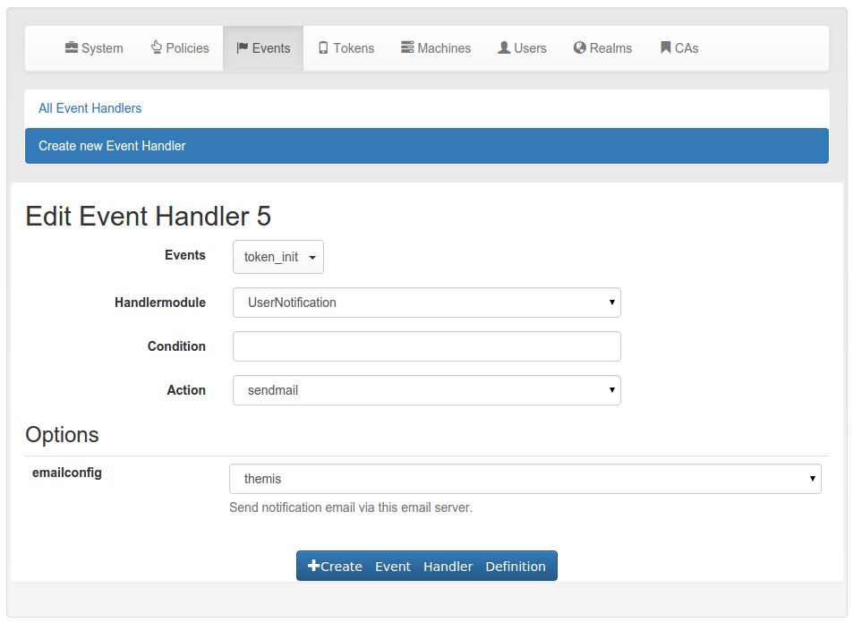

.. _eventhandler:

Event Handler
=============

.. index:: Event Handler, events

Added in version 2.12.

What is the difference between :ref:`policies` and event handlers?

Policies are used to define the behaviour of the system. With policies you
can *change* the way the system reacts.

With event handlers you do not change the way the system reacts. But on
certain events you can *trigger a new action* in addition to the behaviour
defined in the policies.

These additional actions are also logged to the audit log. These actions are
marked as *EVENT* in the audit log and you can see, which event triggered
these actions. Thus a single API call can cause several audit log entries:
One for the API call and more for the triggered actions.

Events
------

Each **API call** is an **event** and you can bind arbitrary actions to each
event as you like.

Internally events are marked by a decorator "event" with an *event identifier*.
At the moment not all events might be tagged. Please drop us a note to tag
all further API calls.

.. figure:: event-list.png
   :width: 500

   *An action is bound to the event* token_init.

.. _handlermodules:

Handler Modules and Actions
---------------------------

.. index:: Handler Modules, Actions

The actions are defined in handler modules. So you bind a handler module and
the action, defined in the handler module, to the events.

The handler module can define several actions and each action in the handler
module can require additional options.

   *The event* sendmail *requires the option* emailconfig.

Conditions
----------

.. index:: Event Handler, conditions

Added in version 2.14

An event handler module may also contain conditions. Only if all conditions
are fullfilled, the action is triggered. Conditions are defined in the class
property *conditions* and checked in the method *check_condition*. The
UserNotification Event Handler defines such conditions.

Basic conditions
~~~~~~~~~~~~~~~~

The basic event handler module has the following conditions.

**last_auth**

This condition checks if the last authentication is older than the specified
time delta. The timedelta is specified with "h" (hours), "d" (days) or "y"
(years). Specifying *180d* would mean, that the action is triggered if the
last successful authentication witht he token was berformed more than 180
days ago.

This can be used to send notifications to users or administrators to inform
them, that there is a token, that might be orphaned.

**logged_in_user**

This condition checks if the logged in user is either an administrator or a
normal user. This way the administrator can bind actions to events triggered
by normal users or e.g. by help desk users. If a help desk user enrolls a
token for a user, the user might get notified.

If a normal user enrolls some kind of token, the administrator might get
notified.

**otp_counter**

The action is triggered, if the otp counter of a token has reached the given
value.

The administrator can use this condition to e.g. automatically enroll a new
paper token for the user or notify the user that nearly all OTP values of a
paper token have been spent.

**realm**

The condition *realm* matches the user realm. The action will only trigger,
if the user in this event is located in the given realm.

This way the administrator can bind certain actions to specific realms. E.g.
some actions will only be triggered, if the event happens for normal users,
but not for users in admin- or helpdesk realms.

**result_value**

This condition checks the result of an event.

E.g. the result of the event *validate_check* can be a failed authentication.
This can be the trigger to notify either the token owner or the administrator.

**serial**

The action will only be triggered, if the serial number of the token in the
event does match the regular expression.

This is a good idea to combine with other conditions. E.g. only tokens with a
certain kind of serial number like Google Authenticator will be deleted
automatically.

**tokenrealm**

In contrast to the *realm* this is the realm of the token - the *tokenrealm*.
The action is only triggerd, if the token within the event has the given
tokenrealm. This can be used in workflows, when e.g. hardware tokens which
are not assigned to a user are pushed into a kind of storage realm.

**tokentype**

The action is only triggered if the token in this event is of the given type.
This way the administrator can design workflows for enrolling and reenrolling
tokens. E.g. the tokentype can be a registration token and the registration
code can be easily and automatically sent to the user.

**token_locked**

The action is only triggered, if the token in the event is locked, i.e. the
maximum failcounter is reached. In such a case the user can not use the token
to authenticate anymore. So an action to notify the user or enroll a new
token can be triggered.

**token_has_owner**

The action is only triggered, if the token is or is not assigned to a user.

**token_is_orphaned**

The action is only triggered, if the user, to whom the token is assigned,
does not exist anymore.

This can be used to trigger the deletion of the token, if the token owner was
removed from the userstore.

**token_validity_period**

Checks if the token is in the current validity period or not. Can be set to
*True* or *False*.

.. note:: ``token_validity_period==False`` will trigger an action if either the
   validitiy period is either *over* or has not *started*, yet.

**user_token_number**

The action is only triggered, if the user in the event has the given number
of tokens assigned.

This can be used to e.g. automatically enroll a token for the user if the
user has no tokens left (token_number == 0) of to notify the administrator if
the user has to many tokens assigned.

Available Handler Modules
-------------------------

.. toctree::
   :maxdepth: 1

   usernotification
   tokenhandler
   scripthandler
