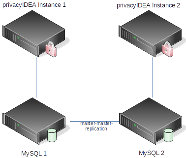

.. _ha_setups:

HA setups
---------

privacyIDEA does not track any state internally. All information is kept in
the database. Thus you can configure several privacyIDEA instances against one
DBMS [#dbms]_ and have the DBMS do the high availability.

When running HA you need to assure to configure the *pi.cfg* file on all
privacyIDEA instances accordingly. You might need to adapt the
``SQLALCHEMY_DATABASE_URI`` accordingly.

Be sure to set the same ``SECRET_KEY`` and ``PI_PEPPER`` on all instances.

Then you need to provide the same encryption key (file *encKey*) and the same
audit signing keys on all instances.

Using one central DBMS
~~~~~~~~~~~~~~~~~~~~~~

.. figure:: images/ha-one-dbms.png
   :width: 500

If you already have a high available, redundant DBMS which might even be
addressable via one cluster IP address the configuration is fairly simple.
In such a case you can configure the same ``SQLALCHEMY_DATABASE_URI`` on all
instances.

Using MySQL master-master-replication
~~~~~~~~~~~~~~~~~~~~~~~~~~~~~~~~~~~~~

If you have no DBMS or might want to use a dedicated database server for
privacyIDEA, you can setup one MySQL server per privacyIDEA instance and
configure the MySQL servers to run in a master-master-replication.

.. note:: The master-master-replication only works with two MySQL
servers.

There are some good howtos out there like [#mastermasterhowto]_.

.. rubric:: Footnotes

.. [#dbms] Database management system
.. [#mastermasterhowto] https://www.digitalocean.com/community/tutorials/how-to-set-up-mysql-master-master-replication.
