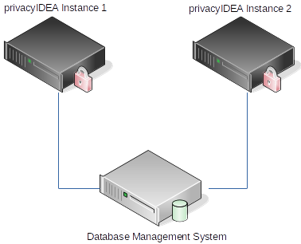
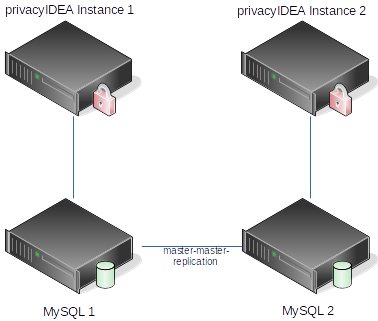

How can I set up HA (High Availability) with privacyIDEA?
---------------------------------------------------------

.. index:: HA

privacyIDEA does not track any state internally. All persistent information
is kept in the database; if you enable the :ref:`redis_cache`, challenges and
cached data are kept in Redis instead (see below). Thus you can configure
several privacyIDEA instances against one DBMS [#dbms]_ and have the DBMS do
the high availability.

.. note:: The passwords and OTP key material in the database are encrypted
   using the *encKey*. Thus it is possible to put the database onto a DBMS
   that is controlled by another database administrator in another department.

.. _ha_setups:

HA setups
.........

When running HA you need to make sure that the *pi.cfg* file is configured on
all privacyIDEA instances. You might need to adapt the
``SQLALCHEMY_DATABASE_URI``.

Be sure to set the same ``SECRET_KEY`` and ``PI_PEPPER`` on all instances.

Do not copy the node settings, though: every instance needs its own
``PI_NODE`` and its own node ID. The node ID is ``PI_NODE_UUID``, or else it is
read from the file ``PI_UUID_FILE`` (default */etc/privacyidea/uuid.txt*) or
from */etc/machine-id*, so make sure these differ as well, e.g. after cloning
a virtual machine. Instances with the same node ID count as one node, which
keeps the name of the instance that started last, and realm resolvers bound to
that node are used on all of them. Instances with the same node name share one
record of the last run of each periodic task, so whether a due task runs on one
or on several of them depends on timing. See the section *privacyIDEA Nodes*
in :ref:`cfgfile` and :ref:`periodic_tasks`.

Then you need to provide the same encryption key (file *encKey*) and the same
audit signing keys on all instances.

If you enable the :ref:`redis_cache`, all instances must connect to the same
Redis (the same ``PI_REDIS_URL``) and use the same ``PI_REDIS_CACHE_*``
settings. With ``PI_REDIS_CACHE_CHALLENGES``, challenges are stored only in
Redis: an instance that uses another Redis, or does not have this setting,
does not find a challenge that another instance created, so the second request
of a challenge-response or push login fails whenever the load balancer sends
it to another instance. With separate Redis servers, a cached authentication
(``PI_REDIS_CACHE_AUTH``) is only found by the instance that stored it, and
the user cache (``PI_REDIS_CACHE_USERS``) of the other instances keeps
outdated user data until its entries expire.

Using one central DBMS
~~~~~~~~~~~~~~~~~~~~~~

If you already have a highly available, redundant DBMS -
like MariaDB Galera Cluster - which might even be
addressable via one cluster IP address the configuration is fairly simple.
In such a case you can configure the same ``SQLALCHEMY_DATABASE_URI`` on all
instances.

Using MySQL replication between two servers
~~~~~~~~~~~~~~~~~~~~~~~~~~~~~~~~~~~~~~~~~~~

If you have no DBMS or might want to use a dedicated database server for
privacyIDEA, you can set up one MySQL server per privacyIDEA instance and
configure the two MySQL servers to replicate from each other, so that each
server is both source and replica of the other (formerly called
master-master replication).

.. note:: This setup only works with two MySQL servers.

privacyIDEA expects a single writer. It does not coordinate OTP counters, fail
counters and challenges between two databases, so send all requests to one
instance at a time, e.g. with a load balancer in active/passive mode or a
proxy that sends all writes to one MySQL server. The other instance with its
MySQL server takes over when the first one fails. If both instances accept
requests, then within the replication delay an OTP value that was used on one
instance is still accepted on the other, the fail counters of the two
instances do not add up, and a challenge that one instance created is not
known to the other. If both servers take writes, the check of the audit log
can also report entries as missing (``missing_line`` *FAIL*) although nothing
was deleted.

The replication setup is described in the MySQL Reference Manual [#mysqlreplication]_.

.. rubric:: Footnotes

.. [#dbms] Database management system
.. [#mysqlreplication] https://dev.mysql.com/doc/refman/8.4/en/replication.html
