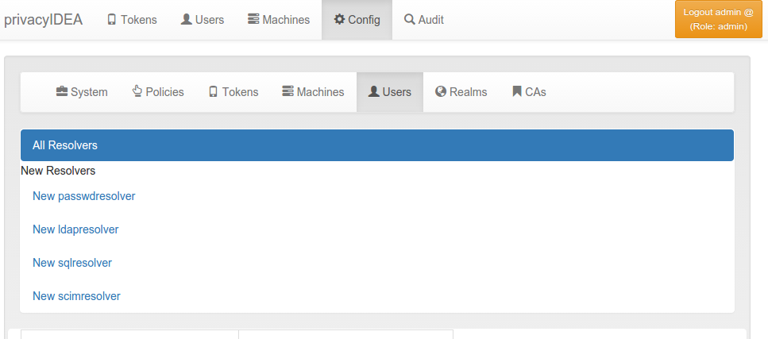
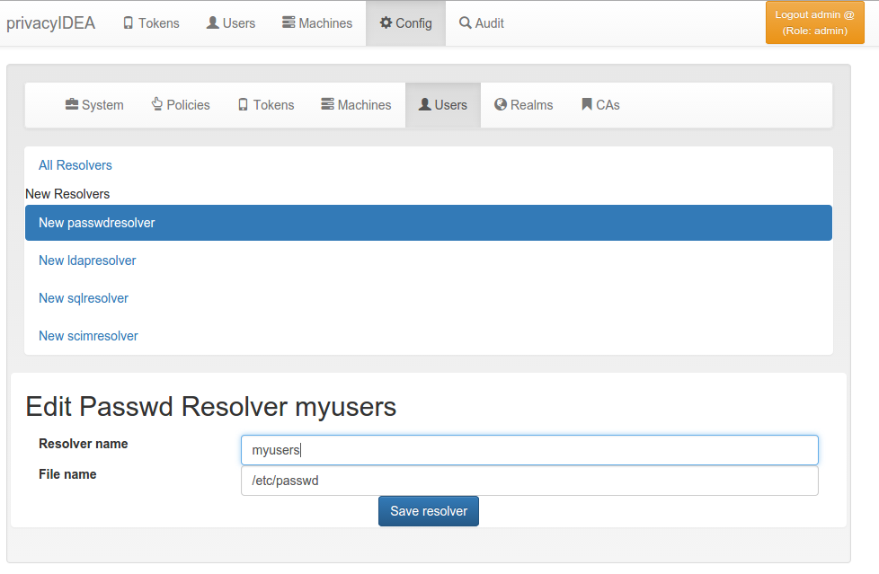
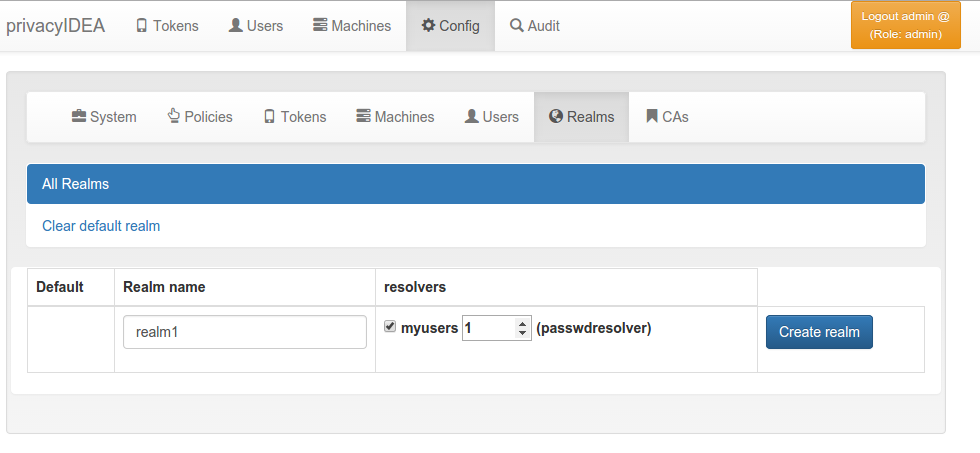
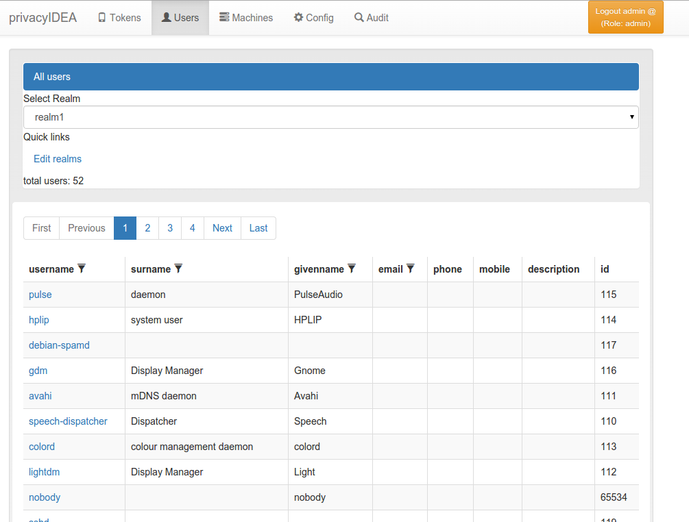

.. _first_steps_realm:

Creating your first realm
=========================

.. note:: When the administrator logs in and no useridresolver and no
   realm is defined, a popup appears, which asks you to create a default
   realm. During these first steps you may say "No", to get a better
   understanding.

Users in privacyIDEA are read from existing sources. See :ref:`realms` for
more information.

In these first steps we will simply read the users from your `/etc/passwd` file.

Create a UserIdResolver
-----------------------

The UserIdResolver is the connector to the user source. For more information
see :ref:`useridresolvers`.

* Go to `Config -> Users` to create a UserIdResolver.

   *Create the first UserIdResolver*

* Choose `New passwdresolver` and
* Enter the name "myusers".
* Save it.

   *Create the first UserIdResolver*

You just created your first connection to a user source.

Create a Realm
--------------

User sources are grouped together to a so called "realm". For more
information see :ref:`realms`.

* Go to `Config -> Realms`
* Enter "realm1" as the new realm name and select the priority 1.
* Check the resolver "myusers" to be included into this realm.
* Save it.

   *Create the first Realm*

* Go to `Users` and you will see the users from the `/etc/passwd`.

   *The users from /etc/passwd*

**Congratulation!** You created your first realm.

You are now ready to enroll a token to a user. Read :ref:`first_steps_token`.

