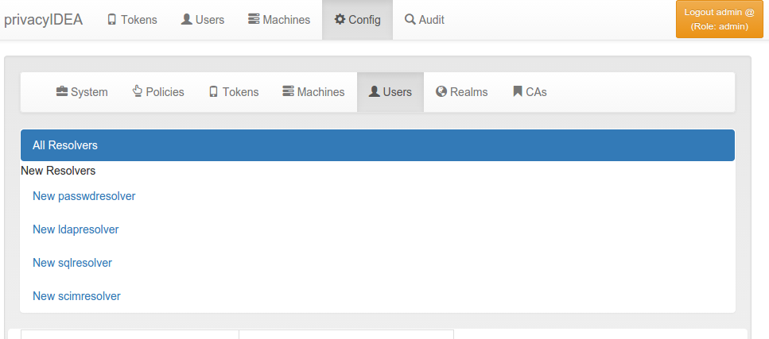
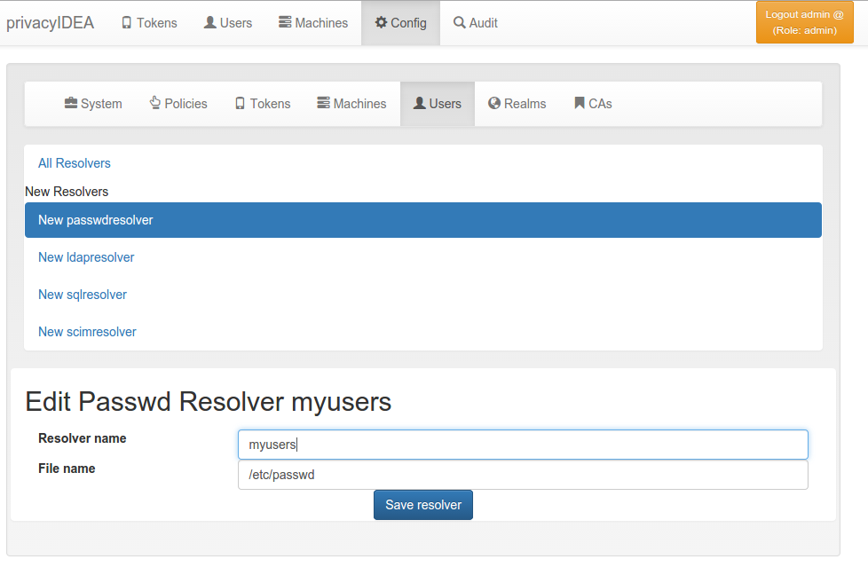
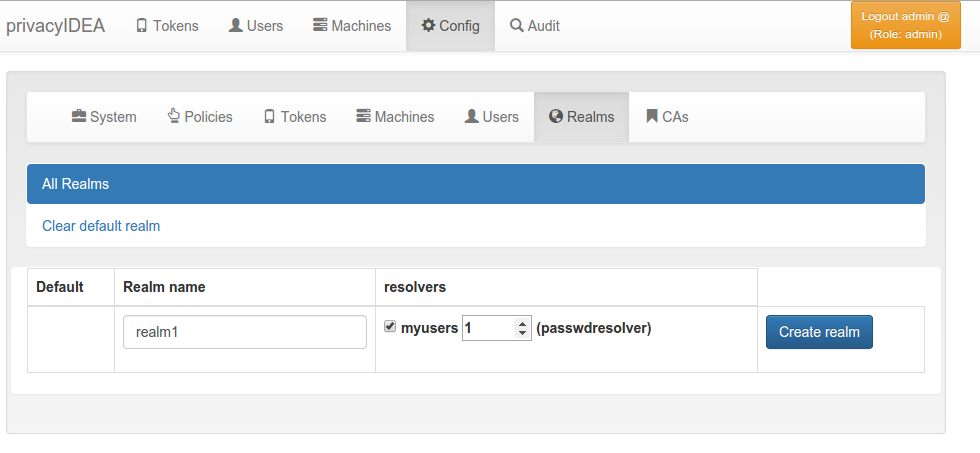
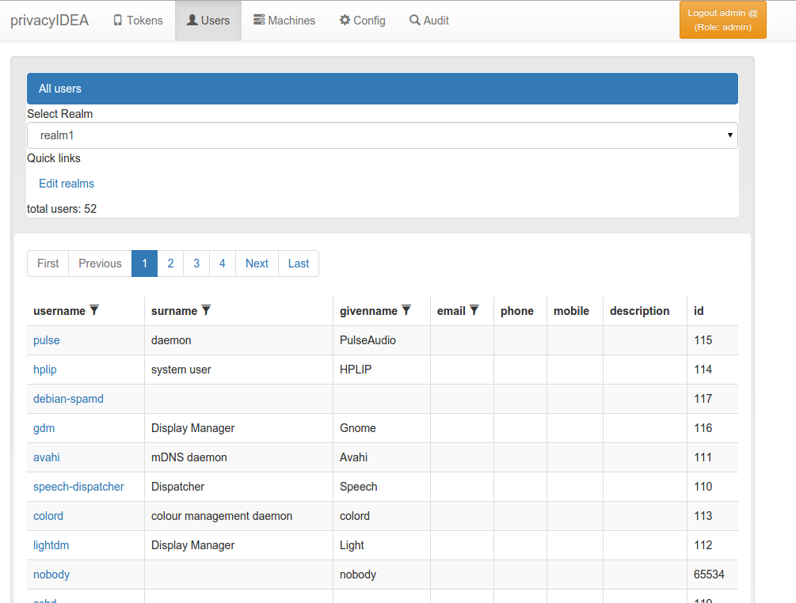

.. _first_steps_realm:

Creating your first realm
=========================

.. note:: The first realm you create automatically becomes the default
   realm.

Users in privacyIDEA are read from existing sources. See :ref:`realms` for
more information.

In these first steps we will simply read the users from your ``/etc/passwd`` file.

Create a UserIdResolver
-----------------------

The UserIdResolver is the connector to the user source. For more information
see :ref:`useridresolvers`.

* Go to *Users -> Resolvers* and click *New Resolver*.

   *Create the first UserIdResolver*

* Keep the *Type* *Passwd*, which is the default. Its *Filename* is already
  set to ``/etc/passwd``.
* Enter "myusers" as *Resolver Name*.
* Click *Save*.

   *Create the first UserIdResolver*

You just created your first connection to a user source.

Create a Realm
--------------

User sources are grouped together into a so-called "realm". For more
information see :ref:`realms`.

* Go to *Users -> Realms*. A new realm is created in the last row of the
  realm table.
* Enter "realm1" as *Realm Name*.
* Select the resolver "myusers" in *Resolvers* and set its priority to 1.
* Click *Create*.

   *Create the first Realm*

* Go to *Users -> Overview* and you will see the users from ``/etc/passwd``.

   *The users from /etc/passwd*

**Congratulations!** You created your first realm.

You are now ready to enroll a token to a user. Read :ref:`first_steps_token`.

