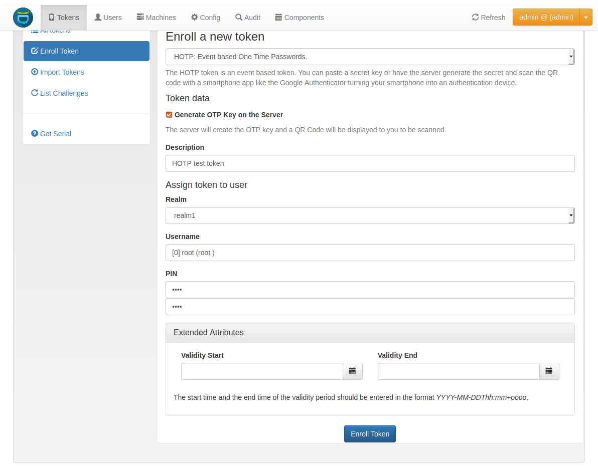
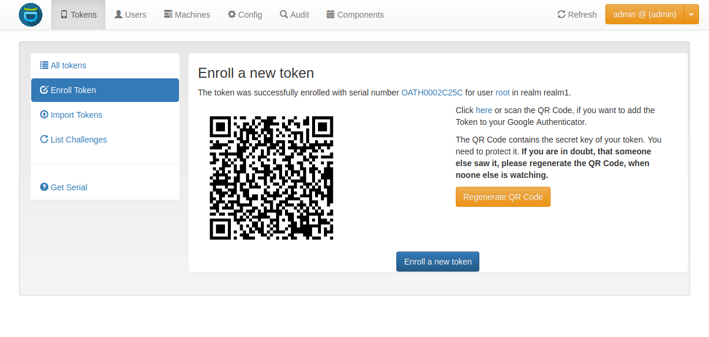
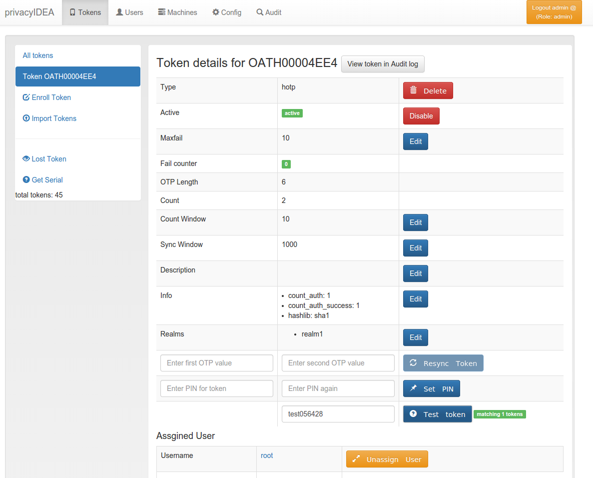

.. _first_steps_token:

Enrolling your first token
==========================

You may now enroll a new token. In this example we are using the Google
Authenticator App,
that you need to install on your smartphone.

* Go to `Tokens -> Enroll Token`

   *The Token Enrollment Dialog*

* Select the username *root*. When you start typing "r", "o"... the system
  will find the user root automatically.
* Enter a PIN. I entered "test" ...
* ... and click "Enroll Token".

   *Enrollment Success*

* After enrolling the token you will see a QR code, that you need to scan with
  the Google Authenticator App.
* Click on the serial number link at the top of the dialog.

   *Test the Token*

* Now you see the token details.
* Left to the button "Test Token" you can enter the PIN and the OTP value
  generated by the Google Authenticator.
* Click the button "Test Token". You should see a green "matching 1 tokens".

**Congratulations!** You just enrolled your first token to a user.

Now you are ready to attach applications to
privacyIDEA in order to add two factor authentication to those applications.
To attach applications read the chapter :ref:`application_plugins`.

You may also go on reading the chapter :ref:`configuration` to get a deeper
insight in the configuration possibilities.
