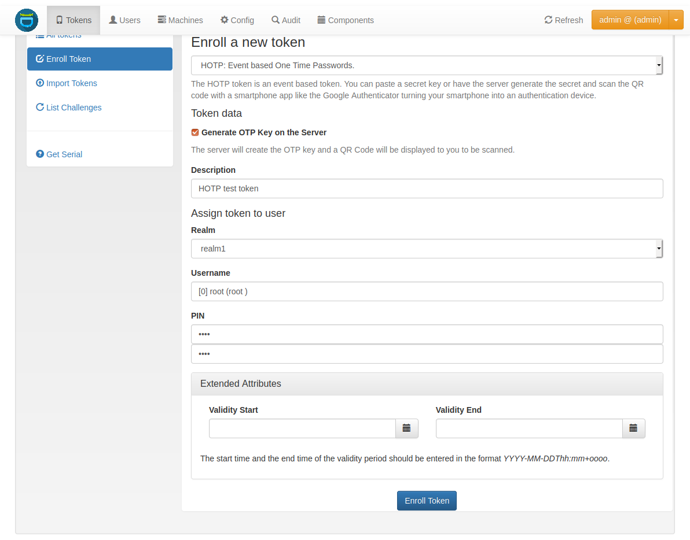
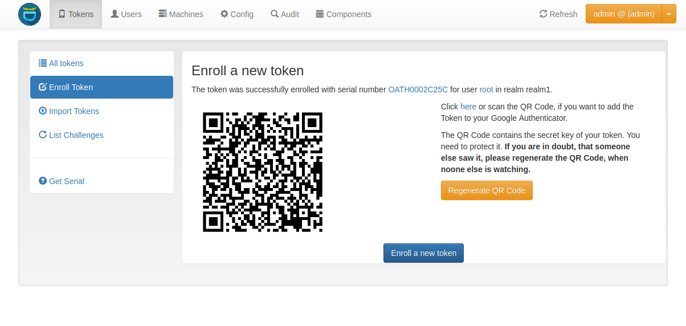
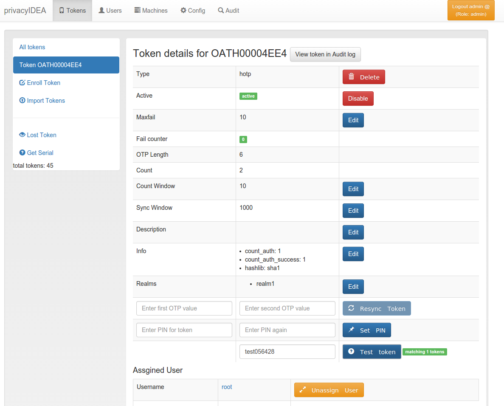

.. _first_steps_token:

Enrolling your first token
==========================

You may now enroll a new token. In this example we are using the privacyIDEA
Authenticator App,
that you need to install on your smartphone.

* Go to *Token* and click *Enroll Token*.

   *The token enrollment page*

* In *Assign Token to a User*, check that *realm1* is selected in *Select Realm
  of User* and enter the username *root* in *Enter User*. When you start typing
  "r", "o"... the system will suggest the user root.
* Enter a PIN in *PIN* and *Repeat PIN*. I entered "test" ...
* ... and click *Enroll Token*.

   *Enrollment Success*

* After enrolling the token, a dialog shows a QR code that you need to scan with
  the privacyIDEA Authenticator App.
* Click the serial number link in the dialog.

   *Test the Token*

* Now you see the token details.
* In the *Test* section, enter the PIN followed by the OTP value generated by
  the privacyIDEA Authenticator in *PIN and/or OTP*.
* Click *Test Token*. You should see the message "OTP or Pin tested with token
  was accepted."

**Congratulations!** You just enrolled your first token to a user.

Now you are ready to attach applications to
privacyIDEA in order to add two factor authentication to those applications.
To attach applications read the chapter :ref:`application_plugins`.

You may also go on reading the chapter :ref:`configuration` to get a deeper
insight in the configuration possibilities.
