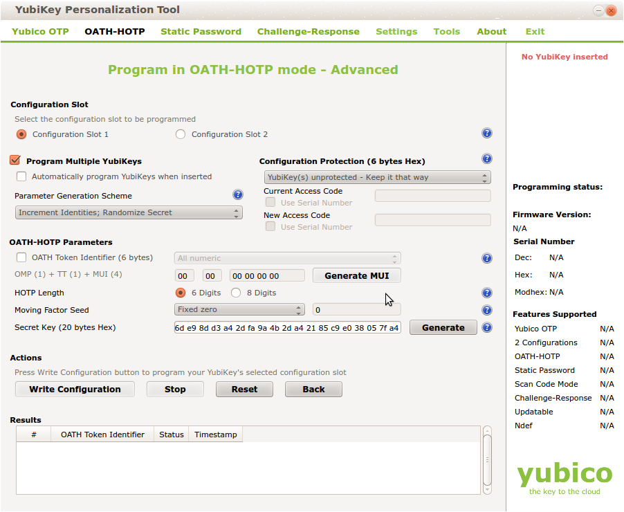

.. _import:

Import
======

.. index:: import, OATH CSV, Yubikey CSV, PSKC, RFC6030

Seed files that contain the secret keys of hardware tokens can be 
imported to the system via the menu *Import*.

The default import options are to import *SafeNet XML* file,
*OATH CSV* files, *Yubikey CSV* files or
*PSKC* files.

OATH CSV
--------

This is a very simple CSV file to import HOTP, TOTP or OATH tokens.
You can also convert your seed easily to this file format, to import
the tokens. 

The file format looks like this::

   <serial>, <seed>, <type>, <otp length>, <time step>

For OCRA tokens it looks like this::
   
   <serial>, <seed>, OCRA, <ocra suite>

**serial** is the serial number of the token that will also be used
to identify the token in the database. Importing the same serial number 
twice will overwrite the token data.

**seed** is the secret key, that is used to calculate the OTP
value. The seed is provided in a hexadecimal notation. 
Depending on the length either the SHA1 or SHA256 hash algorithm 
is identified.

**type** is either HOTP, TOTP or OCRA.

**otp length** is the length of the OTP value generated by the token.
This is usually 6 or 8.

**time step** is the time step of TOTP tokens. This is usually
30 or 60.

**ocra suite** is the ocra suite of the OCRA token according to [#ocra]_.

Yubikey CSV
-----------

Here you can import the CSV file that is written by the Yubikey personalization
tool [#yubipers]_.
privacyIDEA can import all Yubikey modes, either Yubico mode or HOTP mode.

.. note:: There is an annoying drawback of the personalization tool: If you a 
   initializing 
   several HOTP yubikeys it will not write the serial number to the file.

PSKC
----

The *Portable Symmetric Key Container* is specified in [#RFC6030]_.
OATH compliant token vendors provide the token seeds in a PSKC file.
privacyIDEA lets you import PSKC files.
All necessary information (OTP lenght, Hash algorithm, token type) are read
from the file.

.. [#ocra] http://tools.ietf.org/html/rfc6287#section-6
.. [#yubipers] http://www.yubico.com/products/services-software/personalization-tools/use/
.. [#RFC6030] https://tools.ietf.org/html/rfc6030
