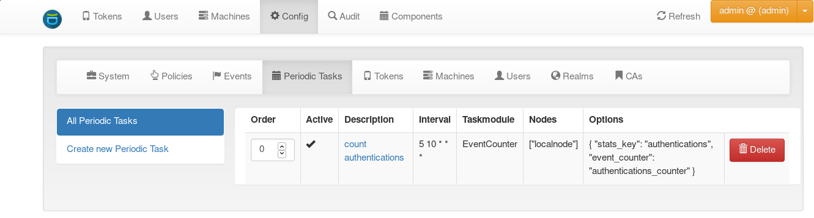

.. _periodic_tasks:

Periodic Tasks
==============

.. index:: periodic task, recurring task

Starting with version 2.23, privacyIDEA comes with the ability to define periodically recurring tasks
in the Web UI. The purpose of such tasks is to periodically execute certain processes automatically.
The administrator defines which tasks should be executed using task modules. Currently there are task modules
for simple statistics and for handling recorded events. Further task modules can be added easily.

As privacyIDEA is a web application, it can not actually execute the defined periodic tasks itself. For that,
privacyIDEA comes with a script ``privacyidea-cron`` which must be invoked by the system cron daemon.
This can, for example, be achieved by creating a file ``/etc/cron.d/privacyidea`` with the following
contents (this is done automatically by the Ubuntu package)::

	 */5 * * * *	privacyidea	privacyidea-cron run_scheduled -c

This tells the system cron daemon to invoke the ``privacyidea-cron`` script every five minutes. At
each invocation, the ``privacyidea-cron`` script determines which tasks are due and executes
them. The ``-c`` option tells the script to be quiet and only print to stderr in case of an
error (see :ref:`privacyidea_cron`).

The Ubuntu package's file also holds the jobs that clean up the database, see :ref:`cleanup_jobs`.

Periodic tasks can be managed in the WebUI by navigating to *Config->Periodic Tasks*:

	Periodic task definitions

Every periodic task has the following attributes:

**name**
	A human-readable, unique name of the task. ``privacyidea-cron run_manually -t``
	expects this name.

**active**
	A boolean flag determining whether the periodic task should be run or not.

**ordering**
	A number (at least zero) that can be used to rearrange the order of periodic tasks. This is
	used by ``privacyidea-cron`` to determine the running order of tasks if multiple
	periodic tasks are scheduled to be run. Tasks with a lower number are run first.

**retry if failed**
	If set (the default), a failed run is not recorded, so ``privacyidea-cron`` executes the
	task again at its next invocation, until the task succeeds. With the crontab entry above,
	a task that keeps failing is retried, and reports its error, every five minutes.
	If not set, a failed run counts as a run, and the task is next executed at its next
	scheduled time.

**interval**
	The periodicity of the task. This uses crontab notation, e.g. ``*/30 * * * *`` runs
	the task every 30 minutes. The expression is evaluated in the local time zone of the
	system that runs ``privacyidea-cron``.

	Keep in mind that the entry in the system crontab determines the minimal resolution
	of periodic tasks: If you specify a periodic task that should be run every two minutes,
	but the ``privacyidea-cron`` script is invoked every five minutes only, the periodic task
	will actually be executed every five minutes!

**nodes**
	The names of the privacyIDEA nodes on which the periodic task should be executed.
	This is useful in a redundant master-master setup, because database-related tasks should then
	only be run on *one* of the nodes (because the replication will take care of
	propagating the database changes to the other node). A node's name is the value of
	``PI_NODE`` in its :ref:`cfgfile`. Every node adds its name to the database when it
	starts, so that it can be selected here. ``privacyidea-cron`` only runs the tasks of the
	node it runs on, see :ref:`privacyidea_cron`.

**taskmodule**
	The task module determines the actual activity of the task. privacyIDEA comes
	with several task modules, see :ref:`periodic_task_modules`.

**options**
	The options are a set of key-value pairs that configure the behavior of the task module.
	Each task module can have it's own allowed options.

.. _periodic_task_modules:

Task Modules
~~~~~~~~~~~~

privacyIDEA comes with the following task modules:

.. toctree::
   :maxdepth: 1

   simplestats
   eventcounter

.. _privacyidea_cron:

The ``privacyidea-cron`` script
~~~~~~~~~~~~~~~~~~~~~~~~~~~~~~~

The ``privacyidea-cron`` script executes the periodic tasks defined in the Web UI. It reads
the configuration file ``/etc/privacyidea/pi.cfg``, or the file given in the environment
variable ``PRIVACYIDEA_CONFIGFILE``.

The script works with the name of the node it runs on: ``PI_NODE`` from the configuration
file, or ``PI_AUDIT_SERVERNAME`` if ``PI_NODE`` is not set, or ``localnode`` if neither is
set. In a setup with several nodes, give every node its own ``PI_NODE``: nodes that end up
with the same name all run the tasks assigned to that name. The option ``-n`` overrides the
node name.

``privacyidea-cron run_scheduled [-c] [-d] [-n NODE]``
   Executes all active tasks that are assigned to the node and are due. Tasks with a lower
   ``ordering`` value are executed first. The command exits with status 1 if one of the
   tasks failed.

   ``-c``, ``--cron``
      Cron mode: do not write to stdout, only write errors to stderr. Use it in the
      crontab, so that cron only reports errors.

   ``-d``, ``--dryrun``
      Only list the tasks that are due, do not execute them.

   ``-n NODE``, ``--node NODE``
      Use ``NODE`` as the node name.

``privacyidea-cron list``
   Lists all periodic tasks with their state, interval, task module, nodes and options.

``privacyidea-cron run_manually -t NAME [-n NODE]``
   Executes the task with the name ``NAME`` at once. The command does not check whether the
   task is active, due, or assigned to the node. A successful run is recorded as the last
   run of the task on the node, and the next scheduled run is calculated from it. The
   command exits with a non-zero status if the task fails.