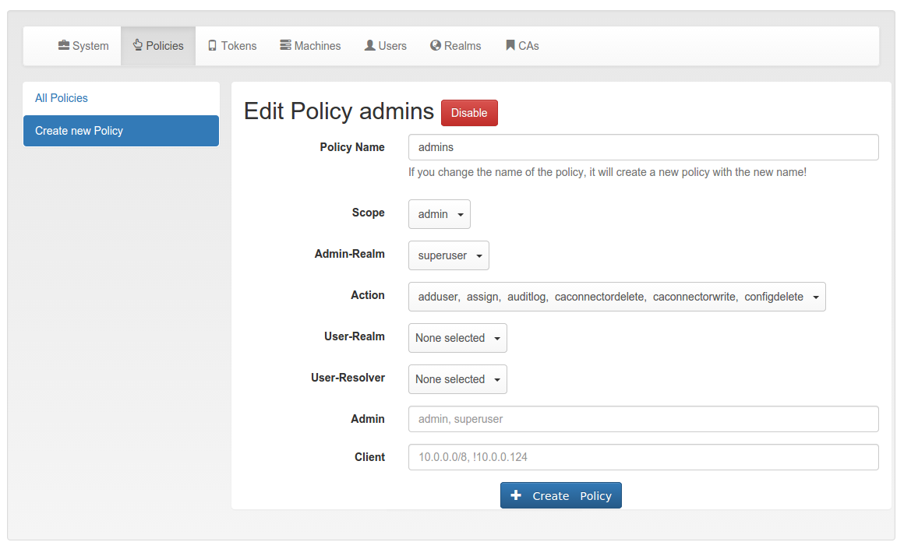

.. _admin_policies:

Admin policies
--------------

.. index:: admin policies, superuser realm, admin realm, help desk

Admin policies are used to regulate the actions that administrators are
allowed to do.
Technically admin policies control the use of the REST
API :ref:`rest_token`, :ref:`rest_system`, :ref:`rest_realm` and
:ref:`rest_resolver`.

Admin policies are implemented as decorators in :ref:`code_policy` and
:ref:`policy_decorators`.

The ``user`` in the admin policies refers to the name of the administrator.

Starting with privacyIDEA 2.4 admin policies can also store a field "admin
realm". This is used, if you define realms to be superuser realms. See
:ref:`cfgfile` for information how to do this. Read :ref:`faq_admins` for
more information on the admin realms.

This way it is easy to define administrative rights for big groups of
administrative users like help desk users in the IT department.

   *The Admin scope provides an additional field 'admin realm'.*

All administrative actions also refer to the defined user realm. Meaning
an administrator may have many rights in one user realm and only a few
rights in another realm.

Creating a policy with ``scope:admin``, ``admin-realm:helpdesk``,
``user:frank``, ``action:enable`` and ``realm:sales``
means that the administrator *frank* in the admin-realm *helpdesk* is allowed
to enable tokens in the user-realm *sales*.

.. note:: As long as no admin policy is defined all administrators
   are allowed to do everything.

The following actions are available in the scope
*admin*:

tokenlist
~~~~~~~~~

type: bool

This allows the administrator to list existing tokens in the specified user realm.
Note, that the resolver in this policy is ignored.

If the policy with the action ``tokenlist`` is not bound to any user realm, this acts
as a wild card and the admin is allowed to list all tokens.

If the action ``tokenlist`` is not active, but admin policies exist, then the admin
is not allowed to list any tokens.

.. note:: As with all boolean policies, multiple *tokenlist* policies add up to
   create the resulting rights of the administrator.
   So if there are multiple matching policies for different realms,
   the admin will have list rights on all mentioned realms
   independent on the priority of the policies.

init
~~~~

type: bool

There are ``init`` actions per token type. Thus you can 
create policy that allow an administrator to enroll 
SMS tokens but not to enroll HMAC tokens.

enable
~~~~~~

type: bool

The ``enable`` action allows the administrator to activate 
disabled tokens.

disable
~~~~~~~

type: bool

Tokens can be enabled and disabled. Disabled tokens can not be
used to authenticate. The ``disable`` action allows the 
administrator to disable tokens.

revoke
~~~~~~

type: bool

Tokens can be revoked. Usually this means the token is disabled and locked.
A locked token can not be modified anymore. It can only be deleted.

Certain token types like *certificate* may define special actions when
revoking a token.

set
~~~

type: bool

Tokens can have additional token information, which can be
viewed in the :ref:`token_details`.

If the ``set`` action is defined, the administrator allowed
to set those token information.

setpin
~~~~~~

type: bool

If the ``setpin`` action is defined, the administrator
is allowed to set the OTP PIN of a token.

setrandompin
~~~~~~~~~~~~

type: bool

If the ``setrandompin`` action is defined, the administrator
is allowed to call the endpoint, that sets a random token PIN.

enrollpin
~~~~~~~~~

type: bool

If the action ``enrollpin`` is defined, the administrator
can set a token PIN during enrollment. If the action is not defined and
the administrator tries to set a PIN during enrollment, this PIN is deleted
from the request.

otp_pin_maxlength
~~~~~~~~~~~~~~~~~

.. index:: PIN policy, Token specific PIN policy

type: integer

range: 0 - 31

This is the maximum allowed PIN length the admin is allowed to
use when setting the OTP PIN.

.. note:: There can be token type specific policies like
   ``spass_otp_pin_maxlength``, ``spass_otp_pin_minlength`` and
   ``spass_otp_pin_contents``. If suche a token specific policy exists, it takes
   priority of the common PIN policy.

otp_pin_minlength
~~~~~~~~~~~~~~~~~

type: integer

range: 0 - 31

This is the minimum required PIN the admin must use when setting the
OTP PIN.

.. _admin_policies_otp_pin_contents:

otp_pin_contents
~~~~~~~~~~~~~~~~

type: string

contents: cns

This defines what characters an OTP PIN should contain when the admin
sets it.

**c** are letters matching [a-zA-Z].

**n** are digits matching [0-9].

**s** are special characters matching [\[\].:,;-_<>+*!/()=?$§%&#~\^].

**[allowedchars]** is a specific list of allowed characters.

**Example:** The policy action ``otp_pin_contents=cn, otp_pin_minlength=8`` would
require the admin to choose OTP PINs that consist of letters and digits
which have a minimum length of 8.

``cn``

   *test1234* and *test12$$* would be valid OTP PINs. *testABCD* would
   not be a valid OTP PIN.

The logic of the ``otp_pin_contents`` can be enhanced and reversed using the
characters ``+`` and ``-``.

``-cn`` (denial)

   The PIN must not contain a character and must not contain a number.
   *test1234* would not be a valid PIN, since it does contains numbers and characters.
   *test///* would not be a valid PIN, since it contains characters.

``-s`` (denial)

   The PIN must not contain a special character.
   **test1234* would be a valid PIN. *test12$$* would not.

``+cn`` (grouping)

   combines the two required groups. I.e. the OTP PIN should contain
   characters from the sum of the two groups.
   *test1234*, *test12$$*, *test*
   and *1234* would all be valid OTP PINs.
   Note, how this is different to ``-s``, since it allows special characters to be
   included.

``[123456]``

   allows the digtits 1-6 to be used.
   *1122* would be a valid PIN.
   *1177* would not be a valid PIN.

otp_pin_set_random
~~~~~~~~~~~~~~~~~~

type: integer

range: 1-31

The administrator can set a random pin for a token
with the endpoint ``token/setrandompin``.
This policy is needed to define how long the PIN will be.

.. note:: The PIN will consist of digits and letters.

resync
~~~~~~

type: bool

If the ``resync`` action is defined, the administrator is
allowed to resynchronize a token.

assign
~~~~~~

type: bool

If the ``assign`` action is defined, the administrator is
allowed to assign a token to a user. This is used for 
assigning an existing token to a user but also to 
enroll a new token to a user.

Without this action, the administrator can not create 
a connection (assignment) between a user and a token.

unassign
~~~~~~~~

type: bool

If the ``unassign`` action is defined, the administrator
is allowed to unassign tokens from a user. I.e. the 
administrator can remove the link between the token 
and the user. The token still continues to exist in the system.

import
~~~~~~

type: bool

If the ``import`` action is defined, the administrator is 
allowed to import token seeds from a token file, thus
creating many new token objects in the systems database.

remove
~~~~~~

type: bool

If the ``remove`` action is defined, the administrator is
allowed to delete a token from the system. 

.. note:: If a token is removed, it can not be recovered.

.. note:: All audit entries of this token still exist in the audit log.

userlist
~~~~~~~~

type: bool

If the ``userlist`` action is defined, the administrator is 
allowed to view the user list in a realm.
An administrator might not be allowed to list the users, if
he should only work with tokens, but not see all users at once.

.. note:: If an administrator has any right in a realm, the administrator
   is also allowed to view the token list.

checkstatus
~~~~~~~~~~~

type: bool

If the ``checkstatus`` action is defined, the administrator is 
allowed to check the status of open challenge requests.

manageToken
~~~~~~~~~~~

type: bool

If the ``manageToken`` action is defined, the administrator is allowed
to manage the realms of a token.

.. index:: realm administrator

A token may be located in multiple realms. This can be interesting if
you have a pool of spare tokens and several realms but want to 
make the spare tokens available to several realm administrators.
(Administrators, who have only rights in one realm)

Then all administrators can see these tokens and assign the tokens.
But as soon as the token is assigned to a user in one realm, the
administrator of another realm can not manage the token anymore.

getserial
~~~~~~~~~

type: bool

.. index:: getserial

If the ``getserial`` action is defined, the administrator is
allowed to calculate the token serial number for a given OTP
value.

getrandom
~~~~~~~~~

type: bool

.. index:: getrandom

The ``getrandom`` action allows the administrator to retrieve random
keys from the endpoint *getrandom*. This is an endpoint in :ref:`rest_system`.

*getrandom* can be used by the client, if the client has no reliable random
number generator. Creating API keys for the Yubico Validation Protocol uses
this endpoint.

getchallenges
~~~~~~~~~~~~~

type: bool

.. index:: getchallenges

This policy allows the administrator to retrieve a list of active challenges
of a challenge response tokens. The administrator can view these challenges
in the web UI.

.. _lost_token:

losttoken
~~~~~~~~~

type: bool

If the ``losttoken`` action is defined, the administrator is
allowed to perform the lost token process.

To only perform the lost token process the actions ``copytokenuser``
and ``copytokenpin`` are not necessary!

adduser
~~~~~~~

type: bool

.. index:: Add User, Users

If the ``adduser`` action is defined, the administrator is allowed to add
users to a user store.

.. note:: The user store still must be defined as editable, otherwise no
   users can be added, edited or deleted.

updateuser
~~~~~~~~~~

.. index:: Edit User

type: bool

If the ``updateuser`` action is defined, the administrator is allowed to edit
users in the user store.

deleteuser
~~~~~~~~~~

.. index:: Delete User

type: bool

If the ``deleteuser`` action is defined, the administrator is allowed to
delete an existing user from the user store.

copytokenuser
~~~~~~~~~~~~~

type: bool

If the ``copytokenuser`` action is defined, the administrator is
allowed to copy the user assignment of one token to another.

This functionality is also used during the lost token process.
But you only need to define this action, if the administrator
should be able to perform this task manually.

copytokenpin
~~~~~~~~~~~~

type: bool

If the ``copytokenpin`` action is defined, the administrator is
allowed to copy the OTP PIN from one token to another without
knowing the PIN.

This functionality is also used during the lost token process.
But you only need to define this action, if the administrator
should be able to perform this task manually.

smtpserver_write
~~~~~~~~~~~~~~~~

type: bool

To be able to define new :ref:`smtpserver` or delete existing ones, the
administrator needs this rights ``smtpserver_write``.

smtpserver_read
~~~~~~~~~~~~~~~

type: bool

Allow the administrator to read the :ref:`smtpserver`.

smsgateway_write
~~~~~~~~~~~~~~~~

type: bool

To be able to define new :ref:`sms_gateway_config` or delete existing ones, the
administrator needs the right ``smsgateway_write``.

smsgateway_read
~~~~~~~~~~~~~~~

type: bool

Allow the administrator to read the :ref:`sms_gateway_config`.

periodictask_write
~~~~~~~~~~~~~~~~~~

type: bool

Allow the administrator to write or delete :ref:`periodic_tasks` definitions.

periodictask_read
~~~~~~~~~~~~~~~~~

type: bool

Allow the administrator to read the :ref:`periodic_tasks` definitions.

eventhandling_write
~~~~~~~~~~~~~~~~~~~

type: bool

Allow the administrator to configure :ref:`eventhandler`.

eventhandling_read
~~~~~~~~~~~~~~~~~~

type: bool

Allow the administrator to read :ref:`eventhandler`.

.. note:: Currently the policies do not take into account resolvers,
   or realms. Having the right to read event handlers, will allow the
   administrator to see all event handler definitions.

policywrite, policyread, policydelete
~~~~~~~~~~~~~~~~~~~~~~~~~~~~~~~~~~~~~

type: bool

Allow the administrator to write, read or delete policies.

.. note:: Currently the policies do not take into account resolvers,
   or realms. Having the right to read policies, will allow the
   administrator to see all policies.

resolverwrite, resolverread, resolverdelete
~~~~~~~~~~~~~~~~~~~~~~~~~~~~~~~~~~~~~~~~~~~

type: bool

Allow the administrator to write, read or delete user resolvers and realms.

.. note:: Currently the policies do not take into account resolvers,
   or realms. Having the right to read resolvers, will allow the
   administrator to see all resolvers and realms.

mresolverwrite, mresolverread, mresolverdelete
~~~~~~~~~~~~~~~~~~~~~~~~~~~~~~~~~~~~~~~~~~~~~~

type: bool

Allow the administrator to write, read or delete machine resolvers.

configwrite, configread, configdelete
~~~~~~~~~~~~~~~~~~~~~~~~~~~~~~~~~~~~~

type: bool

Allow the administrator to write, read or delete system configuration.

auditlog
~~~~~~~~

type: bool

The administrators are allowed to view the audit log. If the policy contains
a user realm, than the administrator is only allowed to see entries which
contain this very user realm. A list of user realms may be defined.

To learn more about the audit log, see :ref:`audit`.

auditlog_download
~~~~~~~~~~~~~~~~~

type: bool

The administrator is allowed to download the audit log.

.. note:: The download is not restricted to filters and audit age.
   Thus, if you want to avoid, that an administrator can see older
   logs, you need to disallow downloading the data. Otherwise he
   may download the audit log and look at older entries manually.

auditlog_age
~~~~~~~~~~~~

type: string

This limits the maximum age of displayed audit entries. Older entries are not
remove from the audit table but the administrator is simply not allowed to
view older entries.

Can be something like 10m (10 minutes), 10h (10 hours) or 10d (ten days).

trigger_challenge
~~~~~~~~~~~~~~~~~

type: bool

If set the administrator is allowed to call the API
``/validate/triggerchallenge``. This API can be used to send an OTP SMS to
user without having specified the PIN of the SMS token.

The usual setup that one administrative account has only this single policy
and is only used for triggering challenges.

New in version 2.17.

.. _admin_policy_2step:

hotp_2step and totp_2step
~~~~~~~~~~~~~~~~~~~~~~~~~

type: string

This allows or forces the administrator to enroll a smartphone based token in two steps.
In the second step the smartphone generates a part of the OTP secret, which the administrator
needs to enter. (see :ref:`2step_enrollment`).
Possible values are *allow* and *force*.
This works in conjunction with the enrollment parameters :ref:`2step_parameters`.

Such a policy can also be set for the user. See :ref:`user_policy_2step`.

New in version 2.21

hotp_hashlib and totp_hashlib
~~~~~~~~~~~~~~~~~~~~~~~~~~~~~

type: string

Force the admin to enroll HOTP/TOTP Tokens with the specified hashlib.
The corresponding input selector will be disabled in the web UI.
Possible values are *sha1*, *sha256* and *sha512*, default is *sha1*.

New in 3.2

hotp_otplen and totp_otplen
~~~~~~~~~~~~~~~~~~~~~~~~~~~

type: int

Force the admin to enroll HOTP/TOTP Tokens with the specified otp length.
The corresponding input selector will be disabled in the web UI.
Possible values are *6* or *8*, default is *6*.

New in 3.2

totp_timestep
~~~~~~~~~~~~~

type: int

Enforce the timestep of the time-based OTP token.
A corresponding input selection will be disabled/hidden in the web UI.
Possible values are *30* or *60*, default is *30*.

New in 3.2

system_documentation
~~~~~~~~~~~~~~~~~~~~

type: bool

The administrator is allowed to export a complete system documentation
including resolvers and realm.
The documentation is created as restructured text.

sms_gateways
~~~~~~~~~~~~

type: string

Usually an SMS token sends the SMS via the SMS gateway that is system wide defined in the token settings.
This policy takes a blank-separated list of configured SMS gateways.
It allows the administrator to define an individual SMS gateway during token enrollment.

New in version 3.0.

indexedsecret_force_attribute
~~~~~~~~~~~~~~~~~~~~~~~~~~~~~

type: string

If an administrator enrolls an indexedsecret token then the value of the given
user attribute is set as the secret.
The admin does not know the secret and can not change the secret.

For more details of this token type see :ref:`indexedsecret_token`.

New in version 3.3.