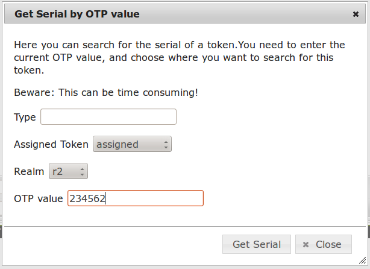

.. _admin_policies:

Admin policies
--------------

.. index:: admin policies

Admin policies are used to regulate the actions that administrators are
allowed to do.
Technically admin policies controll the use of the :ref:`admin_controller`
and are checked using the method ``getAdminPolicies``
of the :ref:`code_policy_class`.

The ``user`` in the admin policies refers to the administrator.

All administrative actions also refer to the defined realm. Meaning
and administrator may have many rights in one realm and only a few
rights in another realm.

Creating a policy with ``scope:admin``, ``user:frank``, ``action:enable``
and ``realm:sales``
means that the administrator *Frank* is allowed to enable tokens in the
realm *sales*. 

.. note:: As long as no admin policy is defined all administrators
   are allowed to do everything.

.. note:: In the scope admin you can use the wildcard "*" in the
   actions to create a superuser, who is allowed to do everything.

The following actions are available in the scope 
*admin*:

init
~~~~

type: bool

There are ``init`` actions per token type. Thus you can 
create policy that allow an administrator to enroll 
SMS tokens but not to enroll HMAC tokens.

enable
~~~~~~

type: bool

The ``enable`` action allows the administrator to activate 
disabled tokens.

disable
~~~~~~~

type: bool

Tokens can be enabled and disabled. Disabled tokens can not be
used to authenticate. The ``disable`` action allows the 
administrator to disable tokens.

set
~~~

type: bool

Tokens can have additional token information, which can be
viewed in the tokeninfo dialog (see :ref:`tokeninfo`).

If the ``set`` action is defined, the administrator allowed
to set those token information.

setOTPPIN
~~~~~~~~~

type: bool

If the ``setOTPPIN`` action is defined, the administrator
is allowed to set the OTP PIN of a token.

setMOTPPIN
~~~~~~~~~~

type: bool

If the ``setMOTPPIN`` action is defined,  the administrator
is allowed to set the mOTP PIN of an mOTP token.

resync
~~~~~~

type: bool

If the ``resync`` action is defined, the administrator is
allowed to resynchronize a token.

assign
~~~~~~

type: bool

If the ``assign`` action is defined, the administrator is
allowed to assign a token to a user. This is used for 
assigning an existing token to a user but also to 
enroll a new token to a user.

Without this action, the administrator can not create 
a connection (assignment) between a user and a token.

unassign
~~~~~~~~

type: bool

If the ``unassign`` action is defined, the administrator
is allowed to unassign tokens from a user. I.e. the 
administrator can remove the link between the token 
and the user. The token still continues to exist in the system.

import
~~~~~~

type: bool

If the ``import`` action is defined, the administrator is 
allowed to import token seeds from a token file, thus
creating many new token objects in the systems database.

remove
~~~~~~

type: bool

If the ``remove`` action is defined, the administrator is
allowed to delete a token from the system. 

.. note:: If a token is removed, it can not be recovered.

.. note:: All audit entries of this token still exist in the audit log.

userlist
~~~~~~~~

type: bool

If the ``userlist`` action is defined, the administrator is 
allowed to view the user list in a realm.
An administrator might not be allowed to list the users, if
he should only work with tokens, but not see all users at once.

.. note:: If an administrator has any right in a realm, the administrator
   is also allowed to view the token list.

checkstatus
~~~~~~~~~~~

type: bool

If the ``checkstatus`` action is defined, the administrator is 
allowed to check the status of open challenge requests.

manageToken
~~~~~~~~~~~

type: bool

If the ``manageToken`` action is defined, the administrator is allowed
to manage the realms of a token.

.. index:: realm administrator

A token may be located in multiple realms. This can be interesting if
you have a pool of spare tokens and several realms but want to 
make the spare tokens available to several realm administrators.
(Administrators, who have only rights in one realm)

Then all administrators can see these tokens and assign the tokens.
But as soon as the token is assigned to a user in one realm, the
administrator of another realm can not manage the token anymore.

getserial
~~~~~~~~~

type: bool

.. index:: getserial

If the ``getserial`` action is defined, the administrator is
allowed to calculate the token serial number for a given OTP
value.

   *The tool to determine the token serial number for a given OTP value*

copytokenuser
~~~~~~~~~~~~~

type: bool

If the ``copytokenuser`` action is defined, the administrator is
allowed to copy the user assignment of one token to another.

This functionality is also used during the lost token process.
But you only need to define this action, if the administrator
should be able to perform this task manually.

copytokenpin
~~~~~~~~~~~~

type: bool

If the ``copytokenpin`` action is defined, the administrator is
allowed to copy the OTP PIN from one token to another without
knowing the PIN.

This functionality is also used during the lost token process.
But you only need to define this action, if the administrator
should be able to perform this task manually.

losttoken
~~~~~~~~~

type: bool

If the ``losttoken`` action is defined, the adminstrator is 
allowed to perform the lost token process.

To only perform the lost token process the actions ``copytokenuser``
and ``copytokenpin`` are not necessary!

getotp
~~~~~~

type: bool

If the ``getserial`` action is defined, the administrator is
allowed to retrieve OTP values for a given token.

