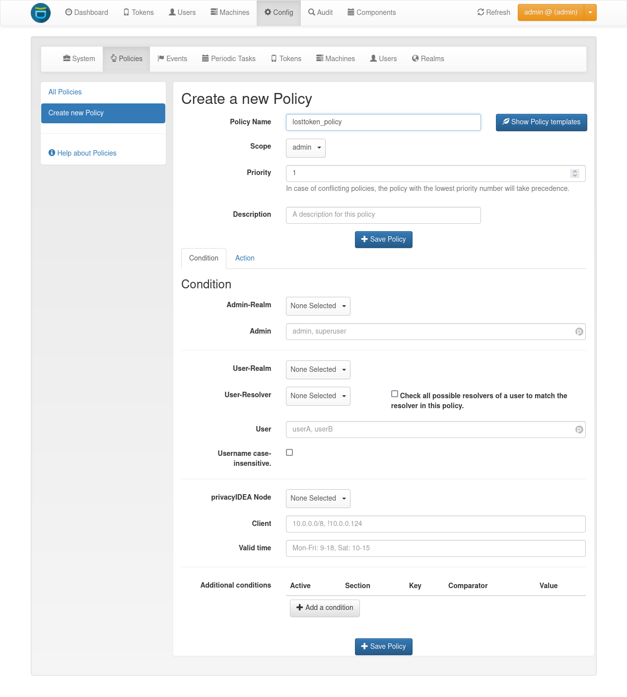

.. _admin_policies:

Admin policies
--------------

.. index:: admin policies, superuser realm, admin realm, help desk

Admin policies are used to regulate the actions that administrators are
allowed to do.
Technically admin policies control the use of the REST
API :ref:`rest_token`, :ref:`rest_system`, :ref:`rest_realm` and
:ref:`rest_resolver`.

Admin policies are implemented as decorators in :ref:`code_policy` and
:ref:`policy_decorators`.

Starting with privacyIDEA 2.4 admin policies can also store a field "admin
realm". This is used, if you define realms to be superuser realms. See
:ref:`cfgfile` for information how to do this. Read :ref:`faq_admins` for
more information on the admin realms.

This way it is easy to define administrative rights for big groups of
administrative users like helpdesk users in the IT department.



   *The Admin scope provides an additional field 'admin realm'.*

All administrative actions also refer to the defined user realm. Meaning
an administrator may have many rights concerning one user realm and only a few
rights concerning another.

Creating a policy with ``scope:admin``, ``admin-realm:helpdesk``,
``user:frank``, ``action:enable`` and ``realm:sales``
means that the administrator *frank* in the admin-realm *helpdesk* is allowed
to enable tokens in the user-realm *sales*.

.. note:: As long as no admin policy is defined all administrators
   are allowed to do everything.

.. note:: Admin policies are also checked for all local administrators.

The following actions are available in the scope
*admin*:

tokenlist
~~~~~~~~~

type: ``bool``

This allows the administrator to list existing tokens in the specified user realm.
Note that the resolver in this policy is ignored.

If the policy with the action ``tokenlist`` is not bound to any user realm, this acts
as a wild card and the admin is allowed to list all tokens.

If the action ``tokenlist`` is not active, but admin policies exist, then the admin
is not allowed to list any tokens.

.. note:: As with all boolean policies, multiple *tokenlist* policies add up to
   create the resulting rights of the administrator.
   So if there are multiple matching policies for different realms,
   the admin will have list rights on all mentioned realms
   independent on the priority of the policies.

enroll
~~~~~~

type: ``bool``

There are enrollment actions per token type, e.g. ``enrollHOTP``. Only those token
types are selectable in the WebUI during enrollment which are allowed by their
corresponding enroll policy action.

enable
~~~~~~

type: ``bool``

The ``enable`` action allows the administrator to activate
disabled tokens.

disable
~~~~~~~

type: ``bool``

Tokens can be enabled and disabled. Disabled tokens can not be
used to authenticate. The ``disable`` action allows the
administrator to disable tokens.

revoke
~~~~~~

type: ``bool``

Tokens can be revoked. Usually this means the token is disabled and locked.
A locked token can not be modified anymore. It can only be deleted.

Certain token types like *certificate* may define special actions when
revoking a token.

set
~~~

type: ``bool``

Tokens can have additional token information, which can be
viewed in the :ref:`token_details`.

If the ``set`` action is defined, the is administrator allowed
to set those token properties like ``description``, ``max_failcount``
or ``validity_period_start`` at the ``/token/set`` endpoints
(see :ref:`rest_token`).

setdescription
~~~~~~~~~~~~~~

type: ``bool``

The admin is allowed to set the description of tokens via the endpoint `/token/descriptipon`.

.. note:: An admin can also be allowed to set the description of a token by
   granting the aforementioned policy `set`.

setpin
~~~~~~

type: ``bool``

If the ``setpin`` action is defined, the administrator
is allowed to set the OTP PIN of a token.

setrandompin
~~~~~~~~~~~~

type: ``bool``

If the ``setrandompin`` action is defined, the administrator
is allowed to call the endpoint that sets a random token PIN.

settokeninfo
~~~~~~~~~~~~

type: ``bool``

The administrator is allowed to manually set and delete token info.

enrollpin
~~~~~~~~~

type: ``bool``

If the action ``enrollpin`` is defined, the administrator
can set a token PIN during enrollment. If the action is not defined and
the administrator tries to set a PIN during enrollment, this PIN is deleted
from the request.

hide_tokeninfo
~~~~~~~~~~~~~~

type: ``string``

This specifies a blank-separated list of tokeninfo keys, which should be removed
from the response and therefore will not be shown in the WebUI or JSON response.

For example a value ``tokenkind auto_renew`` will hide these two tokeninfo entries.

otp_pin_maxlength
~~~~~~~~~~~~~~~~~

.. index:: PIN policy, Token specific PIN policy

type: ``integer``

range: 0 - 31

This is the maximum allowed PIN length the admin is allowed to
use when setting the OTP PIN.

.. note:: There can be token type specific policies like
   ``spass_otp_pin_maxlength``, ``spass_otp_pin_minlength`` and
   ``spass_otp_pin_contents``. If suche a token specific policy exists, it takes
   priority of the common PIN policy.

otp_pin_minlength
~~~~~~~~~~~~~~~~~

type: ``integer``

range: 0 - 31

This is the minimum required PIN length the admin must use when setting the
OTP PIN.

.. _admin_policies_otp_pin_contents:

otp_pin_contents
~~~~~~~~~~~~~~~~

type: ``string``

contents: cns

This defines which characters are allowed when the admin sets an OTP PIN.

**c** are letters matching [a-zA-Z].

**n** are digits matching [0-9].

**s** are special characters matching [\[\].:,;-_<>+*!/()=?$§%&#~\^].

**[allowedchars]** is a specific list of allowed characters.

**Example:** The policy action ``otp_pin_contents=cn, otp_pin_minlength=8`` would
require the admin to choose OTP PINs that consist of letters and digits
which have a minimum length of 8.

``cn``

   *test1234* and *test12$$* would be valid OTP PINs. *testABCD* would
   not be a valid OTP PIN.

The logic of the ``otp_pin_contents`` can be enhanced and reversed using the
characters ``+`` and ``-``.

``-cn`` (denial)

   The PIN must not contain a character and must not contain a number.
   *test1234* would not be a valid PIN, since it does contain numbers and characters.
   *test///* would not be a valid PIN, since it contains characters.

``-s`` (denial)

   The PIN must not contain a special character.
   *test1234* would be a valid PIN. *test12$$* would not.

``+cn`` (grouping)

   combines the two required groups. I.e. the OTP PIN should contain
   characters from the sum of the two groups.
   *test1234*, *test12$$*, *test*
   and *1234* would all be valid OTP PINs.
   Note, how this is different to ``-s``, since it allows special characters to be
   included.

``[123456]``

   allows the digtits 1-6 to be used.
   *1122* would be a valid PIN.
   *1177* would not be a valid PIN.


otp_pin_set_random
~~~~~~~~~~~~~~~~~~

type: ``integer``

range: 1-31

The administrator can set a random pin for a token
with the endpoint ``token/setrandompin``.
This policy is needed to define how long the PIN will be.

.. note:: The PIN will consist of digits and letters.

reset
~~~~~

type: ``bool``

The administrator is allowed to reset the fail counter of a token.

resync
~~~~~~

type: ``bool``

If the ``resync`` action is defined, the administrator is
allowed to resynchronize a token.

assign
~~~~~~

type: ``bool``

If the ``assign`` action is defined, the administrator is
allowed to assign a token to a user. This is used for
assigning an existing token to a user but also to
enroll a new token to a user.

Without this action, the administrator can not create
a connection (assignment) between a user and a token.

Note that the condition ``realm`` for this action is also evaluated to true if the token is in no realm.

unassign
~~~~~~~~

type: ``bool``

If the ``unassign`` action is defined, the administrator
is allowed to unassign tokens from a user. Meaning the
administrator can remove the link between the token
and the user. The token still continues to exist in the system.

importtokens
~~~~~~~~~~~~

type: ``bool``

If the ``importtokens`` action is defined, the administrator is
allowed to import token seeds from a token file, thus
creating many new token objects in the system's database.

The right to upload tokens can be limited to certain realms.
Thus the administrator could only upload tokens into realm they are allowed to
manage.

delete
~~~~~~

type: ``bool``

If the ``delete`` action is defined, the administrator is
allowed to delete a token from the system.

.. note:: If a token is deleted, it can not be recovered.

.. note:: All audit entries of this token still exist in the audit log.

spass_otp_pin_contents
~~~~~~~~~~~~~~~~~~~~~~

type: ``string``

This policy defines what characters are allowed when the admin sets an OTP PIN
for a :ref:`spass_token`.

.. _spass-otp-pin-minlength:
.. _spass-otp-pin-maxlength:


spass_otp_pin_minlength and spass_otp_pin_maxlength
~~~~~~~~~~~~~~~~~~~~~~~~~~~~~~~~~~~~~~~~~~~~~~~~~~~

type: ``integer``

These policy actions define the required minimal and allowed maximal pin length
for a :ref:`spass_token`.

userlist
~~~~~~~~

type: ``bool``

If the ``userlist`` action is defined, the administrator is
allowed to view the user list in a realm.
An administrator might not be allowed to list the users, if
they should only work with tokens, but not see all users at once.

.. note:: If an administrator has any right in a realm, the administrator
   is also allowed to view the token list.

getchallenges
~~~~~~~~~~~~~

type: ``bool``

If the ``getchallenges`` action is defined, the administrator is
allowed to check the status of open challenge requests.

tokenrealms
~~~~~~~~~~~

type: ``bool``

If the ``tokenrealms`` action is defined, the administrator is allowed
to manage the realms of a token.

A token may be located in multiple realms. This can be interesting if
you have a pool of spare tokens and several realms but want to
make the spare tokens available to several realm administrators.
(Administrators, who have only rights in one realm)

Then all administrators can see these tokens and assign the tokens.
But as soon as the token is assigned to a user in one realm, the
administrator of another realm can not manage the token anymore.

.. _tokengroups:

tokengroups
~~~~~~~~~~~

type: ``bool``

If the ``tokengroups`` action is defined, the administrator is allowed to
manage the tokengroups of a token.

Tokens can be grouped into tokengroups, so that such tokens can be more easily
addressed in certain situations.

Administrators can also be allowed to define tokengroups and delete tokengroup definitions.

tokengroup_list
~~~~~~~~~~~~~~~

type: ``bool``

This allows the administrator to list all defined tokengroups.

tokengroup_add
~~~~~~~~~~~~~~

type: ``bool``

If the policy ``tokengroup_add`` is defined, the administrator is allowed to
define new tokengroups.

tokengroup_delete
~~~~~~~~~~~~~~~~~

type: ``bool``

If the policy ``tokengroup_delete`` is defined, the administrator is allowed to
delete existing tokengroup definitions.

.. _policy_serviceids:

serviceid_add
~~~~~~~~~~~~~

type: ``bool``

.. index:: service ID

This policy allows the administrator to add a new service ID to the list of
defined services. These service IDs can then be used in attaching SSH keys or can be used with
application specific passwords.

See :ref:`serviceids`.

serviceid_delete
~~~~~~~~~~~~~~~~

type: ``bool``

This policy allows the administrator to delete a service ID definition.

servivceid_list
~~~~~~~~~~~~~~~

type: ``bool``

This policy allows the administrator to list all defined service IDs.

getserial
~~~~~~~~~

type: ``bool``

.. index:: getserial

If the ``getserial`` action is defined, the administrator is
allowed to calculate the token serial number for a given OTP
value.


getrandom
~~~~~~~~~

type: ``bool``

.. index:: getrandom

The ``getrandom`` action allows the administrator to retrieve random
keys from the endpoint *getrandom*. This is an endpoint in :ref:`rest_system`.

*getrandom* can be used by the client, if the client has no reliable random
number generator. Creating API keys for the Yubico Validation Protocol uses
this endpoint.

getchallenges
~~~~~~~~~~~~~

type: ``bool``

.. index:: getchallenges

This policy allows the administrator to retrieve a list of active challenges
of a challenge response token. The administrator can view these challenges
in the web UI.

.. _lost_token:

losttoken
~~~~~~~~~

type: ``bool``

If the ``losttoken`` action is defined, the administrator is
allowed to perform the lost token process.

To only perform the lost token process the actions ``copytokenuser``
and ``copytokenpin`` are not necessary!


adduser
~~~~~~~

type: ``bool``

.. index:: Add User, Users

If the ``adduser`` action is defined, the administrator is allowed to add
users to a user store.

.. note:: The user store still must be defined as editable, otherwise no
   users can be added, edited or deleted.

updateuser
~~~~~~~~~~

.. index:: Edit User

type: ``bool``

If the ``updateuser`` action is defined, the administrator is allowed to edit
users in the user store.

deleteuser
~~~~~~~~~~

.. index:: Delete User

type: ``bool``

If the ``deleteuser`` action is defined, the administrator is allowed to
delete an existing user from the user store.


copytokenuser
~~~~~~~~~~~~~

type: ``bool``

If the ``copytokenuser`` action is defined, the administrator is
allowed to copy the user assignment of one token to another.

This functionality is also used during the lost token process.
But you only need to define this action, if the administrator
should be able to perform this task manually.

copytokenpin
~~~~~~~~~~~~

type: ``bool``

If the ``copytokenpin`` action is defined, the administrator is
allowed to copy the OTP PIN from one token to another without
knowing the PIN.

This functionality is also used during the lost token process.
But you only need to define this action, if the administrator
should be able to perform this task manually.

smtpserver_write
~~~~~~~~~~~~~~~~

type: ``bool``

To be able to define new :ref:`smtpserver` or delete existing ones, the
administrator needs this rights ``smtpserver_write``.

smtpserver_read
~~~~~~~~~~~~~~~

type: ``bool``

Allow the administrator to read the :ref:`smtpserver`.

smsgateway_write
~~~~~~~~~~~~~~~~

type: ``bool``

To be able to define new :ref:`sms_gateway_config` or delete existing ones, the
administrator needs the right ``smsgateway_write``.

smsgateway_read
~~~~~~~~~~~~~~~

type: ``bool``

Allow the administrator to read the :ref:`sms_gateway_config`.

periodictask_write
~~~~~~~~~~~~~~~~~~

type: ``bool``

Allow the administrator to write or delete :ref:`periodic_tasks` definitions.

periodictask_read
~~~~~~~~~~~~~~~~~

type: ``bool``

Allow the administrator to read the :ref:`periodic_tasks` definitions.

eventhandling_write
~~~~~~~~~~~~~~~~~~~

type: ``bool``

Allow the administrator to configure :ref:`Event Handlers<eventhandler>`.

eventhandling_read
~~~~~~~~~~~~~~~~~~

type: ``bool``

Allow the administrator to read :ref:`Event Handlers<eventhandler>`.

.. note:: Currently the policies do not take into account resolvers
   or realms. Having the right to read event handlers will allow the
   administrator to see all event handler definitions.

radiusserver_write
~~~~~~~~~~~~~~~~~~

type: ``bool``

Allow the administrator to write or delete :ref:`radiusserver_config` definitions.

radiusserver_read
~~~~~~~~~~~~~~~~~

type: ``bool``

Allow the administrator to read the :ref:`radiusserver_config` definitions.

privacyideaserver_write
~~~~~~~~~~~~~~~~~~~~~~~

type: ``bool``

Allow the administrator to write or delete :ref:`privacyideaserver_config` definitions.

privacyideaserver_read
~~~~~~~~~~~~~~~~~~~~~~

type: ``bool``

Allow the administrator to read the :ref:`privacyideaserver_config` definitions.

.. _policywrite:
.. _policyread:
.. _policydelete:

policywrite, policyread, policydelete
~~~~~~~~~~~~~~~~~~~~~~~~~~~~~~~~~~~~~

type: ``bool``

Allow the administrator to write, read or delete policies.

.. note:: Currently the policies do not take into account resolvers
   or realms. Having the right to read policies will allow the
   administrator to see all policies.

.. _resolverwrite:
.. _resolverread:
.. _resolverdelete:

resolverwrite, resolverread, resolverdelete
~~~~~~~~~~~~~~~~~~~~~~~~~~~~~~~~~~~~~~~~~~~

type: ``bool``

Allow the administrator to write, read or delete user resolvers and realms.

.. note:: Currently the policies do not take into account resolvers
   or realms. Having the right to read resolvers will allow the
   administrator to see all resolvers and realms.

.. _mresolverwrite:
.. _mresolverread:
.. _mresolverdelete:

mresolverwrite, mresolverread, mresolverdelete
~~~~~~~~~~~~~~~~~~~~~~~~~~~~~~~~~~~~~~~~~~~~~~

type: ``bool``

Allow the administrator to write, read or delete machine resolvers.

.. _configwrite:
.. _configread:
.. _configdelete:

configwrite, configread, configdelete
~~~~~~~~~~~~~~~~~~~~~~~~~~~~~~~~~~~~~

type: ``bool``

Allow the administrator to write, read or delete system configuration.

.. _caconnectorwrite:
.. _caconnectorread:
.. _caconnectordelete:

caconnectorwrite, caconnectorread, caconnectordelete
~~~~~~~~~~~~~~~~~~~~~~~~~~~~~~~~~~~~~~~~~~~~~~~~~~~~

type: ``bool``

Allow the administrator to write, read or delete CA connectors.


statistics_read
~~~~~~~~~~~~~~~

type: ``bool``

This action allows the reading of the statistics at the :ref:`rest_monitoring`.


statistics_delete
~~~~~~~~~~~~~~~~~

type: ``bool``

This action allows deleting statistics at the :ref:`rest_monitoring`.


auditlog
~~~~~~~~

type: ``bool``

The administrators are allowed to view the audit log. If the policy contains
a user realm, then the administrator is only allowed to see entries which
contain this very user realm. A list of user realms may be defined.

To learn more about the audit log, see :ref:`audit`.

auditlog_download
~~~~~~~~~~~~~~~~~

type: ``bool``

The administrator is allowed to download the audit log.

.. note:: The download is **not** restricted to filters, hidden columns and audit age.
   Thus, if you want to avoid that an administrator can see older
   logs or columns, hidden by `hide_audit_columns`, you need to disallow downloading the data.
   Otherwise, they may download the audit log and look at older entries manually.

auditlog_age
~~~~~~~~~~~~

type: ``string``

This limits the maximum age of displayed audit entries. Older entries are not
removed from the audit table, but the administrator is simply not allowed to
view older entries.

Can be something like 10m (10 minutes), 10h (10 hours) or 10d (ten days).

hide_audit_columns
~~~~~~~~~~~~~~~~~~

type: ``string``

This species a blank separated list of audit columns, that should be removed
from the response and also from the WebUI.
For example a value ``sig_check log_level`` will hide these two columns.

The list of available columns can be checked by examining the response of the
request to the :ref:`rest_audit`.

triggerchallenge
~~~~~~~~~~~~~~~~~

type: ``bool``

If set the administrator is allowed to call the API
``/validate/triggerchallenge``. This API can be used to send an OTP SMS to
user without having specified the PIN of the SMS token.

A common setup is that one administrative account only has this single
permission enabled and is only used for triggering challenges.

.. versionadded:: 2.17

.. _admin_policy_2step:
.. _hotp-2step:
.. _totp-2step:

hotp_2step and totp_2step
~~~~~~~~~~~~~~~~~~~~~~~~~

type: ``string``

This allows or forces the administrator to enroll a smartphone based token in two steps.
In the second step the smartphone generates a part of the OTP secret, which the administrator
needs to enter. (see :ref:`2step_enrollment`).
Possible values are *allow* and *force*.
This works in conjunction with the enrollment parameters :ref:`2step_parameters`.

Such a policy can also be set for the user. See :ref:`user_policy_2step`.

.. note:: This does not work in combination with the enrollment
   policy :ref:`policy_verify_enrollment`, since the usage of 2step already
   ensures that the user has successfully scanned the QR code.

.. _admin_policy_hashlib:
.. _hotp-hashlib:
.. _totp-hashlib:

hotp_hashlib and totp_hashlib
~~~~~~~~~~~~~~~~~~~~~~~~~~~~~

type: ``string``

Force the admin to enroll HOTP/TOTP Tokens with the specified hashlib.
The corresponding input selector will be disabled in the web UI.
Possible values are *sha1*, *sha256* and *sha512*, default is *sha1*.

.. versionadded:: 3.2

.. _admin_policy_otplen:
.. _hotp-otplen:
.. _totp-otplen:

hotp_otplen and totp_otplen
~~~~~~~~~~~~~~~~~~~~~~~~~~~

type: ``integer``

Force the admin to enroll HOTP/TOTP Tokens with the specified otp length.
The corresponding input selector will be disabled in the web UI.
Possible values are *6* or *8*, default is *6*.

.. versionadded:: 3.2

.. _admin_policy_force-server-generate:

hotp-, totp-, daypassword-, applspec- and motp_force_server_generate
~~~~~~~~~~~~~~~~~~~~~~~~~~~~~~~~~~~~~~~~~~~~~~~~~~~~~~~~~~~~~~~~~~~~

type: ``bool``

Enforce the key generation on the server. Even if an otp key is passed, the server will generate a new key.

In the web UI, a corresponding input field for the key is disabled/hidden.

Default value is *false*.

totp_timestep
~~~~~~~~~~~~~

type: ``integer``

Enforce the timestep of the time-based OTP token.
A corresponding input selection will be disabled/hidden in the web UI.
Possible values are *30* or *60*, default is *30*.

.. versionadded:: 3.2

system_documentation
~~~~~~~~~~~~~~~~~~~~

type: ``bool``

The administrator is allowed to export a complete system documentation
including resolvers and realm.
The documentation is created as restructured text.

sms_gateways
~~~~~~~~~~~~

type: ``string``

Usually an SMS token sends the SMS via the SMS gateway that is defined
system-wide in the token settings.
This policy takes a blank-separated list of configured SMS gateways.
It allows the administrator to select an individual SMS gateway during token enrollment.

.. versionadded:: 3.0

indexedsecret_force_attribute
~~~~~~~~~~~~~~~~~~~~~~~~~~~~~

type: ``string``

If an administrator enrolls an indexedsecret token then the value of the given
user attribute is set as the secret.
The admin does not know the secret and can not change the secret.

For more details of this token type see :ref:`indexedsecret_token`.

.. versionadded:: 3.3

.. _admin_trusted_attestation_CA:

certificate_trusted_Attestation_CA_path
~~~~~~~~~~~~~~~~~~~~~~~~~~~~~~~~~~~~~~~

type: ``string``

An administrator can enroll a certificate token for a user.
If an attestation certificate is provided in addition, this policy holds the
path to a directory, that contains trusted CA paths.
Each PEM encoded file in this directory needs to contain the root CA certificate
at the first position and the consecutive intermediate certificates.

If an attestation certificate is required, see the enrollment policy
:ref:`require_attestation`.


.. versionadded:: 3.5

.. _admin_set_custom_user_attributes:

set_custom_user_attributes
~~~~~~~~~~~~~~~~~~~~~~~~~~

type: ``string``

.. versionadded:: 3.6

This policy defines which additional attributes an administrator is allowed to set.
It can also define, to which value the admin is allowed to set such attribute.
For allowing all values, the asterisk ("*") is used.

.. note:: Commas are not allowed in policy actions value, so the setting has to
   be defined by separating colons (":") and spaces.

Each key is enclosed in colons and followed by a list of values separated by whitespaces,
thus values are not allowed to contain whitespaces.

Example:

    ``:department: sales finance :city: * :*: 1 2``

``:department: sales finance`` means that the administrator can set an additional
attribute "department" with the allowed values of "sales" or "finance".

``:city: *`` means that the administrator can set an additional attribute
"city" to any value.

``:*: 1 2`` means that the administrator can set any other additional attribute
either to the value "1" or to the value "2".


.. _admin_delete_custom_user_attributes:

delete_custom_user_attributes
~~~~~~~~~~~~~~~~~~~~~~~~~~~~~

type: ``string``

This takes a space separated list of attributes that the administrator is allowed to
delete. You can use the asterisk "*" to indicate that this policy allows the
administrator to delete any additional attribute.

Example:

    ``attr1 attr2 department``

The administrator is allowed to delete the attributes "attr1", "attr2" and
the attributes "department" of the corresponding users.

.. note:: If this policy is not set, the admin is not allowed to delete any
   custom user attributes.

.. versionadded:: 3.6

.. _admin_machinelist:

machinelist
~~~~~~~~~~~

type: ``bool``

The administrator is allowed to list the machines.

manage_machine_tokens
~~~~~~~~~~~~~~~~~~~~~

type: ``bool``

The administrator is allowed to attach and detach tokens to machines to enable the use with
one of the available appliactions. See :ref:`machines`.

fetch_authentication_items
~~~~~~~~~~~~~~~~~~~~~~~~~~

type: ``bool``

The administrator is allowed to fetch authentication items of tokens assigned to machines.
It grants access to the ``/machine/authitem`` endpoints (see :ref:`rest_machine`).

clienttype
~~~~~~~~~~

type: ``bool``

This policy action allows the admin to view the list of clients which authenticate to privacyIDEA
at the :ref:`rest_client`.

managesubscription
~~~~~~~~~~~~~~~~~~

type: ``bool``

The administrator is able to view and change the subscriptions.
It grants access to the :ref:`rest_subscriptions`.

set_hsm_password
~~~~~~~~~~~~~~~~

The administrator is able to set the password of the hardware security module.
It grants access to the `/system/hsm` endpoint (see :ref:`rest_system`).


container_info
~~~~~~~~~~~~~~

type: ``bool``

The administrator is allowed to edit the container information.

.. versionadded:: 3.10

container_state
~~~~~~~~~~~~~~~

type: ``bool``

The administrator is allowed to edit the container states.

.. versionadded:: 3.10

container_description
~~~~~~~~~~~~~~~~~~~~~

type: ``bool``

The administrator is allowed to edit the container description.

.. versionadded:: 3.10

container_create
~~~~~~~~~~~~~~~~

type: ``bool``

The administrator is allowed to create containers.

.. versionadded:: 3.10

container_delete
~~~~~~~~~~~~~~~~

type: ``bool``

The administrator is allowed to delete containers.

.. versionadded:: 3.10

container_add_token
~~~~~~~~~~~~~~~~~~~

type: ``bool``

The administrator is allowed to add tokens to a container.

.. versionadded:: 3.10

container_remove_token
~~~~~~~~~~~~~~~~~~~~~~

type: ``bool``

The administrator is allowed to remove tokens from containers.

.. versionadded:: 3.10

container_assign_user
~~~~~~~~~~~~~~~~~~~~~

type: ``bool``

The administrator is allowed to assign users to containers.

Note that the condition ``realm`` for this action is also evaluated to true if the token is in no realm.

.. versionadded:: 3.10

container_unassign_user
~~~~~~~~~~~~~~~~~~~~~~~

type: ``bool``

The administrator is allowed to unassign users from containers.

.. versionadded:: 3.10

container_realms
~~~~~~~~~~~~~~~~

type: ``bool``

The administrator is allowed to edit the container realms.

.. versionadded:: 3.10


.. _admin_policy_container_register:

container_register
~~~~~~~~~~~~~~~~~~

type: bool

The administrator is allowed to generate the QR code for the registration of a container.

New in version 3.11

container_unregister
~~~~~~~~~~~~~~~~~~~~

type: bool

The administrator is allowed to unregister a container. This terminates the possibility to synchronize the container
with the server.

New in version 3.11

container_rollover
~~~~~~~~~~~~~~~~~~

type: bool

The administrator is allowed to perform a rollover of a container and all contained tokens.

New in version 3.11

container_template_create
~~~~~~~~~~~~~~~~~~~~~~~~~

type: bool

The administrator is allowed to create and edit container templates.

New in version 3.11

container_template_delete
~~~~~~~~~~~~~~~~~~~~~~~~~

type: bool

The administrator is allowed to delete container templates.

New in version 3.11

container_template_list
~~~~~~~~~~~~~~~~~~~~~~~

type: bool

The administrator is allowed to list container templates and see the template properties.
In combination with the ```container_list`` policy, the administrator is allowed to compare templates with containers.

New in version 3.11

hide_container_info
~~~~~~~~~~~~~~~~~~~~

type: string

This specifies a whitespace-separated list of container info keys that should be removed from the response of the
:http:get:`/container/` endpoint and therefore will not be shown in the WebUI on the container details page.

New in version 3.12
