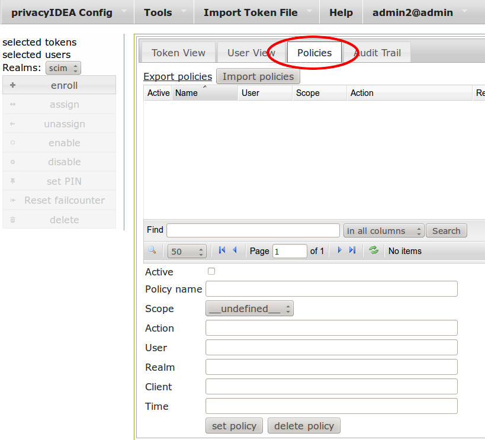

.. _policies:

Policies
========

.. index:: policies, scope

Policies can be used to define the reaction and behaviour of the system.

Each policy defines the behaviour in a certain area, called scope. 
privacyIDEA knows the scopes:

.. toctree::
   :maxdepth: 1

   admin
   user
   authentication
   authorization
   enrollment
   webui
   audit
   gettoken
   register

You can define as many policies as you wish to.
The logic of the policies in the scopes is additive.

   *Policy Definition*

Starting with privacyIDEA 2.5 you can use policy templates to ease the setup.

.. toctree::
   :maxdepth: 1

   templates

Each policy can contain the following attributes:

**policy name**

  A unique name of the policy. The name is the identifier of
  the policy. If you create a new policy with the same name,
  the policy is overwritten.

**scope**

  The scope of the policy as described above.

**action**

  This is the important part of the policy. 
  Each scope provides its own
  set of actions. 
  An action describes that something is `allowed` or
  that some behaviour is configured.
  A policy can contain several actions.
  Actions can be of type `boolean`, `string` or `integer`.
  Boolean actions are enabled by just adding this action - like
  ``scope=user:action=disable``, which allows the user to disable his own
  tokens.
  `string` and `integer` actions require an additional value - like
  ``scope=authentication:action='otppin=userstore'``.

**user**

  This is the user, for whom this policy is valid. Depending on the scope
  the user is either an administrator or a normal authenticating user.

  If this field is left blank, this policy is valid for all users.

**resolver**

  This policy will be valid for all users in this resolver.

  If this field is left blank, this policy is valid for all resolvers.

**realm**

  This is the realm, for which this policy is valid.

  If this field is left blank, this policy is valid for all realms.

.. _client_policies:

**client**

  This is the requesting client, for which this action is valid.
  I.e. you can define different policies if the user access is
  allowed to manage his tokens from different IP addresses like the internal
  network or remotely via the firewall.

  You can enter several IP addresses or subnets divided by comma
  (like ``10.2.0.0/16, 192.168.0.1``).

**time**

  (added in privacyIDEA 2.12)

  In the time field of a policy you can define a list of time ranges. A time
  range can consist of day of weeks (*dow*) and of times in 24h format.
  Possible values are:

     <dow>: <hh>-<hh>
     <dow>: <hh:mm>-<hh:mm>
     <dow>-<dow>: <hh:mm>-<hh:mm>

  You may use any combination of these. Like:

     Mon-Fri: 8-18

  to define certain policies to be active throughout working hours.

  .. note:: If the time of a policy does not match, the policy is not found.
     Thus you can get effects you did not plan. So think at least *twice* before
     using time restricted policies.

  **Example**:

.. note:: Policies can be active or inactive. So be sure to activate a policy to 
   get the desired effect. 

