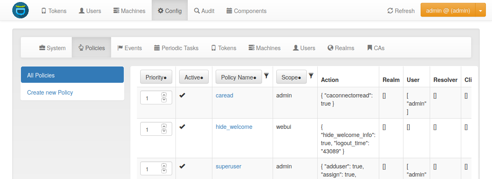

.. _policies:

Policies
========

.. todo:: Policies may be outdated. How to check which components are missing?
   And do we want to document all actions? I added a link to the :ref:`code_policy`.

.. index:: policies, scope

Policies can be used to define the reaction and behaviour of the system.

Each policy defines the behaviour in a certain area, called scope.
privacyIDEA knows these scopes:

.. toctree::
   :maxdepth: 1

   admin
   user
   authentication
   authorization
   enrollment
   webui
   register
   container
   token

You can define as many policies as you wish to.
The logic of the policies in the scopes is additive.

   *Policy Definition*

Starting with privacyIDEA 2.5 you can use policy templates to ease the setup.

.. toctree::
   :maxdepth: 1

   templates

Each policy can contain the following attributes:

**policy name**

  A unique name of the policy. The name is the identifier of
  the policy. If you create a new policy with the same name,
  the policy is overwritten.

  .. note:: In the web UI and the API policies can only be created
     with the characters 0-9, a-z, A-Z, "_", "-", " " and ".".
     On a library level or during migration scripts policies with
     other characters could be created.

**scope**

  The scope of the policy as described above.

**priority**

  The priority field of policies contains a positive number and defaults to 1.
  In case of policy conflicts, policies with a lower priority number take precedence.

  It can be used to resolve policy conflicts. An example is the :ref:`passthru_policy` policy:
  Assume there are two passthru policies ``pol1`` and ``pol2`` that
  define different action values, e.g. ``pol1`` defines ``passthru=userstore``
  and ``pol2`` defines ``passthru=radius1``.
  If multiple policies match for an incoming authentication request, the priority
  value is used to determine the policy that should take precedence: Assuming ``pol1``
  has a priority of 3 and ``pol2`` has a priority of 2, privacyIDEA
  will honor only the ``pol2`` policy and authenticate the user against the RADIUS server ``radius1``.

  Policy conflicts can still occur if multiple policies with the same priority
  specify different values for the same action.

.. versionadded:: 2.23

**description**
    Use this to describe your policy in more detail.

**action**

  This is the important part of the policy.
  Each scope provides its own
  set of actions.
  An action describes that something is `allowed` or
  that some behaviour is configured.
  A policy can contain several actions.
  Actions can be of type `boolean`, `string` or `integer`.
  Boolean actions are enabled by just adding this action - like
  ``scope=user:action=disable``, which allows the user to disable their own
  tokens.
  `string` and `integer` actions require an additional value - like
  ``scope=authentication:action='otppin=userstore'``.

Conditions
----------

**realm**

  This is the realm, for which this policy is valid.

  If this field is left blank, this policy is valid for all realms.

.. _check_all_resolvers:

**resolver**

  This policy will be valid for all users in this resolver.

  If this field is left blank, this policy is valid for all resolvers.

  .. note:: Starting with version 2.17 you can use the parameter
     ``check_all_resolvers``. This is *Check all possible resolvers*
     *of a user to match the resolver in this policy* in the WebUI.

     Assume a user *user@realm1* is contained in *resolver1* and *resolver2*
     in the realm *realm1*, where *resolver1* is the resolver with the
     highest priority. If the user authenticates as *user@realm1*, only
     policies for *resolver1* will match, since the user is identified as
     *user.resolver1@realm1*.

     If you also want to match a policy with ``resolver=resolver2``, you need
     to select *Check all possible resolvers* in this policy. Thus this
     policy will match for all users, which are also contained in *resolver2*
     as a secondary resolver.

**user**

  This is the user, for whom this policy is valid. Depending on the scope
  the user is either an administrator or a normal authenticating user.

  If this field is left blank, this policy is valid for all users.

  .. note:: Starting with version 3.10 you can choose if the username and the
    adminname has to match case-sensitive or not.

**privacyIDEA Node**

  If you have a redundant setup requests can hit different dedicated nodes of
  your privacyIDEA cluster. If you want a policy to only be valid for certain
  privacyIDEA Nodes, you can set a list of allowed nodes.

  This can be useful if you e.g. only want certain administrative actions on
  dedicated nodes.

  The nodes are configured in pi.cfg. See :ref:`cfgfile`.

.. versionadded:: 3.4

**time**

  In the time field of a policy you can define a list of time ranges. A time
  range can consist of day of weeks (*dow*) and of times in 24h format.
  Possible values are::

     <dow>: <hh>-<hh>
     <dow>: <hh:mm>-<hh:mm>
     <dow>-<dow>: <hh:mm>-<hh:mm>

  You may use any combination of these. Like::

     Mon-Fri: 8-18

  to define certain policies to be active throughout working hours.

  .. note:: If the time of a policy does not match, the policy is not found.
     This can lead to unintended side effects. Carefully consider this before
     using time restricted policies.

.. versionadded:: 2.12

.. _client_policies:

**client**

  This is the requesting client for which this action is valid.
  You can use this to define policies in which the user is allowed to manage
  their tokens depending on their IP addresses (like the internal network or
  remotely via the firewall).

  You can enter several IP addresses or subnets divided by comma. Exclude item
  by prepending a minus sign (like ``10.2.0.0/16, -10.2.0.1, 192.168.0.1``).

**User Agent**

  This is the user agent of the requesting client for which this action is valid. You can use this to define policies
  depending on the plugin. Multiple plugins can be selected from the drop-down list. But you can also add custom
  user agents. The matching is applied to the name, but not to the version. It is case-insensitive.

**additional conditions**

  Using conditions you can specify more advanced rules that determine whether
  a policy is valid for a request.

  Conditions are described in

.. toctree::
    :maxdepth: 1

    conditions

.. versionadded:: 3.1
