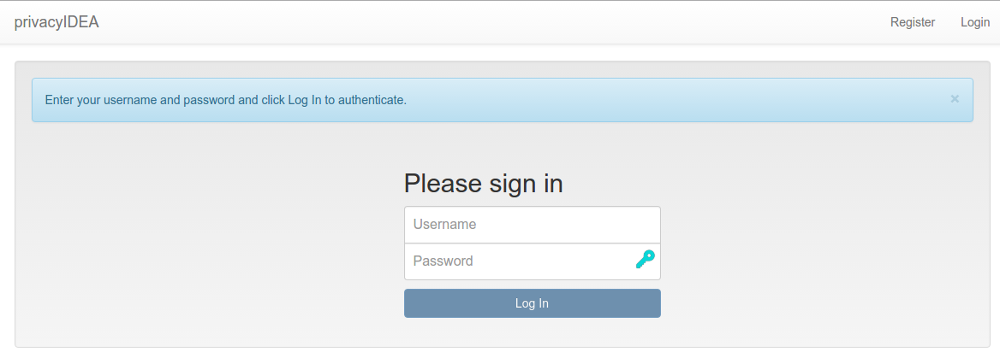
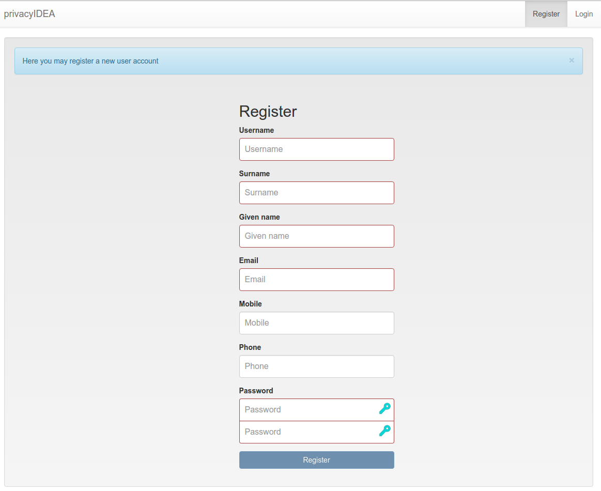
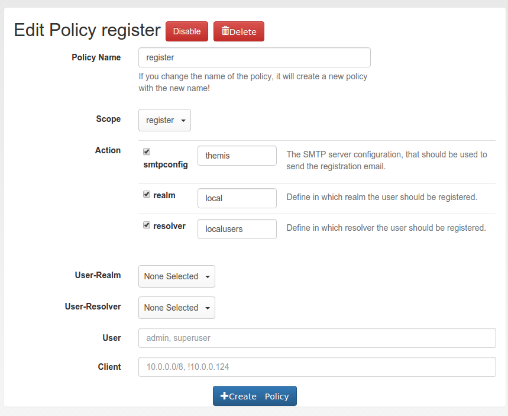

.. _register_policy:

Register Policy
---------------

.. index:: policies, register policy, user registration

.. _user_registration:

User registration
.................

.. deprecated:: 3.14
   Self-registration is deprecated and will be removed in a future release,
   together with this policy scope and the ``/register`` endpoints. Its only
   user interface is the registration link of the old WebUI, which is being
   removed, and the new WebUI does not offer registration. The endpoints log a
   warning when they are used - if your installation relies on
   self-registration, please let us know before it is removed.

Users can register with privacyIDEA.
I.e. a user that does not exist in a given realm and resolver can create a
new account.

.. note:: Registering new users is only possible, if there is a writeable
   resolver and if a policy in the scope *register* defines at least *resolver*
   and *smtpconfig*.
   For editable UserIdResolvers see :ref:`useridresolvers`.

If a register policy with the action *resolver* is defined, the login window
gets a new link "Register".

   *Next to the login button is a new link 'register', so that new users are
   able to register.*

A user who clicks the link to register a new account gets this registration
dialog:

   *Registration form*

During registration the user is also enrolled a
:ref:`registration token<registration_token>`. This registration code is sent
to the user via a notification email.

.. note:: Using the right policies in scope *webui* and *authentication* the
   user could log in with the password they set during registration and the
   registration code received via email.

Policy settings
...............

In the scope *register* several settings define the behavior of the
registration process.

   *Creating a new registration policy*

realm
~~~~~

type: ``string``

This is the realm, in which a new user will be registered. If this realm is
not specified, the user will be registered in the default realm.

resolver
~~~~~~~~

type: ``string``

This is the resolver, in which the new user will be registered. If this
resolver is not specified, **registration is not possible!**

.. note:: This resolver must be an editable resolver, otherwise the user can
   not be created in this resolver.

smtpconfig
~~~~~~~~~~

type: ``string``

This is the unique identifier of the :ref:`smtpserver`. This SMTP server is
used to send the notification email with the registration code during the
registration process.

.. note:: *smtpconfig* is required. Without it the registration is refused. If it
   names an SMTP server configuration that does not exist, the registration fails
   with an error after the user and the registration token were created, and they
   are not removed.

.. _policy_requiredemail:

requiredemail
~~~~~~~~~~~~~

type: ``string``

This is a regular expression according to [#pythonre]_.

Only email addresses in which this regular expression is found are allowed to
register. The expression is searched anywhere in the address, so anchor it with
``^`` and ``$``. If several policies apply, an address matching any of them is
allowed.

**Example**: If you only want to allow email addresses from the domain
*example.com*, a policy might look like this::

   action: requiredemail=/^[^@]+@example\.com$/

registration_body
~~~~~~~~~~~~~~~~~

type: ``string``

The body of the registration email. Use ``{regkey}`` as tag for the
registration key.

.. _register_policy_hide_specific_error_message:

hide_specific_error_message
~~~~~~~~~~~~~~~~~~~~~~~~~~~

type: ``bool``

If this policy is set, a failed registration returns the generic error message
"Failed registering new user" instead of the specific one.

.. [#pythonre] https://docs.python.org/3/library/re.html
