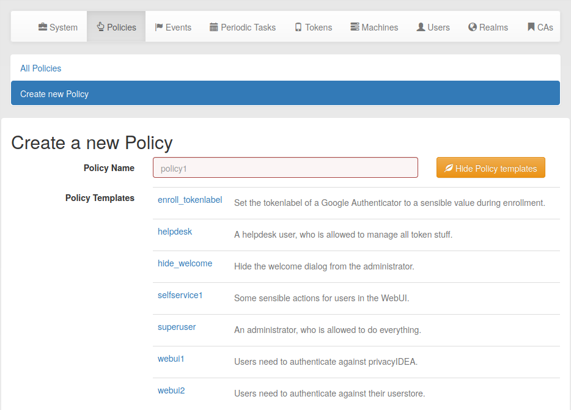

.. _policy_templates:

Policy Templates
----------------

.. index:: policies, policy templates

Policy templates are defined in a Github repository which can be changed
using a WebUI policy :ref:`policy_template_url`.

The policy templates are json files, which can contain common settings, that
can be used to start your own polcies. When creating a new policy, you can
select an existing policy template as a starting point.

You may also fork the github repository and commit pull request to improve
the policy templates. Or you may fork the github repositry and use your own
policy template URL for your policy templates.

A policy templates looks like this::

   {
    "name": "template_name1",
    "scope": "enrollment",
    "action": {
               "tokenlabel": "<u>@<r>/<s>",
               "autoassignment": true
              }
   }

*realms*, *resolver* and *clients* are not used in the templates.

A template must be referenced in a special ``index.json`` file::

   {
     "template_name1": "description1",
     "template_name2": "description2"
   }

where the key is the name of the template file and the value is a description
displayed in the WebUI. A number of policies come preinstalled with privacyIDEA.

