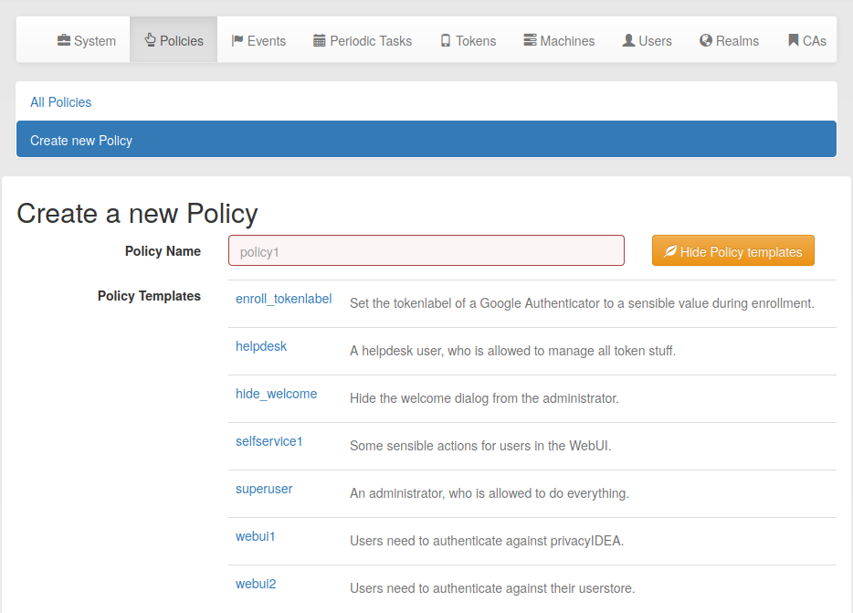

.. _policy_templates:

Policy Templates
----------------

.. index:: policies, policy templates

privacyIDEA ships a set of policy templates with the WebUI. The WebUI policy
:ref:`policy_template_url` can point to a different location.
The templates are then fetched from the given URL during runtime.

The policy templates are JSON files, which can contain common settings that
can be used to start your own policies. When creating a new policy, you can
select an existing policy template as a starting point.

You may also provide your own policy templates at a URL of your choice and set
this URL with the policy :ref:`policy_template_url`.

A policy template looks like this::

   {
    "name": "template_name1",
    "scope": "enrollment",
    "action": {
      "tokenlabel": "{user}@{realm}/{serial}",
      "autoassignment": "userstore"
    }
   }

The WebUI also takes the optional keys ``realm``, ``resolver``, ``adminrealm``,
``conditions`` and ``user_agents`` from a template, and so does the previous WebUI.
A ``client`` key is not used.

A template must be referenced in a special ``index.json`` file::

   {
     "template_name1": "description1",
     "template_name2": "description2"
   }

where the key is the name of the template file and the value is a description
displayed in the WebUI.
