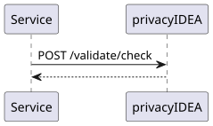
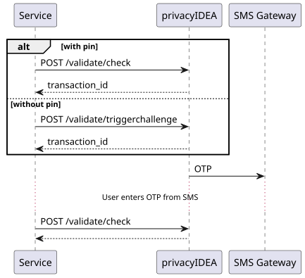
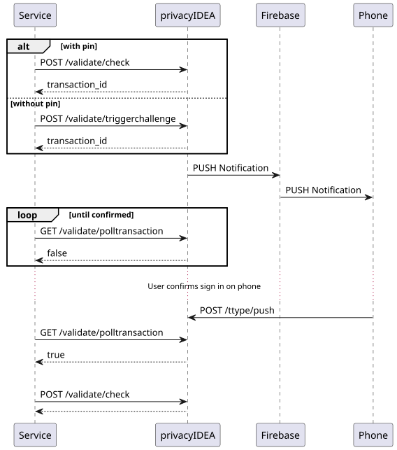

.. _authentication_modes:
.. _client_modes:

Authentication Modes and Client Modes
=====================================

privacyIDEA supports a variety of tokens that implement different
authentication flows. We call these flows *authentication modes*. Currently,
tokens may implement three authentication modes, namely ``authenticate``,
``challenge`` and ``outofband``.

Application plugins need to implement the three authentication modes
separately, as the modes differ in their user experience. To help the plugins
identify the flow, the JSON response of an authentication request
contains additional information in the section

.. code-block:: json

    {
      "detail": {
        "multi_challenge": [
          {
            "client_mode": "poll"
          }
        ]
      }
    }

The "client_mode" gives the plugin even more information on how to respond.
The authentication mode ``challenge`` can either result in client_mode ``interactive``
or ``webauthn``, and the authentication mode ``outofband`` results in client mode
``poll``, or in ``interactive`` for a push token with :ref:`policy_push_code_to_phone`,
where the user types the code shown on the smartphone.

Here are examples for the flows:

* The HOTP token type implements the ``authenticate`` mode, which is a
  single-shot authentication flow. For each authentication request, the user
  uses their token to generate a new HOTP value and enters it along with their
  OTP PIN. The plugin sends both values to privacyIDEA, which decides whether
  the authentication is valid or not.
* The email and SMS token types implement the ``challenge`` mode. With such a
  token, the authentication flow consists of two steps: In a
  first step, the plugin triggers a challenge. privacyIDEA sends the challenge
  response --- a fresh OTP value --- to the user via email or SMS.
  In a second step, the user responds to the challenge by entering the
  respective OTP value in the plugin's login form. The plugin sends the
  challenge response to privacyIDEA, which decides whether the authentication
  is valid or not.
  The "client_mode" is set to ``interactive``. This indicates that
  the plugin should display an input field, so that the user can enter the response
  interactively.
* WebAuthn tokens also implement the ``challenge`` mode. However,
  the plugin needs to handle these challenges differently, since the user does
  not need to enter the response to the challenge manually.
  The "client_mode" is set to ``webauthn`` so that the plugin
  can handle the cryptographic challenge accordingly.
* The PUSH and TiQR token types implement the ``outofband`` mode.
  With a PUSH token, the authentication flow also consists of two steps:
  In a first step, the user triggers a challenge. privacyIDEA pushes the
  challenge to the user's smartphone app. In a second step, the user approves
  the challenge on their phone, and the app responds to the challenge by
  communicating with the privacyIDEA server on behalf of the user.
  The plugin periodically queries privacyIDEA to check if
  the challenge has been answered correctly and the authentication is valid.
  In this case the "client_mode" is set to ``poll``, so that the plugin knows, that
  it needs to poll for the response to the challenge.

The following describes the authentication flows of the three authentication
modes in more detail.

.. _authentication_mode_authenticate:

``authenticate`` mode
---------------------

The *Service* is an application that is protected with a second factor by privacyIDEA.

* The user enters an OTP PIN along with an OTP value at the *Service*.
* The plugin sends a request to the ``/validate/check`` endpoint of privacyIDEA:

  .. sourcecode:: http

    POST /validate/check HTTP/1.1
    Accept: application/json

    user=<user>
    pass=<PIN+OTP>

  and privacyIDEA returns whether the authentication request has succeeded
  or not.

.. _authentication_mode_challenge:

``challenge`` mode
------------------

* The plugin triggers a challenge, for example via the
  ``/validate/triggerchallenge`` endpoint. This endpoint requires the
  authorization token of an administrator in the ``PI-Authorization`` header,
  typically of a service account that only has the admin policy
  :ref:`policy_triggerchallenge`:

  .. sourcecode:: http

    POST /validate/triggerchallenge HTTP/1.1
    PI-Authorization: <admin token>

    user=<user>

  Alternatively, a challenge can be triggered via the ``/validate/check``
  endpoint with the PIN of a challenge-response token:

  .. sourcecode:: http

    POST /validate/check HTTP/1.1

    user=<user>
    pass=<PIN>

  In both variants, the plugin receives a transaction ID which we call
  ``transaction_id`` and asks the user for the challenge response.
* The user enters the challenge response, which we call ``OTP``.
  The plugin forwards the response to privacyIDEA along with the
  transaction ID:

  .. sourcecode:: http

    POST /validate/check HTTP/1.1

    user=<user>
    transaction_id=<transaction_id>
    pass=<OTP>

  and privacyIDEA returns whether the authentication request succeeded or not.

To clean up expired challenges read the :ref:`pimanage_challenge` section.

.. _authentication_mode_outofband:

``outofband`` mode
------------------

* The plugin triggers a challenge, for example via the
  ``/validate/triggerchallenge`` endpoint. This endpoint requires the
  authorization token of an administrator in the ``PI-Authorization`` header,
  typically of a service account that only has the admin policy
  :ref:`policy_triggerchallenge`:

  .. sourcecode:: http

    POST /validate/triggerchallenge HTTP/1.1
    PI-Authorization: <admin token>

    user=<user>

  or via the ``/validate/check`` endpoint with the PIN of an out-of-band token:

  .. sourcecode:: http

    POST /validate/check HTTP/1.1

    user=<user>
    pass=<PIN>

  In both variants, the plugin receives a transaction ID which we call
  ``transaction_id``.
  The plugin may now periodically query the status of the challenge by
  polling the ``/validate/polltransaction`` endpoint:

  .. sourcecode:: http

    GET /validate/polltransaction HTTP/1.1

    transaction_id=<transaction_id>

  The endpoint returns ``true`` once the challenge has been answered
  (``detail.challenge_status`` is then ``accept``). With ``false``,
  ``detail.challenge_status`` tells the cases apart: ``pending`` means the
  challenge has not been answered yet, or that no valid challenge exists for
  this transaction ID (for example because it has expired); ``declined`` or
  ``cancelled`` means the user refused the challenge, and
  ``result.authentication`` is then ``DECLINED``. Stop polling on
  ``declined`` and ``cancelled``.
* The user approves the challenge on a separate device, e.g. their
  smartphone app. The app communicates with a tokentype-specific endpoint of
  privacyIDEA, which marks the challenge as answered.
  The exact communication depends on the token type.
* Once ``/validate/polltransaction`` returns ``true``, the plugin *must*
  finalize the authentication via the ``/validate/check`` endpoint:

  .. sourcecode:: http

    POST /validate/check HTTP/1.1

    user=<user>
    transaction_id=<transaction_id>
    pass=

  For the ``pass`` parameter, the plugin sends an empty string.

  This step is crucial because the ``/validate/check`` endpoint takes defined
  authentication and authorization policies into account to decide whether
  the authentication was successful or not.

  .. note:: There are two distinct time windows involved:

      * The **answer window** is the challenge validity time. The user has to
        approve (or decline) the challenge on their separate device within this
        window. An answer arriving after the challenge has expired is rejected.
      * For push tokens, the **finalize window** starts once the challenge has
        been answered. Answering the challenge pushes its expiration out to at
        least ``PushChallengeFinalizeGrace`` seconds (default 300) from that
        moment, so that the plugin can still finalize the authentication via
        ``/validate/check`` afterwards. The expiration only
        ever moves forward, so with an answer window longer than the grace period, the
        challenge may stay redeemable until its original expiration. Once the
        challenge finally expires it can no longer be redeemed and the
        transaction has to be started again.

      A TiQR challenge has no finalize window: the answer and the finalizing
      ``/validate/check`` both have to happen within the original challenge
      validity time. An answer that arrives shortly before the challenge
      expires leaves the plugin only the remaining validity time to finalize.

      Both windows behave identically whether or not the Redis challenge cache
      is enabled. See :ref:`push_token` for the push durations.

  .. note:: The ``/validate/polltransaction`` endpoint does not require
      authentication and does not increase the failcounters of tokens. Hence, attackers
      may try to brute-force transaction IDs of correctly answered challenges.
      Due to the short expiration timeout and the length of the randomly-generated
      transaction IDs, it is unlikely that attackers correctly guess a
      transaction ID in time.
      Nonetheless, plugins must not allow users to inject transaction
      IDs, and plugins must not leak transaction IDs to users.
