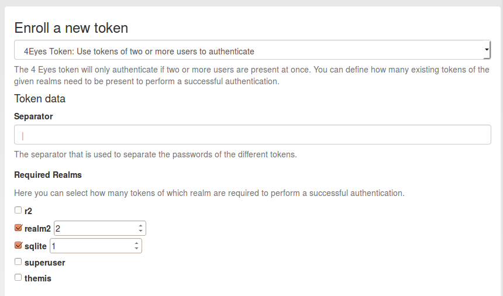

.. _four_eyes_token:

Four Eyes
---------

.. index:: Four Eyes, 4 Eyes, Two Man

Starting with version 2.6 privacyIDEA supports 4 Eyes Token. This is a meta
token, that can be used to define, that two or more token must be used to
authenticate. This way, you can set up a "two man rule".

You can define, from which realm how many unique tokens need to be
present, when authenticating:

   *Enroll a 4 eyes token*

In this example authentication will only be possible if at least two tokens
from *realm2* and one token from realm *sqlite* are present.

Authentication is done by concatenating the OTP PINs and the OTP values of
all tokens. The concatenation is split by the *separator* character.

It does not matter, in which order the tokens from the realms are entered.

**Example**

Authentication as::

   username: "root@r2"
   password: "pin123456 secret789434 key098123"

The three blocks separated by the *blank* are checked, if they match tokens
in the realms *realm2* and *sqlite*.

The response looks like this in case of success::

   {
     "detail": {
       "message": "matching 1 tokens",
       "serial": "PI4E000219E1",
       "type": "4eyes"
     },
     "id": 1,
     "jsonrpc": "2.0",
     "result": {
       "status": true,
       "value": true
     },
     "version": "privacyIDEA 2.6dev0",
     "versionnumber": "2.6dev0"
   }

In case of a failed authentication the response looks like this::

   {
     "detail": {
       "foureyes": "Only found 0 tokens in realm themis",
       "message": "wrong otp value",
       "serial": "PI4E000219E1",
       "type": "4eyes"
     },
     "id": 1,
     "jsonrpc": "2.0",
     "result": {
       "status": true,
       "value": false
     },
     "version": "privacyIDEA 2.6dev0",
     "versionnumber": "2.6dev0"
   }

Using Challenge Response mode
~~~~~~~~~~~~~~~~~~~~~~~~~~~~~

Starting with version 3.5 it is also possible to use the 4eyes token in
multi challenge-response mode.
This way in the first authentication response the users will either enter the
OTP PIN of the 4eyes token or (if the 4eyes token has no PIN) enter the first
token (OTP PIN + OTP value) of one of the users.
After this a challenge is sent back, that further tokens need to be entered.
Every one of the required tokens is entered separately.

.. note:: The 4Eyes Token verifies that unique tokens from each realm are
   used. I.e. if you require 2 tokens from a realm, you can not use the same
   token twice.

.. warning:: But it does not verify, if these two unique tokens belong to
   the same user. Thus you should create a policy, that in such a realm a user
   may only have on token.
