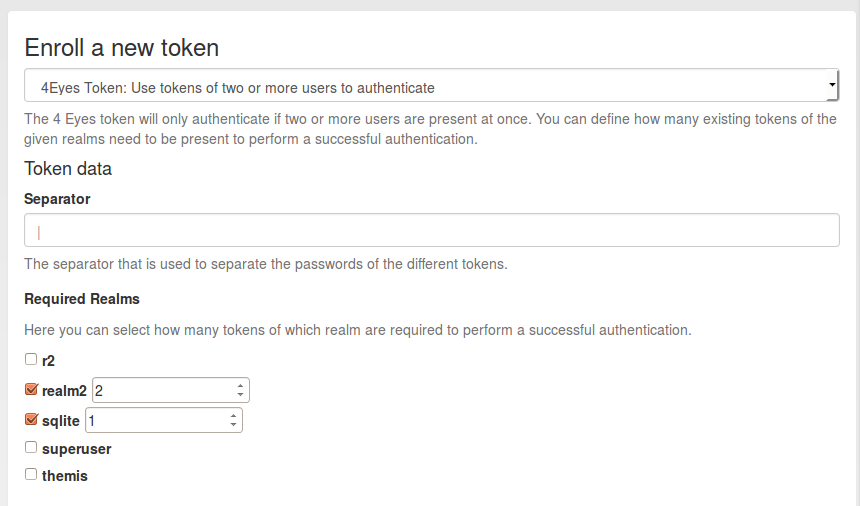

.. _four_eyes_token:

Four Eyes
---------

.. index:: Four Eyes, 4 Eyes, Two Man

privacyIDEA supports the 4 Eyes token. This is a meta
token, that can be used to define, that two or more tokens must be used to
authenticate. This way, you can set up a "two man rule".

You can define, from which realm how many unique tokens need to be
present, when authenticating:

   *Enroll a 4 eyes token*

In this example authentication will only be possible if at least two tokens
from *realm2* and one token from realm *sqlite* are present.

Authentication is done by concatenating the OTP PINs and the OTP values of
all tokens. The concatenation is split by the *separator* character.

Only the OTP PINs and OTP values of the member tokens are checked. The PIN of
the 4eyes token itself is not part of this authentication; it only starts the
challenge response mode (see below).

It does not matter, in which order the tokens from the realms are entered.

**Example**

Authentication as::

   username: "root@r2"
   password: "pin123456 secret789434 key098123"

The three blocks separated by the *blank* are checked, if they match tokens
in the realms *realm2* and *sqlite*.

The separator is set during enrollment (one character; the WebUI suggests
``|``, the API default is a blank). The example uses a blank; with ``|`` the
password is ``pin123456|secret789434|key098123``.

The response looks like this in case of success::

   {
     "detail": {
       "message": "matching 1 tokens",
       "serial": "PI4E000219E1",
       "type": "4eyes"
     },
     "id": 1,
     "jsonrpc": "2.0",
     "result": {
       "status": true,
       "value": true
     }
   }

In case of a failed authentication the response looks like this::

   {
     "detail": {
       "foureyes": "Only found 0 tokens in realm themis",
       "message": "wrong otp value",
       "serial": "PI4E000219E1",
       "type": "4eyes"
     },
     "id": 1,
     "jsonrpc": "2.0",
     "result": {
       "status": true,
       "value": false
     }
   }

Using Challenge Response mode
~~~~~~~~~~~~~~~~~~~~~~~~~~~~~

It is also possible to use the 4eyes token in
multi challenge-response mode.
This way in the first authentication request the users will either enter the
OTP PIN of the 4eyes token or the first token (OTP PIN + OTP value) of one of
the users - also if the 4eyes token has a PIN. No
:ref:`policy_challenge_response` policy is needed.
After this a challenge is sent back, that further tokens need to be entered.
Every one of the required tokens is entered separately.

.. note:: The 4Eyes Token verifies that unique tokens from each realm are
   used. I.e. if you require 2 tokens from a realm, you can not use the same
   token twice.

.. warning:: But it does not verify, if these two unique tokens belong to
   the same user. Thus you should create a policy, that in such a realm a user
   may only have one token.
