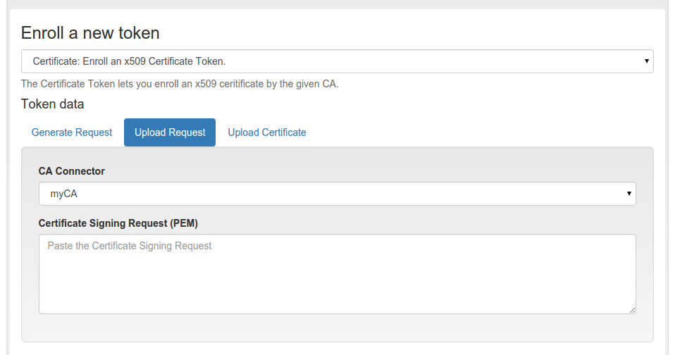
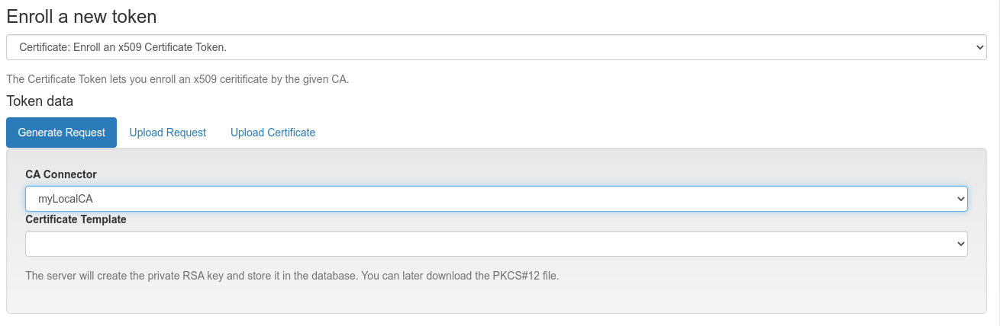
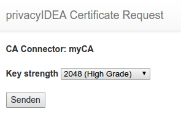

.. _certificate_token:

Certificates
------------

.. index:: certificates, client certificates, request, CSR, CA

Starting with version 2.3 privacyIDEA supports certificates. A user can

* upload a certificate request,
* upload a certificate or
* he can generate a certificate request in the browser.

privacyIDEA does not sign certificate requests itself but connects to
existing certificate authorities. To do so, you need to define
:ref:`caconnectors`.

Certificates are attached to the user just like normal tokens. One token of
type *certificate* always contains only one certificate.

If you have defined a CA connector you can upload a certificate signing
request (CSR) via the *Token Enroll Dialog* in the WebUI.

   *Upload a certificate signing request*

You need to choose the CA connector. The certificate will be signed by
the CA accordingly. Just like all other tokens the certificate token can be
attached to a user.

Generating Signing Requests
~~~~~~~~~~~~~~~~~~~~~~~~~~~

You can also generate the signing request directly in your browser.

.. note:: This uses the keygen HTML-tag that is not supported by the Internet
   Explorer!

   *Generate a certificate signing request*

When generating the certificate signing request this way the RSA keypair is
generated on the client side in the browser.

The certificate is signed by the CA connected by the chosen CA connector.

   *Download or install the client certificate*

Afterwards the user can install the certificate into the browser.

.. note:: By requiring OTP authentication for the users to login to the WebUI
   (see :ref:`policy_login_mode`)
   you can have two factor authentication required for the user to be allowed
   to enroll a certificate.

