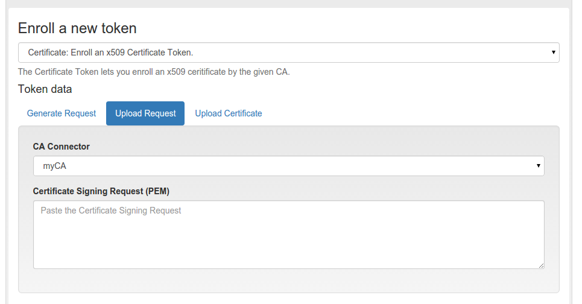
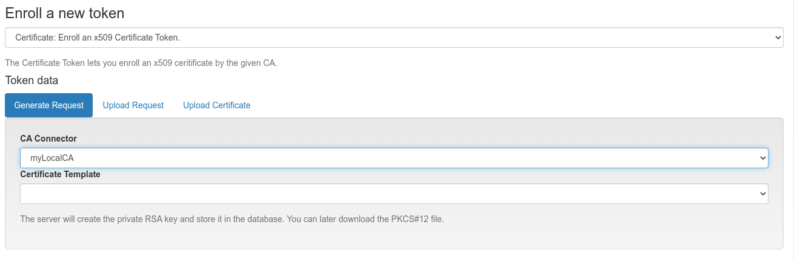
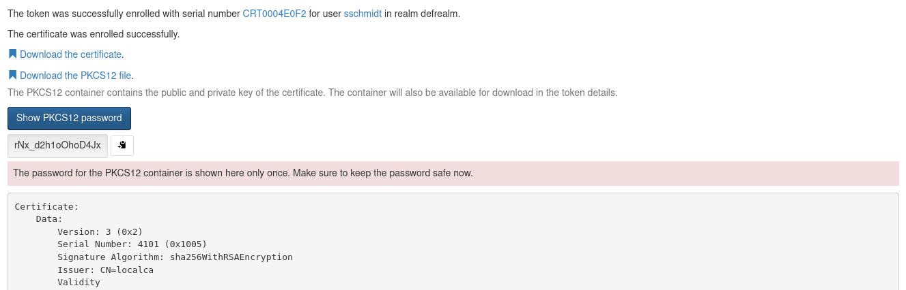

.. _certificate_token:

Certificate Token
-----------------

.. index:: certificates, client certificates, request, CSR, CA, attestation

privacyIDEA supports certificates. A user can

* submit a certificate signing request (including an attestation certificate),
* upload a certificate or
* generate a certificate signing request within privacyIDEA.

privacyIDEA signs certificate signing requests through a
:ref:`CA connector <caconnectors>`, which you need to define: either a local CA
that privacyIDEA runs with OpenSSL on its own server (the CA key is then stored
on the privacyIDEA server) or an external CA such as a Microsoft CA.

Certificates are attached to the user just like normal tokens. One token of
type *certificate* always contains only one certificate.

If you have defined a CA connector you can upload a certificate signing
request (CSR) via *Enroll Token* in the WebUI.

   *Upload a certificate signing request*

You need to choose the CA connector. The certificate will be signed by
the CA accordingly. Just like all other tokens the certificate token can be
attached to a user.

When a certificate token is revoked, privacyIDEA also revokes the certificate
at the CA through the CA connector. With the local CA connector, a new CRL is
created as well (see :ref:`caconnectors`).

Generating Signing Requests
~~~~~~~~~~~~~~~~~~~~~~~~~~~

You can also generate the signing request. The key pair and the request are generated on the
server.

   *Generate a certificate signing request*

When generating the certificate signing request this way the RSA key pair is
generated on the server.
When the token is enrolled, the private key and the certificate are available in
an encrypted PKCS12 container. The PKCS12 file is encrypted with the token PIN
or, if the token has no PIN set, a random password will be generated and
presented to the user only once. The private key is not stored in plain form;
the encrypted PKCS12 container is kept in the token info (``pkcs12``) and can be
downloaded again.

   *Download encrypted PKCS12 container with a generated password*

The certificate is signed by the CA connected by the chosen CA connector.

Afterwards the user can install the certificate into the browser.

.. note:: By requiring OTP authentication for the users to log in to the WebUI
   (see :ref:`policy_login_mode`)
   you can have two factor authentication required for the user to be allowed
   to enroll a certificate.

.. _pending_requests:

Pending certificate requests
~~~~~~~~~~~~~~~~~~~~~~~~~~~~

When sending certificate requests the issuing of the certificate can be pending.
This can happen with e.g. the Microsoft CA, when a CA manager approval is required.
In this case the certificate token in privacyIDEA is marked in the ``rollout_state``
"pending".

Using the :ref:`eventhandler` a user can be notified if a certificate request is pending.
E.g. privacyIDEA can automatically send an email to the user.

Example event handler
.....................

To configure this, create a new post event handler on the event ``token_init`` with the
:ref:`usernotification`.

In the conditions set the ``rollout_state=pending`` and in the *actions* choose to send an
email to the tokenowner. This way, after the token is enrolled and in the state *pending*,
privacyIDEA will send the notification email.
